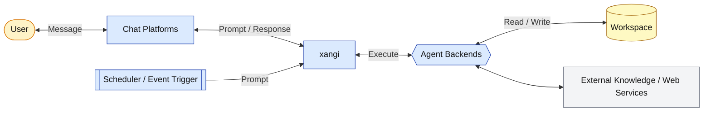

[日本語](README.md) | **English**

# xangi

> **A**GENTIC **N**EON **G**ENESIS **I**NTELLIGENCE

An AI assistant for Discord / Slack / Telegram / browser / LINE, powered by Claude Code / Codex / Cursor CLI / Grok CLI / Antigravity CLI / Local LLM backends. Discord recommended; browser-only mode also supported.

## Features

- Discord / Slack / Telegram / Web Chat UI / LINE support
- Claude Code / Codex / Cursor CLI / Grok CLI / Antigravity CLI / Local LLM support
- Per-channel backend / model / effort switching with `/backend`
- Skills, scheduler, and event triggers
- Docker, pm2, and auto-restart support
- Session persistence, timeout extension, and workspace hooks

## Architecture



## Quickstart

The same flow works on macOS, Linux, and WSL2. First prepare one supported AI tool, then install xangi.

```bash
# Example: prepare Codex (claude-code / cursor / grok / antigravity are also available)
bash <(curl -fsSL https://github.com/karaage0703/xangi/releases/latest/download/setup-ai-tools.sh) codex

# Install xangi
curl -fsSL https://github.com/karaage0703/xangi/releases/latest/download/install.sh | bash
```

After installation, open a normal terminal and run:

```bash
xangi setup
```

The AI guiding `xangi setup` confirms the workspace and Web Chat access scope, registers and starts the OS service, and runs `xangi doctor`. You do not need to run `xangi install` or `xangi doctor` manually afterward. Automatic startup after login or reboot is asked separately and is enabled only with explicit consent. You can change it later with:

```bash
xangi service autostart enable
xangi service autostart disable
```

Run `xangi doctor` later whenever you want to check the current state.

## Detailed setup for users

### 1. Set up an AI coding tool

xangi's guided setup uses Codex, Claude Code, Cursor Agent, Grok Build, or Antigravity. The dedicated script is independent of xangi and can also be used to set up only an AI coding tool.

```bash
bash <(curl -fsSL https://github.com/karaage0703/xangi/releases/latest/download/setup-ai-tools.sh) codex
```

Replace the last argument with `codex`, `claude-code`, `cursor`, `grok`, or `antigravity`. Use `check` as the last argument to inspect installation and authentication without changing them. The script installs a missing tool using its vendor's official installer and starts interactive authentication. Codex requires Node.js and npm; if either is unavailable, the script stops and prints the prerequisite URL.

### 2. Install xangi

Paste the same command into a terminal on macOS, Linux, or WSL2:

```bash
curl -fsSL https://github.com/karaage0703/xangi/releases/latest/download/install.sh | bash
```

The installer detects the operating system and CPU, installs xangi, and creates `~/.local/bin/xangi`. It does not launch an interactive AI UI inside the `curl ... | bash` pipe. After installation, it tells you to run `xangi setup` from a normal terminal. This avoids platform-specific terminal handoff failures in TUI applications such as Codex. Run the installer from any directory. When `~/.local/bin` is not on PATH, it prints an `export PATH=...` command for the current shell and instructions for persisting it in zsh.

### Minimum flow and recovery commands

After the installer completes, run `xangi setup` from a normal terminal. The installer has already placed the xangi application. The AI guiding setup runs `xangi install` when needed to register and start the OS service, asks separately whether to enable automatic startup, and finishes by checking the result with `doctor`.

```text
Prepare an AI tool → install xangi → setup → start the service → doctor
```

If the flow stops partway through, resume from the relevant command below. Normally, you only run `xangi setup` manually; its AI guide continues through service activation and diagnostics.

1. `xangi setup`
   - Interactively saves the workspace, selected AI, and Web Chat access scope.
   - Web Chat defaults to this device only. Tailscale keeps the app on loopback and uses Tailscale Serve to expose it only inside the tailnet. LAN access is enabled only after warning that Web Chat has no application-level authentication.
   - Resume here after waiting for AI tool installation or authentication, or after leaving setup midway.
2. `xangi install`
   - Registers the managed OS service and starts it for the current session. It does not enable startup after login or reboot.
   - The AI launched by `xangi setup` normally runs it. Run it manually only when configuration succeeded but service activation failed.
3. `xangi doctor`
   - Diagnoses the service, Web Chat, and whether the configured workspace matches the running workspace.
   - Run this first when you are unsure where the flow stopped.

### Start using xangi

After setup, xangi runs as a service, so no additional start command is required.

- Browser: open `http://127.0.0.1:18888` for local-only access, or `http://<Tailscale IP>:18888` when Tailscale access was selected
- Discord and other chat platforms: message the bot configured during setup
- Health check: run `xangi doctor`

If the current shell still cannot find `xangi`, run the printed `export PATH=...` command or use the absolute Launcher path.

### Installing multiple xangi instances on one machine

The Gitless managed distribution currently supports one instance per OS user. Running the install command again as the same user updates and reconfigures that instance; it does not create a second one. A different Mac or PC, or a separate OS user on the same computer, has an independent home directory and can run the same install command safely.

Named managed instances under one OS user are not supported yet. Use separate OS users for now. The multiple-clone, PM2, and Docker guidance later in this README is for source-checkout developers, not the Gitless managed distribution.

### Token settings

When setup needs Discord, Slack, LINE, Telegram, or Notion tokens, open the local settings page with one command:

```bash
xangi settings
```

Values never enter the AI conversation or shell history. xangi stores them with mode 0600 in the OS-specific secret area. The temporary page binds only to `127.0.0.1`, never sends stored values back to the browser, and shuts down after saving.

### Settings and updates

```bash
xangi settings
xangi setup
xangi doctor
xangi update
xangi service start
xangi service stop
xangi service restart
xangi service status
xangi service autostart enable
xangi service autostart disable
xangi uninstall
xangi notion-sync enable
```

`start|stop|restart|status` and `autostart enable|disable` are shared by managed and checkout installations. Only `autostart enable` registers startup after login or reboot. `autostart disable` removes that registration without stopping the currently running process. Neither `install` nor `service start` enables automatic startup implicitly.

For Notion sync, save the token and destination parent page with `xangi settings`, then enable it. See the [usage guide](docs/en/usage.md) for detailed commands, update and rollback behavior, and OS-specific paths.

To remove a managed installation, run `xangi uninstall`. It removes the service, scheduled updates, and xangi application while retaining the workspace, settings, tokens, and history, so the same install command can reinstall it immediately. Use `xangi uninstall --purge --yes` for a full settings and history reset. Neither command removes the workspace.

## For developers and advanced users

Everything below is for contributors who clone xangi with Git. Building xangi from source requires Node.js 22+ and npm. Regular users do not run these commands.

### 1. Configure environment variables

```bash
cp .env.example .env
```

**Minimum required settings (.env):**

```bash
# Discord Bot Token (required)
DISCORD_TOKEN=your_discord_bot_token

# Allowed user ID (required, comma-separated for multiple, "*" for all)
DISCORD_ALLOWED_USER=123456789012345678
```

> 💡 The working directory defaults to `./workspace`. Set `WORKSPACE_PATH` to change it.

> 💡 See [Discord Setup](docs/en/discord-setup.md) for how to create a Bot and find IDs.

### 2. Build & Run

```bash
# Requires Node.js 22+ and at least one AI CLI
# Claude Code: curl -fsSL https://claude.ai/install.sh | bash
# Codex CLI:   npm install -g @openai/codex
# Cursor CLI:  curl https://cursor.com/install -fsS | bash
# Grok CLI:    curl -fsSL https://x.ai/cli/install.sh | bash
# Antigravity CLI: curl -fsSL https://antigravity.google/cli/install.sh | bash
# Local LLM:   Install Ollama (https://ollama.com)

npm ci
npm run build
npm start

# Development
npm run dev
```

### 3. Verify

Mention the bot in Discord to start a conversation.

### Browser-only (no Discord/Slack)

If you don't want to set up tokens or just want to use it via a local browser, the Web Chat UI can run standalone.

Add to `.env`:

```bash
WEB_CHAT_ENABLED=true
```

```bash
npm start
```

Open `http://localhost:18888` in your browser.

> 💡 The Web Chat UI is opt-in (`WEB_CHAT_ENABLED=true`) to avoid surprise port conflicts. Change the port with `WEB_CHAT_PORT`.
> 💡 See [Slack Setup](docs/en/slack-setup.md) for Slack integration.
> 💡 See [Telegram Setup](docs/en/telegram-setup.md) for Telegram Bot integration.

### Lifecycle management (pm2)

xangi uses `./bin/xangi service` inside each clone to control the external supervisor. The `/restart` command is a low-level request for the running xangi process to gracefully shut down. A process manager is required for auto-recovery.

```bash
npm install -g pm2
./bin/xangi service start
./bin/xangi service status
./bin/xangi service restart
./bin/xangi service stop
```

To start xangi automatically after an OS reboot, run the following once from the target clone:

```bash
./bin/xangi service start
./bin/xangi service autostart enable
```

Run `./bin/xangi service autostart disable` to remove automatic startup. Enabling runs `pm2 save` and `pm2 startup`; disabling runs `pm2 unstartup`. If PM2 prints a `sudo ...` command, run it once.

When running multiple clones, run `./bin/xangi` from each target directory. If you want commands on PATH, prefer named symlinks such as `xangi-dev` / `xangi-prod` instead of one generic `xangi` symlink.

```bash
ln -sf /home/user/xangi-dev/bin/xangi ~/.local/bin/xangi-dev
ln -sf /home/user/xangi-prod/bin/xangi ~/.local/bin/xangi-prod

xangi-dev service status
xangi-prod service restart
```

`ecosystem.config.cjs` is a PM2 app definition file. It uses `.env`'s `XANGI_PROCESS_NAME` as the PM2 process name, falling back to `XANGI_INSTANCE_ID` and then the directory name. It also defines the script and `node --env-file=.env` arguments. `./bin/xangi service start` uses this config to ask PM2 to start xangi. The `.cjs` extension keeps the PM2 config in CommonJS (`module.exports`) even though this package uses ESM (`"type": "module"`).

## Usage

### Basics

- `@xangi your question` - Mention to interact
- No mention needed in dedicated channels

### Commands

| Command                    | Description                                             |
| -------------------------- | ------------------------------------------------------- |
| `/new`                     | Start a new session                                     |
| `/stop`                    | Stop running task                                       |
| `/settings`                | Show current settings                                   |
| `/notify`                  | Configure completion notifications for this channel     |
| `/backend`                 | Per-channel backend / model switching                   |
| `xangi sessions/chat/send` | Connect to xangi Web sessions from a terminal           |
| `xangi-cmd schedule_*`     | Scheduler (cron / reminders)                            |
| `xangi-cmd discord_*`      | Discord operations (history / send / search, etc.)      |
| `xangi-cmd trigger`        | Event trigger (start an agent turn when a job finishes) |

Response messages include buttons (Stop / New Session). Discord, Slack, and Web Chat keep reply suggestions collapsed and continue the same session when one is selected. Discord and Slack reveal suggestions only to the user who opens them. In Discord threads, completed responses also show a `Leave` button that removes the user who clicked it from the thread (the bot requires the Manage Threads permission). Use Discord's `/replysuggestions mode:on|off|show|default` command to switch suggestions globally. OFF does not add the generation instruction to AI prompts, so it consumes no extra suggestion tokens. Environment variables define per-platform startup defaults.
On the first provider turn, xangi prefetches recent Discord, Slack, or Web history. Set `HISTORY_PREFETCH_ENABLED=false` to disable it and `HISTORY_PREFETCH_COUNT` to change the number of messages.

See [Usage Guide](docs/en/usage.md) for details.

## Running with Docker

Docker containers are available for isolated execution.

```bash
# Claude Code backend
docker compose up xangi -d --build

# Local LLM backend (Ollama)
docker compose up xangi-max -d --build

# GPU version (CUDA + Python + PyTorch)
docker compose up xangi-gpu -d --build
```

`docker-compose.yml` sets `restart: unless-stopped`. Unless you explicitly stop the service with `docker compose stop` / `docker compose down`, the xangi container will be restored when the Docker daemon starts. To start xangi after an OS reboot, enable auto-start for the Docker daemon on the host.

See [Usage Guide: Docker](docs/en/usage.md#docker-deployment) for details.

## Environment Variables

### Required (when using Discord)

| Variable               | Description                                     |
| ---------------------- | ----------------------------------------------- |
| `DISCORD_TOKEN`        | Discord Bot Token                               |
| `DISCORD_ALLOWED_USER` | Allowed user IDs (comma-separated, `*` for all) |

For browser-only operation, just set `WEB_CHAT_ENABLED=true` (no Discord token required).

See [Usage Guide](docs/en/usage.md#environment-variables-reference) for all environment variables.

## Workspace

Recommended workspace: [ai-assistant-workspace](https://github.com/karaage0703/ai-assistant-workspace)

A starter kit with pre-configured skills (note-taking, diary, transcription, Notion integration, etc.). Combine with xangi to automate daily tasks from chat.

## Related Projects

### Device and wearable integrations

- [xangi-stackchan](https://github.com/karaage0703/xangi-stackchan) - A resident bridge that makes a Stack-chan (M5Stack) speak xangi's responses with facial expressions and head movement, by subscribing to the [external event stream](docs/en/events.md) (SSE)
- [xangi-even-g2](https://github.com/karaage0703/xangi-even-g2) - An Even Hub app, bridge, and local Whisper STT server for browsing xangi sessions, sending voice input, and viewing responses on Even Realities G2

## Book

📖 [生活に溶け込むAI — Build Your Own AI Assistant with AI Agents](https://karaage0703.booth.pm/items/8027277) (Japanese)

A book about building AI assistants with xangi.

## Documentation

- [Usage Guide](docs/en/usage.md) - Docker, env vars, Local LLM, troubleshooting
- [Discord Setup](docs/en/discord-setup.md) - Bot creation & ID lookup
- [Slack Setup](docs/en/slack-setup.md) - Slack integration
- [Telegram Setup](docs/en/telegram-setup.md) - Telegram Bot integration
- [LINE Setup](docs/en/line-setup.md) - LINE Messaging API integration (incl. Tailscale Funnel for public webhook)
- [Design Document](docs/en/design.md) - Architecture, design philosophy, data flow
- [External Event Stream](docs/en/events.md) - Response lifecycle event delivery spec
- [Inter-instance Chat](docs/en/inter-instance-chat.md) - Message exchange & auto-talk between instances

## Acknowledgments

xangi's concept is inspired by [OpenClaw](https://github.com/openclaw/openclaw).

## License

MIT
