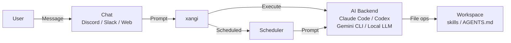

[日本語](README.md) | **English**

# xangi

> **A**I **N**EON **G**ENESIS **I**NTELLIGENCE

An AI assistant for Discord / Slack / browser / LINE, powered by Claude Code / Codex / Gemini CLI / Local LLM backends. Discord recommended; browser-only mode also supported.

## Features

- Multi-backend support (Claude Code / Codex / Gemini CLI / Local LLM)
- `/backend` command for dynamic per-channel backend/model/effort switching
- Local LLM support (Ollama/vLLM, etc., with agent mode / chat mode toggle)
- Discord / Slack / Web Chat UI / LINE support
- Docker support
- Skill system
- Scheduler (cron / one-shot / startup tasks)
- Session persistence

## Architecture



## Quick Start

### 1. Configure environment variables

```bash
cp .env.example .env
```

**Minimum required settings (.env):**
```bash
# Discord Bot Token (required)
DISCORD_TOKEN=your_discord_bot_token

# Allowed user ID (required, comma-separated for multiple, "*" for all)
DISCORD_ALLOWED_USER=123456789012345678
```

> 💡 The working directory defaults to `./workspace`. Set `WORKSPACE_PATH` to change it.

> 💡 See [Discord Setup](docs/en/discord-setup.md) for how to create a Bot and find IDs.

### 2. Build & Run

```bash
# Requires Node.js 22+ and at least one AI CLI
# Claude Code: curl -fsSL https://claude.ai/install.sh | bash
# Codex CLI:   npm install -g @openai/codex
# Gemini CLI:  npm install -g @google/gemini-cli
# Local LLM:   Install Ollama (https://ollama.com)

npm install
npm run build
npm start

# Development
npm run dev
```

### 3. Verify

Mention the bot in Discord to start a conversation.

### Browser-only (no Discord/Slack)

If you don't want to set up tokens or just want to use it via a local browser, the Web Chat UI can run standalone.

Add to `.env`:

```bash
WEB_CHAT_ENABLED=true
```

```bash
npm start
```

Open `http://localhost:18888` in your browser.

> 💡 The Web Chat UI is opt-in (`WEB_CHAT_ENABLED=true`) to avoid surprise port conflicts. Change the port with `WEB_CHAT_PORT`.
> 💡 See [Slack Setup](docs/en/slack-setup.md) for Slack integration.

### Auto-restart (pm2)

xangi supports `/restart` command. A process manager is required for auto-recovery.

```bash
npm install -g pm2
pm2 start "npm start" --name xangi
pm2 restart xangi  # Manual restart
pm2 logs xangi     # View logs
```

## Usage

### Basics
- `@xangi your question` - Mention to interact
- No mention needed in dedicated channels

### Commands

| Command | Description |
|---------|-------------|
| `/new` | Start a new session |
| `/stop` | Stop running task |
| `/settings` | Show current settings |
| `xangi-cmd schedule_*` | Scheduler (cron / reminders) |
| `xangi-cmd discord_*` | Discord operations (history / send / search, etc.) |

Response messages include buttons (Stop / New Session). Set `DISCORD_SHOW_BUTTONS=false` to hide.

See [Usage Guide](docs/usage.md) for details.

## Running with Docker

Docker containers are available for isolated execution.

```bash
# Claude Code backend
docker compose up xangi -d --build

# Local LLM backend (Ollama)
docker compose up xangi-max -d --build

# GPU version (CUDA + Python + PyTorch)
docker compose up xangi-gpu -d --build
```

See [Usage Guide: Docker](docs/usage.md#docker実行) for details.

## Environment Variables

### Required (when using Discord)

| Variable | Description |
|----------|-------------|
| `DISCORD_TOKEN` | Discord Bot Token |
| `DISCORD_ALLOWED_USER` | Allowed user IDs (comma-separated, `*` for all) |

For browser-only operation, just set `WEB_CHAT_ENABLED=true` (no Discord token required).

See [Usage Guide](docs/en/usage.md#environment-variables) for all environment variables.

## Workspace

Recommended workspace: [ai-assistant-workspace](https://github.com/karaage0703/ai-assistant-workspace)

A starter kit with pre-configured skills (note-taking, diary, transcription, Notion integration, etc.). Combine with xangi to automate daily tasks from chat.

## Book

📖 [生活に溶け込むAI — Build Your Own AI Assistant with AI Agents](https://karaage0703.booth.pm/items/8027277) (Japanese)

A book about building AI assistants with xangi.

## Documentation

- [Usage Guide](docs/en/usage.md) - Docker, env vars, Local LLM, troubleshooting
- [Discord Setup](docs/en/discord-setup.md) - Bot creation & ID lookup
- [Slack Setup](docs/en/slack-setup.md) - Slack integration
- [LINE Setup](docs/en/line-setup.md) - LINE Messaging API integration (incl. Tailscale Funnel for public webhook)
- [Design Document](docs/en/design.md) - Architecture, design philosophy, data flow

## Acknowledgments

xangi's concept is inspired by [OpenClaw](https://github.com/openclaw/openclaw).

## License

MIT
