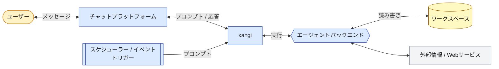

**日本語** | [English](README.en.md)

# xangi

> **A**GENTIC **N**EON **G**ENESIS **I**NTELLIGENCE

Claude Code / Codex / Cursor CLI / Grok CLI / Antigravity CLI / Local LLMをバックエンドに、Discord / Slack / Telegram / ブラウザ / LINE から利用できる AI アシスタント。Discord 推奨、ブラウザ単独でも動作可。

## Features

- Discord / Slack / Telegram / Web Chat UI / LINE 対応
- Claude Code / Codex / Cursor CLI / Grok CLI / Antigravity CLI / Local LLM 対応
- `/backend` でチャンネルごとに backend / model / effort を切り替え
- スキル、スケジューラー、イベントトリガー
- Docker、pm2、supervisorによる自動復帰対応
- セッション永続化、タイムアウト延長、ワークスペース hooks

## アーキテクチャ



## Quickstart

macOS、Linux、WSL2で共通です。最初に利用するAIツールを1つ準備し、xangiをインストールします。

```bash
# 例: Codexを準備（claude-code / cursor / grok / antigravityも選択可能）
bash <(curl -fsSL https://github.com/karaage0703/xangi/releases/latest/download/setup-ai-tools.sh) codex

# xangi本体をインストール
curl -fsSL https://github.com/karaage0703/xangi/releases/latest/download/install.sh | bash
```

インストール後、通常のTerminalを開いて次を実行します。

```bash
xangi setup
```

`xangi setup`を案内するAIがworkspaceとWeb Chatの公開範囲を確認し、OSサービスの登録・起動と`xangi doctor`による診断まで進めます。`xangi install`や`xangi doctor`を続けて手動実行する必要はありません。OSログイン・再起動後も自動起動するかは別途質問され、希望した場合だけ有効になります。後から変更する場合は次を実行します。

```bash
xangi service autostart enable
xangi service autostart disable
```

状態を後から確認したい場合は`xangi doctor`を実行してください。

## ユーザー向け詳細

### 1. AIコーディングツールのセットアップ

xangiのAIガイドには、Codex、Claude Code、Cursor Agent、Grok Build、Antigravityのいずれかを使います。専用スクリプトはxangiと独立しており、AIツールだけをセットアップしたい場合にも使えます。

```bash
bash <(curl -fsSL https://github.com/karaage0703/xangi/releases/latest/download/setup-ai-tools.sh) codex
```

最後の引数は`codex`、`claude-code`、`cursor`、`grok`、`antigravity`から選びます。インストール・認証状態だけを確認する場合は最後の引数を`check`にします。スクリプトは未導入の場合だけ各提供元の公式手順でインストールし、対話型の認証を開始します。Codexを選んだ場合はNode.jsとnpmが必要で、不足していれば導入先を表示して停止します。

### 2. xangiのインストール

macOS、Linux、WSL2のどれでも、同じコマンドをTerminalへ貼り付けます。

```bash
curl -fsSL https://github.com/karaage0703/xangi/releases/latest/download/install.sh | bash
```

OSとCPUを自動判定してxangiを配置し、`~/.local/bin/xangi`を作成します。`curl ... | bash`のpipe内ではAIの対話UIを起動せず、インストール完了後に通常のTerminalから`xangi setup`を実行するよう案内します。これはshellのpipeからCodexなどのTUIへ端末を引き継ぐ際のplatform差を避けるためです。どのディレクトリで実行しても構いません。`~/.local/bin`がPATHに無い場合は、installerが現在のshell用の`export PATH=...`とzshへの永続設定方法を表示します。

### 最短の流れと、途中で止まった時のコマンド

上のinstallerが完了したら、通常のTerminalから`xangi setup`を実行します。配布スクリプトはxangi本体を配置済みで、setupを案内するAIが必要に応じて`xangi install`でOSサービスを登録・起動します。自動起動は別機能であり、setup中に希望を確認し、明示的に希望した場合だけ有効化します。最後に`doctor`で確認します。

```text
AIツールを準備 → xangiをインストール → setup → サービス起動 → doctor
```

途中で止まった場合は、次の該当箇所から再開できます。通常は`xangi setup`だけを手動で実行すれば、セットアップを案内するAIがサービス起動と診断まで続けます。

1. `xangi setup`
   - workspace、利用するAI、Web Chatのアクセス範囲を対話形式で保存します。
   - Web Chatは「この端末のみ」が既定です。Tailscaleを選ぶとloopbackを維持したままTailscale ServeでTailnet内だけへ公開します。LAN公開は認証がない旨を警告してから有効化します。
   - AIツールの導入・認証待ちや、質問の途中で止まった場合はここから再開します。
2. `xangi install`
   - managed版のOSサービスを登録し、現在のセッションで起動します。OSログイン・再起動後の自動起動は登録しません。
   - 通常は`xangi setup`で起動したAIが自動実行します。設定は完了したがサービス起動だけ失敗した場合に、手動で再実行できます。
3. `xangi doctor`
   - サービス、Web Chat、workspaceの設定と実際の動作をまとめて診断します。
   - どこで止まったか分からない場合は、まずこれを実行してください。

### 起動して使う

セットアップ完了後はxangiが常駐しているため、追加の起動コマンドは不要です。

- ブラウザ: この端末のみなら`http://127.0.0.1:18888`を開く。Tailscaleを選んだ場合は`http://<Tailscale IP>:18888`を開く
- Discordなど: セットアップしたbotへ話しかける
- 状態確認: `xangi doctor`

installer後も現在のshellで`xangi`が見つからない場合は、最後に表示された`export PATH=...`を実行するか、Launcherの絶対pathを使ってください。

### 1台に複数のxangiを入れる場合

Gitを使わないmanaged版は、現在1つのOS userにつき1 instanceです。同じuserでもう一度install commandを実行すると、2個目を作らず既存のxangiを更新・再設定します。別のMac・PC、または同じPCの別OS userなら、それぞれのhome directoryへ完全に分かれるため、同じinstall commandを実行できます。

同じOS userで複数instanceを動かすnamed instance機能は未対応です。現時点ではOS userを分けてください。後半にある複数clone / PM2 / Dockerの説明はsource checkout開発者向けで、Gitなしmanaged版の手順ではありません。

### トークン設定

セットアップ中にDiscord、Slack、LINE、Telegram、Notionのトークンが必要になったら、次の1コマンドでローカル設定画面を開きます。

```bash
xangi settings
```

値はAIとの会話やshell historyへ渡さず、OS別の専用secret領域へmode 0600で保存します。設定画面は`127.0.0.1`だけで一時的に開き、保存済みの値をブラウザへ返さず、保存後に終了します。

### 設定と更新

```bash
xangi settings
xangi setup
xangi doctor
xangi update
xangi service start
xangi service stop
xangi service restart
xangi service status
xangi service autostart enable
xangi service autostart disable
xangi uninstall
xangi notion-sync enable
```

`start|stop|restart|status`と`autostart enable|disable`はmanaged版とcheckout版で共通です。`autostart enable`だけがOSログイン・再起動後の自動起動を登録し、`autostart disable`で解除します。解除しても現在動いているxangiは停止しません。`install`や`service start`だけでは自動起動を有効化しません。

Notion同期は`xangi settings`でtokenと同期先の親ページを保存してから有効にします。詳しい使い方、更新の仕組み、OS別の保存先は[使い方ガイド](docs/usage.md)を参照してください。

managed版を削除する場合は`xangi uninstall`を実行します。常駐service、定期update、xangi本体だけを削除し、workspace、設定、token、履歴は残すため、同じinstall commandですぐ再インストールできます。設定や履歴も削除する完全resetは`xangi uninstall --purge --yes`です。どちらもworkspaceは削除しません。

## 開発者・上級者向け

ここから下は、Gitでcloneしてxangi自体を開発する人向けです。xangiのsource buildにはNode.js 22+とnpmが必要です。通常利用者は実行する必要がありません。

### 1. 環境変数設定

```bash
cp .env.example .env
```

**最低限の設定（.env）:**

```bash
# Discord Bot Token（必須）
DISCORD_TOKEN=your_discord_bot_token

# 許可ユーザーID（必須、カンマ区切りで複数可、"*"で全員許可）
DISCORD_ALLOWED_USER=123456789012345678
```

> 💡 作業ディレクトリはデフォルトで `./workspace` を使用。変更する場合は `WORKSPACE_PATH` を設定。

> 💡 Discord Bot の作成方法・ID の調べ方は [Discord セットアップ](docs/discord-setup.md) を参照。

### 2. ビルド・起動

```bash
# Node.js 22+ と使用するAI CLIが必要
# Claude Code: curl -fsSL https://claude.ai/install.sh | bash
# Codex CLI:   npm install -g @openai/codex
# Cursor CLI:  curl https://cursor.com/install -fsS | bash
# Grok CLI:    curl -fsSL https://x.ai/cli/install.sh | bash
# Antigravity CLI: curl -fsSL https://antigravity.google/cli/install.sh | bash
# Local LLM:   Ollama (https://ollama.com) をインストール

npm ci
npm run build
npm start

# 開発時
npm run dev
```

### 3. 動作確認

Discord で bot にメンションして話しかけてください。

### Discord/Slack の代わりにブラウザで使う

トークンを用意したくない・LAN 内のブラウザだけで使いたい場合は、Web Chat UI 単独でも起動できます。

`.env` に以下を追加：

```bash
WEB_CHAT_ENABLED=true
```

```bash
npm start
```

ブラウザで `http://localhost:18888` にアクセスして会話を開始。
セッション監視だけを見たい場合は `http://localhost:18888/monitor` を開くと、Web / Discord / Slack の実行状態を読み取り専用で一覧できます。

> 💡 ポート競合を避けるため Web Chat UI は明示的に `WEB_CHAT_ENABLED=true` した時だけ起動します。ポート変更は `WEB_CHAT_PORT` で。
> 💡 Slack を使う場合は [Slack セットアップ](docs/slack-setup.md) を参照。
> 💡 Telegram を使う場合は [Telegram セットアップ](docs/telegram-setup.md) を参照。

### ライフサイクル管理（pm2）

xangi は clone 内の `./bin/xangi service` で外側の supervisor を操作します。`/restart` コマンドは、起動中の xangi 自身に graceful shutdown を要求する低レベル操作です。自動復帰にはプロセスマネージャが必要です。

```bash
npm install -g pm2
./bin/xangi service start
./bin/xangi service status
./bin/xangi service restart
./bin/xangi service stop
```

OS 再起動後も自動起動したい場合は、対象 clone で一度だけ以下を実行します。

```bash
./bin/xangi service start
./bin/xangi service autostart enable
```

自動起動を解除する場合は`./bin/xangi service autostart disable`を実行します。有効化では`pm2 save`と`pm2 startup`、解除では`pm2 unstartup`を実行します。PM2が`sudo ...`コマンドを表示した場合は、そのコマンドを一度だけ実行してください。

複数 clone を運用する場合は、それぞれのディレクトリで `./bin/xangi` を実行します。PATH から使いたい場合は、単一の `xangi` symlink ではなく `xangi-dev` / `xangi-prod` のような名前付き symlink を作ると対象 clone が明確になります。

```bash
ln -sf /home/user/xangi-dev/bin/xangi ~/.local/bin/xangi-dev
ln -sf /home/user/xangi-prod/bin/xangi ~/.local/bin/xangi-prod

xangi-dev service status
xangi-prod service restart
```

`ecosystem.config.cjs` は PM2 のアプリ定義ファイルです。`.env` の `XANGI_PROCESS_NAME`（未指定時は `XANGI_INSTANCE_ID` → ディレクトリ名）を PM2 のプロセス名に使い、実行ファイル、`node --env-file=.env` などをまとめて定義します。`./bin/xangi service start` はこの設定を使って PM2 に起動を依頼します。`.cjs` にしているのは、このパッケージが ESM (`"type": "module"`) でも PM2 設定を CommonJS (`module.exports`) として確実に読ませるためです。

## 使い方

### 基本

- `@xangi 質問内容` - メンションで反応
- 専用チャンネル設定時はメンション不要

### 主なコマンド

| コマンド                   | 説明                                                     |
| -------------------------- | -------------------------------------------------------- |
| `/new`                     | 新しいセッションを開始                                   |
| `/stop`                    | 実行中のタスクを停止                                     |
| `/settings`                | 現在の設定を表示                                         |
| `/notify`                  | チャンネルごとの完了通知を切り替え                       |
| `/backend`                 | チャンネルごとのバックエンド・モデル切り替え             |
| `xangi sessions/chat/send` | 端末から xangi Web セッションに接続                      |
| `xangi-cmd schedule_*`     | スケジューラー（定期実行・リマインダー）                 |
| `xangi-cmd discord_*`      | Discord操作（履歴取得・メッセージ送信・検索等）          |
| `xangi-cmd trigger`        | イベントトリガー（処理完了時にエージェントターンを起動） |

応答メッセージにはボタン（Stop / New Session）が表示されます。Discord / Slack / Web Chatでは返信候補を折りたたんで表示し、選択すると同じセッションへ送信します。Discord / Slackは押した本人だけに候補を表示します。Discordスレッド内では、完了後に押した本人を退出させる `Leave` ボタンも表示します（Botに「スレッドの管理」権限が必要）。返信候補はDiscordの `/replysuggestions mode:on|off|show|default` で全体切替でき、OFF時は候補生成指示をAIへ送らないため追加トークンを消費しません。プラットフォーム別の起動時設定には環境変数を使います。
初回ターンではDiscord / Slack / Webの直近履歴を自動的に先読みします。`HISTORY_PREFETCH_ENABLED=false` で無効化、`HISTORY_PREFETCH_COUNT` で件数を変更できます。

詳細は [使い方ガイド](docs/usage.md) を参照してください。

## Docker で実行する場合

コンテナ隔離環境で実行したい場合は Docker も利用できます。

```bash
# Claude Code バックエンド
docker compose up xangi -d --build

# Local LLM バックエンド（Ollama）
docker compose up xangi-max -d --build

# GPU版（CUDA + Python + PyTorch）
docker compose up xangi-gpu -d --build
```

`docker-compose.yml` には `restart: unless-stopped` が設定されています。`docker compose stop` / `docker compose down` で明示停止しない限り、Docker daemon の起動時に xangi コンテナも自動復帰します。OS 再起動後も自動起動したい場合は、ホスト側で Docker daemon 自体の自動起動を有効にしてください。

詳細は [使い方ガイド: Docker実行](docs/usage.md#docker実行) を参照してください。

## 環境変数

### 必須（Discord 利用時）

| 変数                   | 説明                                                  |
| ---------------------- | ----------------------------------------------------- |
| `DISCORD_TOKEN`        | Discord Bot Token                                     |
| `DISCORD_ALLOWED_USER` | 許可ユーザーID（カンマ区切りで複数可、`*`で全員許可） |

ブラウザ単独で使う場合は `WEB_CHAT_ENABLED=true` のみで起動可能（トークン不要）。

全ての環境変数（オプション含む）は [使い方ガイド](docs/usage.md#環境変数一覧) を参照してください。

## ワークスペース

推奨ワークスペース: [ai-assistant-workspace](https://github.com/karaage0703/ai-assistant-workspace)

スキル（メモ管理・日記・音声文字起こし・Notion連携など）がプリセットされたスターターキットです。xangi と組み合わせることで、チャットからスキルを呼び出して日常タスクを自動化できます。

## 関連プロジェクト

### デバイス・ウェアラブル連携

- [xangi-stackchan](https://github.com/karaage0703/xangi-stackchan) - xangi の応答をスタックチャン（M5Stack）に喋らせる・表情/首振り連動させる常駐ブリッジ。[外部イベントストリーム](docs/events.md)の SSE を購読して動作
- [xangi-even-g2](https://github.com/karaage0703/xangi-even-g2) - Even Realities G2からxangiのセッションを操作し、音声入力・応答表示を行うEven Hubアプリ、bridge、ローカルWhisper STTサーバー

## 書籍

📖 [生活に溶け込むAI — AIエージェントで作る、自分だけのアシスタント](https://karaage0703.booth.pm/items/8027277)

xangi を使ったAIアシスタント構築のノウハウをまとめた書籍です。

## ドキュメント

- [使い方ガイド](docs/usage.md) - Docker実行・環境変数・Local LLM・複数インスタンスの運用・セッションの保持期間・トラブルシューティング
- [Discord セットアップ](docs/discord-setup.md) - Bot作成・ID確認方法
- [Slack セットアップ](docs/slack-setup.md) - Slack連携
- [Telegram セットアップ](docs/telegram-setup.md) - Telegram Bot連携
- [LINE セットアップ](docs/line-setup.md) - LINE Messaging API 連携 (Tailscale Funnel での外部公開含む)
- [設計ドキュメント](docs/design.md) - アーキテクチャ・設計思想・データフロー
- [外部イベントストリーム](docs/events.md) - 応答ライフサイクルのイベント配信仕様
- [インスタンス間チャット](docs/inter-instance-chat.md) - 複数インスタンス間のメッセージ交換・auto-talk

## Acknowledgments

xangi のコンセプトは [OpenClaw](https://github.com/openclaw/openclaw) に影響を受けています。

## License

MIT
