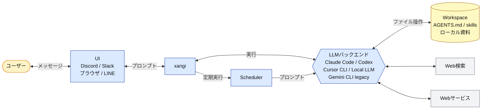

**日本語** | [English](README.en.md)

# xangi

> **A**I **N**EON **G**ENESIS **I**NTELLIGENCE

Claude Code / Codex / Cursor CLI / Local LLM（Gemini CLI は legacy/API-key 用）をバックエンドに、Discord / Slack / ブラウザ / LINE から利用できる AI アシスタント。Discord 推奨、ブラウザ単独でも動作可。

## Features

- Discord / Slack / Web Chat UI / LINE 対応
- Claude Code / Codex / Cursor CLI / Local LLM 対応
- `/backend` でチャンネルごとに backend / model / effort を切り替え
- スキル、スケジューラー、イベントトリガー
- Docker、pm2、自動再起動対応
- セッション永続化、タイムアウト延長、ワークスペース hooks

## アーキテクチャ



## Quick Start

### 1. 環境変数設定

```bash
cp .env.example .env
```

**最低限の設定（.env）:**
```bash
# Discord Bot Token（必須）
DISCORD_TOKEN=your_discord_bot_token

# 許可ユーザーID（必須、カンマ区切りで複数可、"*"で全員許可）
DISCORD_ALLOWED_USER=123456789012345678
```

> 💡 作業ディレクトリはデフォルトで `./workspace` を使用。変更する場合は `WORKSPACE_PATH` を設定。

> 💡 Discord Bot の作成方法・ID の調べ方は [Discord セットアップ](docs/discord-setup.md) を参照。

### 2. ビルド・起動

```bash
# Node.js 22+ と使用するAI CLIが必要
# Claude Code: curl -fsSL https://claude.ai/install.sh | bash
# Codex CLI:   npm install -g @openai/codex
# Gemini CLI (legacy/API-key): npm install -g @google/gemini-cli
# Cursor CLI:  curl https://cursor.com/install -fsS | bash
# Local LLM:   Ollama (https://ollama.com) をインストール

npm install
npm run build
npm start

# 開発時
npm run dev
```

Gemini CLI backend は legacy/API-key 用です。新規セットアップでは Claude Code / Codex / Cursor CLI / Local LLM を推奨します。

### 3. 動作確認

Discord で bot にメンションして話しかけてください。

### Discord/Slack の代わりにブラウザで使う

トークンを用意したくない・LAN 内のブラウザだけで使いたい場合は、Web Chat UI 単独でも起動できます。

`.env` に以下を追加：

```bash
WEB_CHAT_ENABLED=true
```

```bash
npm start
```

ブラウザで `http://localhost:18888` にアクセスして会話を開始。

> 💡 ポート競合を避けるため Web Chat UI は明示的に `WEB_CHAT_ENABLED=true` した時だけ起動します。ポート変更は `WEB_CHAT_PORT` で。
> 💡 Slack を使う場合は [Slack セットアップ](docs/slack-setup.md) を参照。

### 自動再起動（pm2）

xangi は `/restart` コマンドで再起動できます。自動復帰にはプロセスマネージャが必要です。

```bash
npm install -g pm2
pm2 start "npm start" --name xangi
pm2 restart xangi  # 手動再起動
pm2 logs xangi     # ログ確認
```

## 使い方

### 基本
- `@xangi 質問内容` - メンションで反応
- 専用チャンネル設定時はメンション不要

### 主なコマンド

| コマンド | 説明 |
|----------|------|
| `/new` | 新しいセッションを開始 |
| `/stop` | 実行中のタスクを停止 |
| `/settings` | 現在の設定を表示 |
| `/backend` | チャンネルごとのバックエンド・モデル切り替え |
| `xangi-cmd schedule_*` | スケジューラー（定期実行・リマインダー） |
| `xangi-cmd discord_*` | Discord操作（履歴取得・メッセージ送信・検索等） |
| `xangi-cmd trigger` | イベントトリガー（処理完了時にエージェントターンを起動） |

応答メッセージにはボタン（Stop / New Session）が表示されます。`DISCORD_SHOW_BUTTONS=false` で非表示。

詳細は [使い方ガイド](docs/usage.md) を参照してください。

## Docker で実行する場合

コンテナ隔離環境で実行したい場合は Docker も利用できます。

```bash
# Claude Code バックエンド
docker compose up xangi -d --build

# Local LLM バックエンド（Ollama）
docker compose up xangi-max -d --build

# GPU版（CUDA + Python + PyTorch）
docker compose up xangi-gpu -d --build
```

詳細は [使い方ガイド: Docker実行](docs/usage.md#docker実行) を参照してください。

## 環境変数

### 必須（Discord 利用時）

| 変数 | 説明 |
|------|------|
| `DISCORD_TOKEN` | Discord Bot Token |
| `DISCORD_ALLOWED_USER` | 許可ユーザーID（カンマ区切りで複数可、`*`で全員許可） |

ブラウザ単独で使う場合は `WEB_CHAT_ENABLED=true` のみで起動可能（トークン不要）。

全ての環境変数（オプション含む）は [使い方ガイド](docs/usage.md#環境変数一覧) を参照してください。

## ワークスペース

推奨ワークスペース: [ai-assistant-workspace](https://github.com/karaage0703/ai-assistant-workspace)

スキル（メモ管理・日記・音声文字起こし・Notion連携など）がプリセットされたスターターキットです。xangi と組み合わせることで、チャットからスキルを呼び出して日常タスクを自動化できます。

## 関連プロジェクト

- [xangi-stackchan](https://github.com/karaage0703/xangi-stackchan) - xangi の応答をスタックチャン（M5Stack）に喋らせる・表情/首振り連動させる常駐ブリッジ。[外部イベントストリーム](docs/events.md)の SSE を購読して動作

## 書籍

📖 [生活に溶け込むAI — AIエージェントで作る、自分だけのアシスタント](https://karaage0703.booth.pm/items/8027277)

xangi を使ったAIアシスタント構築のノウハウをまとめた書籍です。

## ドキュメント

- [使い方ガイド](docs/usage.md) - Docker実行・環境変数・Local LLM・複数インスタンスの運用・セッションの保持期間・トラブルシューティング
- [Discord セットアップ](docs/discord-setup.md) - Bot作成・ID確認方法
- [Slack セットアップ](docs/slack-setup.md) - Slack連携
- [LINE セットアップ](docs/line-setup.md) - LINE Messaging API 連携 (Tailscale Funnel での外部公開含む)
- [設計ドキュメント](docs/design.md) - アーキテクチャ・設計思想・データフロー
- [外部イベントストリーム](docs/events.md) - 応答ライフサイクルのイベント配信仕様
- [インスタンス間チャット](docs/inter-instance-chat.md) - 複数インスタンス間のメッセージ交換・auto-talk

## Acknowledgments

xangi のコンセプトは [OpenClaw](https://github.com/openclaw/openclaw) に影響を受けています。

## License

MIT
