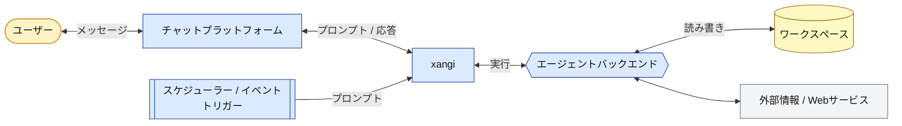

# 設計ドキュメント

xangiのアーキテクチャと設計思想について説明します。

## 概要

xangiは「AI CLI（Claude Code / Codex CLI / Cursor CLI / Grok CLI / Antigravity CLI）やローカルLLM（Ollama等）をチャットプラットフォームから使えるようにするラッパー」です。

```
User → Chat (Discord/Slack) → xangi → AI CLI → Workspace
```

## アーキテクチャ



### レイヤー構成

| レイヤー           | 役割                            | 実装                                                                                     |
| ------------------ | ------------------------------- | ---------------------------------------------------------------------------------------- |
| Chat               | ユーザーインターフェース        | discord.js, @slack/bolt, http (Web Chat), @line/bot-sdk                                  |
| xangi              | AI CLI / Local LLM の統合・制御 | runner-manager.ts, dynamic-runner.ts, agent-runner.ts                                    |
| Backend Resolution | チャンネル別バックエンド解決    | backend-resolver.ts, settings.ts                                                         |
| AI Backend         | 実際のAI処理                    | Claude Code, Codex CLI, Cursor CLI, Grok CLI, Antigravity CLI, Local LLM (Ollama / vLLM) |
| Workspace          | ファイル・スキル                | skills/, AGENTS.md, ローカル資料                                                         |

## コンポーネント

### エントリーポイント（index.ts）

起動シーケンス専用の薄いエントリーポイント。担当は以下のみで、各機能の実体は個別モジュールに分離されている:

- 設定読み込みと検証（`config.ts` / `config-validate.ts`）
- 有効化されたクライアントの起動分岐（Discord / Slack / Web Chat / LINE / Telegram。Web オンリー構成では Discord Client を生成しない）
- スケジューラー・各種 HTTP サーバー（tool-server / events-stream / event-trigger / approval-server 等）の起動
- SIGTERM/SIGINT ハンドリング（`stream-finalizer.ts` の確定処理を含む graceful shutdown）

### Discord 統合（src/discord/）

`discord.js` v14 ベース。役割別にモジュール分割されている:

- `message-handler.ts` — MessageCreate/Update/Delete のハンドリングと `processPrompt`（メンション / DM / `settings.json` の `discordAutoReplyChannels` 判定 → Runner 転送。Discord system message は処理対象外）
- `slash-commands.ts` — スラッシュコマンド定義と Interaction 処理
- `scheduler-bridge.ts` — スケジューラの Discord 送信関数・エージェント実行関数の登録。schedule / trigger 起点の処理中メッセージも `ui.ts` の処理中メッセージ管理に登録し、Stop / 延長 / 残り時間表示を通常メッセージ経路と揃える
- `ui.ts` — ボタン行（Stop / 延長 / 残り時間表示）・処理中メッセージ管理
- `tool-history.ts` — ツール履歴の整形・蓄積（`TOOL_HISTORY_MAX_LINES` で表示行数を制限）
- `message-utils.ts` — Discord メッセージリンク展開・返信元引用・スレッド元引用・チャンネルメンション展開

挙動:

- per-channel / per-thread セッション分離（`contextKey = discord:<channelId>`。スレッド返信モードで新規スレッドを作成できた場合は `discord:<threadId>`）
- Discord API 投稿先は親チャンネルまたは作成済みスレッド、runner / timeout / Stop / processing 管理は確定済みの `runKey = contextKey` で分離し、同じDiscordチャンネル内の別スレッドを別実行単位として扱う
- Discord スレッド内の per-channel 設定解決は親チャンネルIDを使う。`CHANNEL_OVERRIDES`（`/backend` / `/llmmode`）、`settings.json`（`/autoreply` / `/notify` / `/threadmode`）、チャンネル topic 注入は親チャンネル設定を継承する
- 既存スレッド内の発言では、Discord の starter message（親チャンネル側の元メッセージ）を `🧵 スレッド元` としてプロンプトに注入し、スレッド履歴だけでは見えない最初の話題にフォーカスする
- スレッド・添付ファイル・リアクション対応
- ストリーミング表示は `stream-session.ts`（Slack / Web と共通コア）で思考表示・更新スロットリングを統一し、ボタン UI を `message.edit` で 1 秒粒度に更新
- プロセス終了時（SIGTERM）は `stream-finalizer.ts` が実行中のストリーミング表示を「⏸ プロセス再起動により中断されました」へ確定させる（message-handler / scheduler-bridge 両経路で登録）

### Slack 統合（slack.ts）

`@slack/bolt` ベース。

- `app_mention` / DM をハンドリング、スレッド単位で session 分離（`contextKey = <channelId>:<threadTs>`）
- `message` event は通常メッセージ、人間の `/me` 投稿 (`me_message`)、添付付きの `file_share` を処理し、チャンネル名変更などその他の `subtype` 付き Slack システム通知は無視する
- メンションで開始した active thread 内では、後続メッセージをメンション無しで処理する。対象外チャンネルの無関係なスレッド返信は拾わない
- Slack API 投稿先は `channelId`、runner / timeout / Stop / processing 管理は `runKey = contextKey` で分離し、同じSlackチャンネル内の別スレッドを別実行単位として扱う
- 同一 `runKey` の実行中は二重起動を抑止し、Slack の `app_mention` と `message` の重複配送は message ts de-dupe と bot mention skip で一本化する
- 実行中は `tool-history.ts` の整形済みツール履歴を表示し、完了後は通常本文に混ぜず `Tools` ボタンから押した本人だけへ表示する
- スラッシュコマンドとリアクション対応
- `chat.update` でメッセージ末尾に Stop / 延長 / 残り時間ボタン行を 1 秒粒度で差し替え
- スレッド返信しないターンでは、一定時間以上かかった完了時に `✅ 完了しました（...）` の別メッセージを投稿して視認性を補う

### Web Chat（web-chat.ts）

`http.createServer` ベースの軽量サーバー（Express 依存なし）。

- ペイン単位でセッション分離（`contextKey = web:<paneId>`）、`WEB_CHAT_PORT` で公開
- SSE で streaming response + timeout イベント (`timeout-started/extended/cleared`) をフロントへ push
- フロントエンドの tick で残り時間表示を毎秒更新（追加 API 呼び出しなし）
- ファイル添付・ダウンロードは `WEB_CHAT_UPLOAD_ACCEPT` / `WEB_CHAT_DOWNLOAD_ACCEPT` で許可拡張子を制御
- `GET /api/sessions` はセッション一覧に `activity` を含める。`activity-store.ts` が現在ターンの状態、要約、直近ツール行、経過秒をプロセスメモリで保持する
- `/monitor` は読み取り専用のセッション監視ページ。Web Chat と同じ `/api/sessions` を 2 秒ポーリングし、実行中セッションを上に並べる。スマホ・Even G2 からの閲覧を想定して行高と文字サイズを大きめにしている

### LINE Bot 統合（line.ts）

LINE Messaging API 経由の 1:1 chat に対応。設計方針:

- `http.createServer` ベース（`web-chat.ts` と同じ並びで Express 依存を避ける）
- `@line/bot-sdk` の `validateSignature` で raw body + `X-Line-Signature` を HMAC-SHA256 検証
- text message を `runWithBubbleEvents` 経由で Runner に渡し、結果を `LineBotClient.replyMessage` で返信
- per-userId セッション分離 (`contextKey = line:<userId>`)
- `LINE_ALLOWED_USER` ホワイトリスト（`*` で全許可、空ならエラーで起動拒否）
- ack を先に返す（LINE は 30 秒以内に HTTP 200 を期待、本処理は非同期で続行）

#### 応答性の二段防御（loading animation + reply→push 自動切替）

LINE は Slack のスレッドや Discord の New ボタンに相当する明示 UI 境界が無く、reply token も 60s で失効する。長い思考時間や Local LLM の tool ループで返信が遅れると「無視された」体験になりやすいので、2 段の防御を入れる:

1. **即時 ACK — Loading animation API**: `handleEvent` の allowlist 通過直後（Runner 起動前）に LINE 公式 `POST /v2/bot/chat/loading/start` を `client.showLoadingAnimation({ chatId, loadingSeconds })` で叩き、トーク画面に「入力中…」を出す。Bot から本回答を送った時点で自動消滅。失敗しても致命的でないので `console.warn` のみ。1:1 DM のみ機能 (グループは LINE 側で無視)。秒数は `LINE_LOADING_ANIMATION_SECONDS` (default 60、`snapLoadingSeconds` で 5/10/15/20/25/30/40/50/60 にスナップ)。`LINE_LOADING_ANIMATION_ENABLED=false` で無効化可能。

2. **Reply→Push 自動切替 — Slow response fallback**: `LINE_SLOW_RESPONSE_THRESHOLD_MS` (default 45000ms) で `setTimeout` を仕掛け、閾値を超えたら reply token を「🤔 ちょっと待ってね、考えてる…」テンプレに使って消費する (`slowFiredRef` フラグを立てる)。Runner 完走後は `slowFiredRef.value` と elapsed を見て送信経路を決定:
   - `slowFiredRef.value === true` → reply token 消費済なので Push API 必須
   - `slowFiredRef.value === false` かつ `elapsed < threshold` → reply token がまだ生きてる → reply
   - それ以外 → 安全側で Push にフォールバック

   reply 失敗時はさらに push にリトライ (両方失敗したら諦め、`console.error`)。`LINE_SLOW_RESPONSE_ENABLED=false` で無効化可能だが、60s 超応答は完全に失われるので推奨しない。

   Push API は個人 OA で月 200 通無料、超過後は従量課金。Local LLM 運用で多発するなら閾値を見直すか推論バックエンドを高速化する。

#### Session 境界 (idle reset + reset コマンド)

LINE には Slack の「スレッド」や Discord の「New ボタン」のような明示的な session 境界 UI が存在しないため、xangi は時間ベース + コマンドベースの 2 段で session を切り替える:

1. **Reset コマンド検出**: `handleEvent` で allowlist 通過直後、Loading animation や Runner 起動より前に `isResetCommand(text, patterns)` で完全一致判定 (大文字小文字無視 + 前後空白 strip)。一致したら `archiveSession()` + `ensureSession()` で新規発番、`replyMessage` で「最初からお話するね！何かあった？」を即返して return (Runner 起動なし)。default パターンは曖昧さの無い slash 形式 3 つ (`/reset` `/new` `/clear`) に絞る。メイン境界は idle reset (時間ベース)、コマンドは明示リセット用の保険という位置付け。日本語自然言語パターンは「リセットってどういう意味？」「最初からお話したい」等との誤発火境界が曖昧なため default から外し、必要なら `LINE_RESET_TEXT_PATTERNS` CSV で個別追加できる設計。
2. **Idle session reset**: reset コマンドでない通常メッセージで、現 session の `updatedAt` から `LINE_IDLE_RESET_HOURS` (default 4h) 以上経過していたら `hasSessionGoneIdle()` で true → `archiveSession()` してから `ensureSession()` で新規発番。子どもの会話は学校・就寝・食事クラスタで自然に分かれるので 4h で切ると良い境界になる。`logs/sessions/*.jsonl` は archive 後も残るので過去履歴は失われない。

両機能とも `LINE_IDLE_RESET_ENABLED=false` / `LINE_RESET_TEXT_PATTERNS=` で個別に無効化可能。Rich Menu のボタン bind と組み合わせると、「最初から話す」ボタン押下→reset テキスト送信→reset コマンド検出経路でハンドリング、という統合になる。

公開エンドポイントは Tailscale Funnel / Cloudflare Tunnel 等で別立て。詳細は [`docs/line-setup.md`](line-setup.md)。

### Telegram Bot 統合（telegram.ts）

Telegram Bot API 経由の対話に対応。設計方針:

- `grammy` ライブラリを使用。webhook と long polling の両方の起動モードに対応（初期実装は long polling がデフォルト）。
- テキストメッセージ（`message:text`）を監視し、DMおよび許可されたグループチャットのみを処理対象とする。
- 許可ユーザーID（`TELEGRAM_ALLOWED_USER`）および許可Bot ID（`TELEGRAM_ALLOWED_BOTS`）の allowlist 検証を行う。
- グループチャットでは、Botへのメンション、返信、または `TELEGRAM_AUTO_REPLY_CHATS` でのメッセージ検知で応答を開始。
- メンション `@xangi_bot` を自動除去したテキストを Runner へ引き渡す。
- 許可Botからの連続応答回数を制限する無限ループ防止策（`TELEGRAM_ALLOWED_BOTS_MAX_CONSECUTIVE`）を導入。
- `StreamSession` に基づき、処理中メッセージを 1 秒間隔で `editMessageText` 更新するストリーミング表示に対応。
- 最終回答が Telegram の文字数制限（4096文字）を超える場合は、`splitMessage` を用いて分割送信。
- セッションリセットコマンド（`/reset`, `/new`, `/clear`）、タスク停止（`/stop`）、ヘルプ表示（`/help`）に対応。

### エージェントランナー（agent-runner.ts）

AI CLIを抽象化するインターフェース：

```typescript
interface AgentRunner {
  run(prompt: string, options?: RunOptions): Promise<RunResult>;
  runStream(prompt: string, callbacks: StreamCallbacks, options?: RunOptions): Promise<RunResult>;
  cancel?(channelId?: string): boolean;
  destroy?(channelId: string): boolean;
  hasRunner?(channelId: string): boolean;
  /** UIに残り時間を表示するため、現在のリクエストのタイムアウト状態を返す */
  getTimeoutState?(channelId: string): TimeoutState;
  /** +5m ボタン押下時、現在のリクエストのタイムアウトを延長する */
  extendTimeout?(channelId: string, additionalMs: number): ExtendTimeoutResult;
}
```

すべての Runner 実装 (Claude Code / Codex / Cursor / Grok / Antigravity / Local LLM / Dynamic) は EventEmitter
でもあり、`timeout-started` / `timeout-extended` / `timeout-cleared` を emit して
上位 (web-chat の SSE / Discord bot / Slack bot) が UI 更新に利用する。

### Activity Store（activity-store.ts）

`runWithBubbleEvents` の共通ライフサイクルから、現在ターンの軽量スナップショットを更新する。

- `turn.started` 相当で `thinking`
- `onText` で `streaming`
- `onToolUse` で `tool` と直近ツール行
- `onComplete` / cancel / error で `complete` / `aborted` / `error`
- スナップショットはプロセスメモリのみ。再起動後は復元せず、`sessions.json` と transcript を汚さない
- `GET /api/sessions` と Even Terminal 互換 `GET /api/sessions?provider=...` が同じ activity を参照する

### タイムアウトコントローラー（timeout-controller.ts）

各 Runner が抱えるチャンネル別タイムアウト状態を一箇所に集約するヘルパー：

```typescript
class TimeoutController extends EventEmitter {
  start(channelId, onTimeout): void; // リクエスト開始 + emit 'timeout-started'
  clear(channelId, reason): void; // 完了 / エラー + emit 'timeout-cleared'
  extend(channelId, additionalMs): ExtendTimeoutResult; // 延長 + emit 'timeout-extended'
  getState(channelId): TimeoutState; // UI 表示用
  clearAll(reason): void; // shutdown 時に全 cleanup
}
```

- `start()` 時に `setTimeout(onTimeout, baseTimeoutMs)` をセット
- `extend()` で残り時間を再計算して `setTimeout` を貼り直し、`maxTimeoutAt` (リクエスト開始 + 1 時間) を超えるなら `max_timeout_exceeded` で拒否
- `onTimeout` 内で最新の AbortController / 子プロセスを引いて kill する設計にすることで、retry で実体が差し替わってもタイムアウト発火が動く

### 動的ランナーマネージャー（dynamic-runner.ts）

チャンネルごとにバックエンド・モデル・effortを動的に切り替えるラッパー：

```
メッセージ受信
  → BackendResolver.resolve(channelId)
  → { backend, model, effort } を取得
  → DynamicRunnerManager が適切なランナーにルーティング
  → 実行
```

BackendResolverの優先順位:

1. `/backend set` で設定されたchannelOverrides（メモリ上、`.env`のCHANNEL_OVERRIDESに永続化。Discord スレッドでは親チャンネルIDで解決）
2. `.env` のデフォルト（`AGENT_BACKEND`, `AGENT_MODEL`）

### システムプロンプト（base-runner.ts）

xangiがAI CLIに注入するシステムプロンプトを管理：

- **チャットプラットフォーム情報** — Discord/Slack経由の会話であることを伝える短い固定テキスト
- **XANGI_COMMANDS** — `src/prompts/` からプラットフォームに応じたコマンド仕様を注入
  - 共通コマンド（`xangi-commands-common.ts`）: タイムアウト対策等
  - チャットPF共通（`xangi-commands-chat-platform.ts`）: ファイル送信（MEDIA:）・セパレータ（===）・スケジュール・システムコマンド
  - Discord専用（`xangi-commands-discord.ts`）: `xangi-cmd discord_*` CLIツール・自動展開
  - Slack専用（`xangi-commands-slack.ts`）: Slack固有の操作
  - プラットフォーム自動判別: Discordのみ有効なら Discord専用コマンドだけ注入（トークン節約）
- **プラットフォーム識別** — 各メッセージに `[プラットフォーム: Discord]` or `[プラットフォーム: Slack]` を注入。AIが適切なコマンドを使い分け

#### Runtime context 注入（runtime-context.ts）

毎ターン、ユーザープロンプトの先頭に「いま観測されている cwd と git リポ情報」を 1 行で差し込む：

```
[runtime] cwd=/home/karaage/borot/tmp/xangi-stackchan-dev repo=xangi-stackchan-dev@feat/k151-step-b
```

- **目的**: Bash tool の cwd 持続はメッセージ受信を跨いで保証されないため、AI が借りリポと本体リポを取り違えて `git push` する事故を構造的に減らす
- **取得**: `process.cwd()`（同期）+ `git rev-parse --show-toplevel` / `git branch --show-current`（5 秒キャッシュ）
- **注入タイミング**: 全 backend の `run()` / `runStream()` 入口で `prependRuntimeContext()`。常駐プロセス（`persistent-runner.ts`）は `--append-system-prompt` が起動時固定なので user message 本文に注入する
- **無効化**: `XANGI_RUNTIME_CONTEXT_ENABLED=false`（既定 true）で注入をオフにできる。雑談中心のインスタンスや、cwd ブレが事故に繋がらない用途で
- **ツール呼び出し表示**: Discord のツール履歴表示は `DISCORD_TOOL_HISTORY_MODE=button|inline|off` で制御する。既定は `button` で、完了後の通常メッセージには履歴を混ぜず、`Tools` ボタン押下時に押した本人だけへ ephemeral で表示する。Slack も同じ `Tools` ボタン方式を使い、完了後の本文へツール履歴を直出ししない。`DISCORD_SHOW_TOOL_BUTTON=false` なら Discord の `button` モードでも `Tools` ボタンを出さない。`inline` は従来どおり本文上部に表示、`off` は完全非表示。互換設定として `DISCORD_SHOW_TOOL_USE=false` は `off`、`true` は `inline` として扱う。実行中は `DISCORD_SHOW_LIVE_TOOL_USE=false` で無効化しない限り、実コマンドが分かる raw 表示を出す。完了後は `workspace-RAG検索` などの短い履歴ラベルへ正規化し、Bash/exec は `/bin/bash -lc` などの wrapper を落として短縮表示する。実行中の Bash/exec ツール呼び出しの引数表示の最大長は 200 文字で、env `XANGI_TOOL_DISPLAY_MAX` で変更可。
- **返信候補**: Discord / Slack / Web Chat の通常会話では、同じAI応答の末尾に専用JSONブロックで返信候補を生成させ、表示前にブロックを除去する。Discord / Slackは通常メッセージに `返信候補` ボタンだけを置き、押した本人への ephemeral 応答で候補を表示する。Web Chatは回答下の折りたたみUIで表示する。選択文は同じセッションへユーザー入力として渡す。Discordの `/replysuggestions` は `settings.json` の全体overrideを更新し、各プラットフォームはメッセージ処理直前に参照する。OFF時は候補生成指示をプロンプトへ追加しない。タイトル・transcript表示では履歴先読みや候補生成の内部メタデータも除去する。

AGENTS.md / CHARACTER.md / USER.md 等のワークスペース設定は、各AI CLIの自動読み込み機能に委譲：

| CLI         | 自動読み込みファイル     | 注入方法                                                                                          |
| ----------- | ------------------------ | ------------------------------------------------------------------------------------------------- |
| Claude Code | `CLAUDE.md`              | `--append-system-prompt`（一回限り）                                                              |
| Codex CLI   | `AGENTS.md`              | `<system-context>` タグで埋め込み                                                                 |
| Cursor CLI  | `AGENTS.md`              | CLI側で自動読み込み（xangi側の注入なし）                                                          |
| Local LLM   | `AGENTS.md`, `MEMORY.md` | システムプロンプトに直接埋め込み（`CLAUDE.md` は通常 `AGENTS.md` のシンボリックリンクのため除外） |

### AI CLIアダプター

| ファイル             | 対応CLI             | 特徴                                                                            |
| -------------------- | ------------------- | ------------------------------------------------------------------------------- |
| claude-code.ts       | Claude Code         | ストリーミング対応、セッション管理                                              |
| persistent-runner.ts | Claude Code（常駐） | `--input-format=stream-json` で常駐プロセス化、キュー管理、サーキットブレーカー |
| codex-cli.ts         | Codex CLI           | OpenAI製、0.98.0対応、cancel対応                                                |
| cursor-cli.ts        | Cursor CLI          | `cursor-agent` コマンド、JSON/stream-json、tool call表示対応                    |
| grok-cli.ts          | Grok CLI            | xAI `grok` コマンド、json/streaming-json、tool call表示対応                     |
| antigravity-cli.ts   | Antigravity CLI     | Google `agy` コマンド、Agy 1.1.2最終JSONと旧版プレーン出力フォールバック        |
| local-llm/runner.ts  | Local LLM           | Ollama等のローカルLLMを直接呼び出し、ツール実行・ストリーミング対応             |

#### ワンショット CLI ランナー共通基盤（cli-runner-core.ts）

claude-code / codex-cli / cursor-cli / grok-cli / antigravity-cli の 5 アダプターは、抽象基底クラス
`CliRunnerBase` の上に実装されている。基底クラスが以下を一手に引き受け、各アダプターは
「コマンド引数の構築」と「JSONL イベントの解釈（`CliStreamParser`）」だけを実装する：

- **プロセス管理**: spawn、`processManager` / `activeProcesses` への登録・解除、`cancel` / `hasRunner`
- **タイムアウト**: `TimeoutController` 連動（UI の残り時間表示・延長）。channelId が無い
  リクエストは controller の管理対象外になるため、固定タイマーでフォールバックする
- **JSONL バッファリング**: chunk 境界をまたぐ行の組み立て（`jsonl-buffer.ts`）と、
  プロセス終了後の残バッファ flush
- **exit エラー構築**: 「CLI の error イベント本文 > stderr > exit code のみ」の優先順位で、
  利用上限到達などの本当の理由を握り潰さずユーザーに見せる（全アダプター共通）
- **エラー通知の一元化**: `callbacks.onError` の呼び出しは基底クラスが一元管理。
  セッション resume 失敗 → 新規セッションでリトライする一次試行では `notifyOnError: false`
  で誤エラー通知を抑制する
- **stale session 自動回復**: 無効になった sessionId での resume 失敗を検出し、
  新規セッションで 1 回だけ自動リトライする（claude-code / codex / cursor / grok の全ランナー）

#### Local LLMアダプターの詳細設計

**セッションリトライのフロー:**

```
1. ユーザーメッセージをセッション履歴に追加
   ↓
2. LLM APIにリクエスト送信
   ↓
3a. 成功 → ツールループ or 最終応答を返却
3b. エラー発生
   ↓
4. isSessionRelatedError() でエラーを判定
   - context length exceeded / too many tokens / max_tokens / context window
   - invalid message / malformed / 400 / 422
   ↓
5a. セッション起因のエラー → セッションをクリア（最後のユーザーメッセージのみ保持）→ リトライ
5b. セッション起因でない → formatLlmError() でユーザー向けメッセージを生成して返却
   ↓
6. リトライも失敗 → formatLlmError() でエラーメッセージを返却
```

**ツール呼び出しフロー（llm-client.ts）:**

LLMクライアントはOllamaネイティブAPIとOpenAI互換APIの2経路を持つ。ツール呼び出し時のメッセージフォーマットが異なる点に注意:

| 項目                      | OpenAI互換API            | Ollama ネイティブAPI           |
| ------------------------- | ------------------------ | ------------------------------ |
| assistantのツール呼び出し | `tool_calls[].id` で識別 | `tool_calls[].function` で識別 |
| toolメッセージの関連付け  | `tool_call_id`（ID指定） | `tool_name`（名前指定）        |
| 変換関数                  | `toOpenAIMessages()`     | `toOllamaMessages()`           |

Ollamaネイティブ経由では `toolCallId` → `tool_name` の逆引きマップで関連付けを行う。`toOllamaMessages()` は `chatOllamaNative` / `chatStreamOllamaNative` の両方から共通呼び出しされ、tool 履歴が streaming 経路でも欠落しない。

**`chatStream` での tools / tool_choice（OpenAI 互換 streaming 経路）:**

`chatStream` も `chatOpenAI` と同等に `tools` / `tool_choice` を payload に乗せる。streaming で tools を渡さないと、LLM が tool 呼び出しが必要と判断した場面で擬似 tool_call 文字列（例: `<|tool_call>call:fn{args}<tool_call|>`）を text として吐く format drift が発生する（Gemma 4 26B-A4B-NVFP4 + vLLM で実測）。

`LLMChatOptions.toolChoice`:

| 値                                         | 用途                                      |
| ------------------------------------------ | ----------------------------------------- |
| `'auto'`                                   | LLM 判断（OpenAI デフォ）                 |
| `'none'`                                   | tool 呼ばずテキスト応答強制（最終応答用） |
| `'required'`                               | 必ず tool を呼ぶ                          |
| `{ type: 'function', function: { name } }` | 特定 tool を強制                          |

`executeStreamLoop` の最終応答 chatStream では `toolChoice='none'` を指定し、tool ループ完了後に LLM が再度 tool を呼ぼうとして擬似 tool_call 文字列を text 漏れさせないようにする。Codex CLI は Responses API で streaming と tools/tool_choice を一体送信する設計（`codex-rs/core/src/client.rs` 参照）。xangi-dev は Chat Completions API のまま `tool_choice='none'` で同等の効果を得る。

**Ollama ネイティブ経路の tools / tool_choice:**

Ollama ネイティブ API (`/api/chat`) も `chatOllamaNative` / `chatStreamOllamaNative` の両方で同じく `tools` を payload に乗せる。`LOCAL_LLM_THINKING=false` + URL に `11434` / `ollama` を含む場合（`isOllamaUrl()` 判定）、`chatStream` は `chatStreamOllamaNative` 経路に分岐するため、ここで tools が body から欠落していると Gemma 4 vLLM 経路と同じ format drift（最終応答中に擬似 tool_call 文字列が text として漏れる / 投稿本体が生成されない）が Ollama 経由のモデル（Qwen3.6 等）でも発生する。

Ollama ネイティブ API は OpenAI の `tool_choice` パラメータを公式サポートしていない（送っても無視される）。そのため `toolChoice='none'` は **tools 自体を渡さない**ことでエミュレートする（tools が無ければ LLM は tool を呼べないので text 応答強制と同等）。`toolChoice='auto'` / `'required'` は tools を載せるが `tool_choice` 自体は body に含めない（ベストエフォート、Ollama 側で無視される）。

**共通化（4 経路の一貫性保証）:**

`chat` / `chatStream` × OpenAI / Ollama の 4 経路で tools 注入・messages 変換が漏れなく同じ挙動になるよう、以下の共通ヘルパに集約している（`src/local-llm/llm-client.ts` モジュールトップ）:

| ヘルパ                            | 用途                                                                 | 使用箇所                                     |
| --------------------------------- | -------------------------------------------------------------------- | -------------------------------------------- |
| `applyOpenAITools(body, options)` | OpenAI 形式 tools/tool_choice 注入                                   | `chatOpenAI`, `chatStream` (OpenAI 部)       |
| `applyOllamaTools(body, options)` | Ollama 形式 tools 注入 + `tool_choice='none'` エミュレート           | `chatOllamaNative`, `chatStreamOllamaNative` |
| `toOllamaMessages(messages)`      | LLMMessage → Ollama 形式変換（images / tool_calls / tool_name 含む） | `chatOllamaNative`, `chatStreamOllamaNative` |

新しい挙動（追加 tool_choice 値・新 message フィールド・新 provider 等）を入れる際は、共通ヘルパ 1 箇所を更新すれば 4 経路に反映される。テスト (`tests/local-llm-client-ollama-tools.test.ts`) は共通ヘルパの単体検証と Ollama 経路の payload 検証の両方をカバーする。

**エラーハンドリングの設計:**

- `isSessionRelatedError()` — Error インスタンスのメッセージを小文字化して、セッション履歴に起因する既知のパターンにマッチするか判定。非Errorオブジェクトは常にfalseを返す
- `formatLlmError()` — 接続エラー・タイムアウト・認証エラー・レートリミット・サーバーエラーをそれぞれ日本語の分かりやすいメッセージに変換。非Errorオブジェクトにはデフォルトメッセージを返す
- コンテキスト刈り込み（`trimSession()`）— ツール結果の切り詰め、メッセージ数制限、合計文字数制限を直近メッセージ保護付きで実行（上限値は次節の Context budget で動的計算）

**Context budget の動的計算（runner.ts: `loadContextBudget`）:**

LLM の `--max-model-len` (vLLM) や `num_ctx` (Ollama) と xangi 側のセッション枠を整合させるため、刈り込み上限を env から動的計算する。ハードコード `CONTEXT_MAX_CHARS=120000` は廃止。

優先順位:

1. `LOCAL_LLM_CONTEXT_MAX_CHARS` が明示指定 → そのまま使う（最優先）
2. 未指定なら `LOCAL_LLM_NUM_CTX`（default 32768）から逆算:

```
historyTokens   = NUM_CTX - SYSTEM_PROMPT_BUDGET - OUTPUT_BUDGET - SAFETY_MARGIN
contextMaxChars = max(historyTokens * CHARS_PER_TOKEN, 8000)   # 1 token ≒ 3 chars 保守側
```

例: `NUM_CTX=32768` デフォ → `(32768 - 8000 - 4096 - 1000) * 3 = 59016 chars`

| env                                     | 役割                       | デフォルト |
| --------------------------------------- | -------------------------- | ---------- |
| `LOCAL_LLM_CONTEXT_MAX_CHARS`           | 明示優先（unsetなら逆算）  | 自動計算   |
| `LOCAL_LLM_SYSTEM_PROMPT_BUDGET_TOKENS` | system prompt 想定枠       | `8000`     |
| `LOCAL_LLM_OUTPUT_BUDGET_TOKENS`        | 1 リクエストの最大出力枠   | `4096`     |
| `LOCAL_LLM_SAFETY_MARGIN_TOKENS`        | 安全マージン               | `1000`     |
| `LOCAL_LLM_CONTEXT_KEEP_LAST`           | 直近 N 件は trim しない    | `10`       |
| `LOCAL_LLM_TOOL_RESULT_MAX_CHARS`       | tool 結果の切り詰め        | `4000`     |
| `LOCAL_LLM_MAX_SESSION_MESSAGES`        | セッション最大メッセージ数 | `50`       |

`ContextBudget` には計算根拠 (`source: 'explicit' | 'derived'`、各バジェット token 数) を含み、起動時にログ出力する。テスト・チューニング時の根拠追跡用。

**チャンネル毎 LocalLlmMode override（backend-resolver.ts）:**

`ChannelOverride.localLlmMode?: 'agent' | 'lite' | 'chat'` を `backend / model / effort` と同列に並べ、`CHANNEL_OVERRIDES` JSON で per-channel に Local LLM 動作モードを切替可能。

```json
{
  "ch_id": {
    "backend": "local-llm",
    "model": "gemma4-26b-a4b-nvfp4",
    "localLlmMode": "agent"
  }
}
```

`MODE_DEFAULTS` (runner.ts):

| mode    | tools | skills | xangiCommands | triggers |
| ------- | ----- | ------ | ------------- | -------- |
| `agent` | ✅    | ✅     | ✅            | –        |
| `lite`  | ✅    | –      | ✅            | ✅       |
| `chat`  | –     | –      | –             | –        |

**per-call 適用フロー:**

```
RunOptions.localLlmMode (DynamicAgentRunner で resolved.localLlmMode を注入)
   ↓
runner.run() / runStream() で resolveCallModeFlags(callMode) → ModeFlags
   ↓
buildSystemPrompt(flags) と llmTools = callFlags.tools ? getAllTools() : []
が per-call で再計算される
```

起動時の個別 env (`LOCAL_LLM_TOOLS=false` 等) は per-call override 時には**無視され**、MODE_DEFAULTS が直接適用される。

**`/llmmode` slash コマンド（index.ts）:**

`/llmmode <agent|lite|chat|default|show>` で対話的に per-channel mode を切替。`agent/lite/chat` は `BackendResolver.setChannelLocalLlmMode()` で in-memory + `.env` 永続化。`default` は override 削除。`show` は現在の resolved mode を表示。`ALLOW_LLM_MODE_COMMAND=false` で無効化可能（default `true`）。

**Tool 遅延ロード（tool_search、Codex / Claude Code 流）:**

全 tool schema を毎ターン渡すと context が圧迫され、Local LLM では format drift / 誤選択の原因になる。Codex CLI の `tool_search` (stable=true、`TOOL_SEARCH_DEFAULT_LIMIT=8`) と Claude Code の `ToolSearch` を参考に、tool schema をオンデマンドでアクティブ化する仕組みを実装。

設計の核:

1. **常駐セット (per-process default)**: 起動時に `loadAlwaysLoadedToolNames(env)` が `LOCAL_LLM_ALWAYS_LOADED_TOOLS` から読み込み、未指定なら `read,write,edit,exec,glob,grep,send_file,web_fetch,tool_search` を default にする。`tool_search` は無条件で含む（deferred tool 呼び出しの入口を確保するため）
2. **Active set (per-session)**: `Session.activeToolNames: Set<string>` が常駐セットで初期化され、`tool_search` の検索結果で動的に拡張される
3. **Iteration ごとに再計算**: `executeAgentLoop` / `executeStreamLoop` の各 iteration の頭で `getActiveTools(session.activeToolNames)` を呼び、`body.tools` に渡す schema を再構成。これにより tool_search が拡張した active set が**次ターンで即時反映**
4. **Deferred catalog 表示**: `buildSystemPrompt` で「Deferred Tools (load on demand via tool_search)」セクションを追加、deferred tool の名前 + description のみ列挙（schema は載せず token 節約）

`tool_search` 検索ロジック (`scoreToolMatch`):

| マッチ種別                      | スコア      |
| ------------------------------- | ----------- |
| name 完全一致                   | 100         |
| name 部分一致                   | 50          |
| name に query token 含む        | +20 / token |
| description に query token 含む | +10 / token |

スコア降順で上位 N 件 (`LOCAL_LLM_TOOL_SEARCH_LIMIT`、default 8) を `context.activateTools(names)` callback でセッションに追加。

**Tool アクティブ化の callback (types.ts: `ToolContext.activateTools`):**

```ts
interface ToolContext {
  workspace: string;
  channelId?: string;
  activateTools?: (names: string[]) => void; // tool_search が呼び出す
}
```

`runner.executeAgentLoop` が executeTool 呼出時に `(names) => session.activeToolNames.add(...names)` クロージャを context に注入する。これで tool_search → 検索 → active set 拡張 → 次 iteration の reasoning で対象 tool を呼べる、という遅延ロードのループが成立する。

env サマリ:

| env                             | 役割                                     | デフォルト                 |
| ------------------------------- | ---------------------------------------- | -------------------------- |
| `LOCAL_LLM_TOOL_SEARCH_ENABLED` | 機能の有効化                             | `true`                     |
| `LOCAL_LLM_TOOL_SEARCH_LIMIT`   | 1 検索の最大ヒット数                     | `8`                        |
| `LOCAL_LLM_ALWAYS_LOADED_TOOLS` | 常駐 tool 名 (CSV)、`tool_search` は強制 | builtin core + tool_search |

無効化したい場合は `LOCAL_LLM_TOOL_SEARCH_ENABLED=false` で従来挙動（全 tool 常駐）に戻る。

トレードオフ: deferred tool の初回利用時に「`tool_search` → 次ターンで対象 tool 呼ぶ」の +1 turn が発生する。description の質が検索精度を左右する点には注意。

**Tool 失敗→LLM 自己修正のリカバリーループ (Step A〜D):**

一部のローカル LLM は tool_search で結果を得られないと同じ query で MAX_TOOL_ROUNDS まで無限ループし、最後に擬似 tool_call テキスト (`<|channel>thought\ncall:fn{args}<channel|>` / bare `call:fn{args}`) を hallucinate して最終応答に drift が漏れる構造的問題がある。単純な post-process strip では LLM 自身は「自分が無効な擬似 tool_call を吐いた」ことを知らず再発するので、**LLM にフィードバックして自己修正させるリカバリーループ**を実装。

| Step                                                                                                                       | トリガー                                                                                                                         | 動作                                                                                                                                                                                                                                                                                                                                                                                                                                                                                                                                                                                                         |
| -------------------------------------------------------------------------------------------------------------------------- | -------------------------------------------------------------------------------------------------------------------------------- | ------------------------------------------------------------------------------------------------------------------------------------------------------------------------------------------------------------------------------------------------------------------------------------------------------------------------------------------------------------------------------------------------------------------------------------------------------------------------------------------------------------------------------------------------------------------------------------------------------------ |
| **A** (`tools.ts: toolSearchToolHandler`)                                                                                  | tool_search 実行                                                                                                                 | tool マッチに加えて **skill** もマッチ対象に。skill hit があれば `read("skills/<name>/SKILL.md")` を案内。ノーヒット時は「同 query 繰り返し禁止 / 直接 read で skill 読め / plain text 応答」のガイダンスを返す                                                                                                                                                                                                                                                                                                                                                                                              |
| **B** (`runner.ts: recordToolCallAndCheckLoop`)                                                                            | 同一 (name, args) tool_call が 3 回連続                                                                                          | `executeTool` をスキップして synthetic error result (`Tool '...' has been called 3 times consecutively...`) を LLM に返し、「Try: 別 args / 別 tool / plain text 応答」を強制 feedback                                                                                                                                                                                                                                                                                                                                                                                                                       |
| **C** (`runner.ts: 最終 chatStream + pseudo-toolcall.ts: parsePseudoToolCall / isSafeForRescue / buildStructuredFeedback`) | 最終 chatStream に **strict drift** (`call:fn{}` / `<\|channel\|>...<\|channel\|>` / `<\|tool_call\|>...<\|tool_call\|>`) を検出 | drift から `(name, args)` を parse 試行。**(i) parse 成功 + read-only allowlist OK** → 該当 tool を実 executeTool で救済実行し、結果を `[RESCUED TOOL RESULT]` system message として context に注入、chatStream を再生成。**(ii) parse 成功 + 副作用/危険判定** → `{kind, attempted_tool, attempted_args, reason, hint, allowed_actions}` の構造化エラーレコードを `[SYSTEM ERROR RECORD]` デリミタ付きで system に積み、chatStream を再生成。**(iii) parse 失敗 / 冪等キャッシュ HIT / loop 検出** → 対応 `kind` (`unparseable_pseudo_call` / `already_executed`) の構造化レコードを返す。Kmax=2 で繰り返す |
| **D** (`runner.ts: 最終出力差し替え + FRIENDLY_FALLBACK_MESSAGE`)                                                          | Step C を Kmax=2 回繰り返しても strict drift しか出ない                                                                          | `stripPseudoToolCalls` 後に意味のあるテキストが残れば採用、空なら `FRIENDLY_FALLBACK_MESSAGE` (「ごめん、うまく応答を組み立てられなかった。質問をシンプルにして、もう一度試してくれる？」) に差し替え。raw 内容は `console.warn` でログに残す                                                                                                                                                                                                                                                                                                                                                                |

drift 分類:

- **Strict drift** (`STRICT_DRIFT_PATTERNS`): 実応答が欠けているか置き換えられている可能性が高い構造 → Step C で LLM に retry 要求
- **Cosmetic leak** (`COSMETIC_LEAK_PATTERNS`): 先頭/末尾の bare `thought\n` 等、本文は通常通り出ているが marker だけ漏れた状態 → Step C 不要、`stripPseudoToolCalls` で silent strip だけ

Session に `recentToolCallSigs: string[]` (バッファ 8 件、push 押し出し) を追加して `toolCallSignature(name, args)` で正規化 (key sort) シグネチャを記録。`REPEATED_TOOL_CALL_THRESHOLD=3` で連続検出。

**ループ検出 / drift 抑止 / context 圧縮の多段防御:**

Step B (exact 3 回連続) を起点に、以下の 6 機構が同じ tool 繰り返し・擬似 tool_call drift 表示・bot 意図消失・context 膨張の穴を埋める。

| 機構                                          | トリガー                                                                                                                                                                                                                                                                                                                        | 動作                                                                                                                                                                                                                                                                                                                                                                                                                                                                                                                                                         |
| --------------------------------------------- | ------------------------------------------------------------------------------------------------------------------------------------------------------------------------------------------------------------------------------------------------------------------------------------------------------------------------------- | ------------------------------------------------------------------------------------------------------------------------------------------------------------------------------------------------------------------------------------------------------------------------------------------------------------------------------------------------------------------------------------------------------------------------------------------------------------------------------------------------------------------------------------------------------------ |
| exact 検出                                    | 同一 `(name, args)` tool_call が 3 回連続 (`REPEATED_TOOL_CALL_THRESHOLD=3`)                                                                                                                                                                                                                                                    | `repeatedToolCallErrorMessage`: 「別 args / 別 tool / plain text 応答」のいずれかを強制 feedback                                                                                                                                                                                                                                                                                                                                                                                                                                                             |
| 冪等キャッシュ                                | `exec` / `bash` / `python` の `command` / `script` / `code` に冪等パターン (`wc -[clmw]` / `base64` / `(md5\|sha1\|sha224\|sha256\|sha384\|sha512)sum` / `urllib.parse.(quote\|unquote)` / `hashlib` / `printf '%[bs]'`) を含み、副作用パターン (`> redirect` / `rm` / `mv` / `curl` / `git` / `docker` / `kill` 等) を含まない | 2 回目以降は `exec` をスキップして 1 回目の結果を即返却。`Session.idempotentResultCache: Map<string, string>` (FIFO、上限 `IDEMPOTENT_CACHE_LIMIT=32`)                                                                                                                                                                                                                                                                                                                                                                                                       |
| similar 検出                                  | 正規化シグネチャ (lowercase / 数字→`n` / ASCII 句読点→空白 / 連続空白圧縮) の文字 trigram Jaccard 類似度が `SIMILAR_SIGNATURE_THRESHOLD=0.85` 以上のエントリが直近 `RECENT_TOOL_CALL_BUFFER=8` 件中 `SIMILAR_LOOP_MATCH_COUNT=2` 件以上                                                                                         | `similarToolCallErrorMessage`: small wording tweaks では結果変わらない旨を明示して別 intent/別 tool/終了 を促す。`Session.recentNormSigs: string[]` で正規化履歴を保持                                                                                                                                                                                                                                                                                                                                                                                       |
| streaming hold buffer                         | streaming chunk 受信時に partial drift pattern (`<\|channel` open のみ / 末尾 `call:fn{...` / 末尾 `thought\n`) を検出                                                                                                                                                                                                          | partial 部分を hold (Discord 表示停止)、次 chunk で完全な strict drift と確定したら drop、通常 text と分かった時点で release。stream 終了時に残骸を `flush()` して最終応答 `fullText` にマージ (Step C/D の検証に通す)                                                                                                                                                                                                                                                                                                                                       |
| context prune                                 | `trimSession` 内で context 圧縮時に、直近 `contextKeepLast` (=10) 件以外の古い `tool` メッセージを検出                                                                                                                                                                                                                          | 古い tool 結果を `[<tool>] (M chars, pruned from old turn)` 形式の 1 行サマリに置換 (本文削除)。同一 file path の `read` 重複は最新のみ本文保持、それ以外は `(deduped - see latest read of same path below)`。短い結果 (< 200 char) と既に pruned 済はスキップで idempotent。KV cache 効率改善                                                                                                                                                                                                                                                               |
| pseudo tool_call rescue + structured feedback | 最終 chatStream で strict drift を検出 (Step C)                                                                                                                                                                                                                                                                                 | drift から `(name, args)` を parse 試行 → `isSafeForRescue` で allowlist 判定 → **(i) safe** なら該当 tool を実 executeTool で救済実行し `[RESCUED TOOL RESULT]` で context 注入、**(ii) unsafe** なら `{kind, attempted_tool, attempted_args, reason, hint, allowed_actions}` の構造化レコードを `[SYSTEM ERROR RECORD]` デリミタ付きで system 注入、**(iii) parse 失敗 / cache HIT / loop 検出** は対応 `kind` (`unparseable_pseudo_call` / `already_executed`) の構造化レコードを返す。Kmax=2 で繰り返し、超過時のみ `FRIENDLY_FALLBACK_MESSAGE` (Step D) |

API: `recordToolCallAndDetectLoop(session, sig)` が `{ kind: 'none' \| 'exact' \| 'similar', repeats? }` を返し、`executeRunLoop` / `executeStreamLoop` 両方で `kind` 別エラーメッセージ (`repeatedToolCallErrorMessage` / `similarToolCallErrorMessage`) を振り分ける。`recordToolCallAndCheckLoop` は boolean wrapper として温存 (後方互換)。`compactOldToolResults(session, recentKeepCount)` は `{ compactedCount, bytesReclaimed }` を返し、`trimSession` の冒頭で呼ばれる。`parsePseudoToolCall(text)` は anchored grammar で `call:fn{args}` を `{name, args}` に分解し失敗時 `null` を返す。`isSafeForRescue(name, args)` は `{safe, reason?}` を返す。

六者役割分担:

- **exact**: 完全に同じ args を 3 回連続 → 確実なループ。`Session.recentToolCallSigs` で末尾連続をカウント
- **冪等キャッシュ**: 同じ計算/エンコードを args 完全一致で繰り返す → exec せず即返却 (2 回目で短絡、ループ検出に到達しない)
- **similar**: args 微差で「同じ意図」を繰り返す → exact より広い検出網 (trigram Jaccard 類似度ベース)
- **hold buffer**: streaming 中の擬似 tool_call 表示抑止 → Step C/D の前段で「Discord にチャンクが流れる前」に止める
- **context prune**: 直近以外の古い tool 結果を 1 行サマリに圧縮 → 同じ意図のループが万一通過しても context 膨張を防ぎ、`trimSession` の合計文字数制限まで余裕を作る
- **rescue + structured feedback**: 擬似 tool_call として漏れた bot の意図を捨てずに、安全なら救済実行 / 危険なら構造化エラーで self-correct 誘導 → drift fallback で意図が完全消失するのを防ぐ最終層

`TOOLS_USAGE_PROMPT` 側の汎用指針 (「同じ tool を args 微差で繰り返さない」「冪等キャッシュ + ループ検出が効く」「結果薄でも別 args / 別 tool / 終了」) と、xangi 本体の機構が二段防御を成す。`wc -c` / `urllib.parse` / `base64` の具体例は `TOOLS_USAGE_PROMPT` から外し、スキル個別の制約 (sns-post-* の 195 字 / note-taking の URL エンコード等) は各 SKILL.md に書く責務分離。

設計上の決定打: Step A の skill 案内で「次に何をすべきか」が tool_search 結果に書き込まれることが多くのケースで decisive。LLM は skill 経由で正規ルート (`read SKILL.md` → SKILL 内のスクリプト実行) に乗ることで、B/C/D の出番は最終フェイルセーフに留まる。1 つの仕組みに全部負わせず、A→B→C→D + 多段防御 (exact / 冪等キャッシュ / similar / hold buffer / context prune / rescue + structured feedback) の段階的フォールバックで層を分けてある。

#### 救済 allowlist (rescue safety gate)

`isSafeForRescue(name, args)` は擬似 tool_call の救済実行可否を判定する。denylist (`rm/curl/git` 等を弾く) は抜け道が多いため使わず、明示的な allowlist のみを許可:

| カテゴリ                       | 対象                                                                                                                                                                                         |
| ------------------------------ | -------------------------------------------------------------------------------------------------------------------------------------------------------------------------------------------- |
| read-only tool 直接            | `read` / `glob` / `grep` / `tool_search` / `discord_history` / `web_history` / `slack_history` / `discord_channels` / `discord_search` / `slack_channels` / `slack_search` / `schedule_list` |
| `exec` / `bash` のサブコマンド | `xangi-cmd {discord_history,web_history,slack_history,discord_channels,discord_search,slack_channels,slack_search,schedule_list,system_settings}` のいずれかで始まる場合のみ                 |
| shell metacharacter            | `\|` / `&` / `;` / `` ` `` / `$` / `<` / `>` / `$(...)` / `&&` / `\|\|` / `>` リダイレクトが含まれていたら即 reject                                                                          |

それ以外は `{safe: false, reason}` を返し、`unsafe_tool_in_pseudo_format` 構造化エラーで LLM に proper function_calling 構造への切替を促す。

#### 構造化エラーレコード (structured error record)

`buildStructuredFeedback(record)` は `{kind, attempted_tool?, attempted_args?, reason, hint, allowed_actions}` を `[SYSTEM ERROR RECORD] ... [END SYSTEM ERROR RECORD]` デリミタで囲んだ system message を生成する。デリミタは LLM が構造化 JSON を出力にそのまま貼り付ける誤動作を抑止する役割。

`kind` enum:

- `pseudo_format_drift`: 擬似 tool_call drift 検出 (generic)
- `unsafe_tool_in_pseudo_format`: parse 成功するが safety gate で reject
- `already_executed`: 同一シグネチャが冪等キャッシュ HIT / loop 検出 (再実行禁止)
- `unparseable_pseudo_call`: drift 検出されたが parse 失敗 (malformed args / 不明形式)

#### ワークスペース hooks (Stop hook ゲート)

多段防御が「ツール呼び出しの形」を守る層なのに対し、hooks は「応答の中身とツール実行の整合」を検証する層。ターン終了時に外部プロセス (hook) へ最終応答テキストと実行済みツール一覧を渡し、block が返ったらフィードバックを system message として注入して 1 回だけ継続ラウンドを回す。

- 契約は Claude Code / Codex CLI の Stop hook と互換 (stdin JSON、exit 0 + `{"decision":"block","reason":"..."}` または exit 2 + stderr)。同じ hook スクリプトをランタイム間で共用できる
- xangi 拡張として `tools_called` (このターンで実際に実行されたツール名リスト、実行順) を payload に含める。ハーネス自身がツール実行を把握しているため、hook 側で transcript を parse する必要がない
- フェイルオープン: hook 側の異常 (タイムアウト / 不正出力 / spawn 失敗 / 設定ファイル破損) はすべて素通り。ガードが本体応答を wedge しない
- モード連動: ツール無効モード (chat) ではゲート自体をスキップする。継続ラウンドでフィードバックに対処する手段が無い状態で block すると、LLM が擬似 tool_call テキストで対処しようとして応答品質が落ちるため (実機観察)
- 1 ターン 1 ナッジ: 継続ラウンドの結果は再チェックしない。hook は「強制」ではなく「ターン終了前に確認を 1 回挟む」装置
- 実装: `src/hooks.ts` (設定ロード + `StopHookRunner`)、`LocalLlmRunner.applyStopHookGate()` (`run` / `runStream` 両経路に配線)。発火は tool trajectory に `stop_hook_block` イベントで記録される
- 履歴整合: block 時は `assistant(元応答)` → `system(feedback)` → `assistant(継続応答)` の順にセッション履歴へ積まれ、次ターン以降の文脈でも「何が起きたか」が追える

#### Observability: tool trajectory

多段防御の発火タイミング・tool_search 採用結果・drift 救済の安全判定を後で分析できるよう、`src/tool-trajectory/` で観測ロガーを別経路で構造化記録する。既存 `transcript-logger` (`logs/sessions/`) には触らず、`logs/tool-trajectory/<appSessionId>.jsonl` に 1 line = 1 event の jsonl を append する。

設計の要点:

- 共通 fields: `ts` / `event_id` / `kind` / `schema_version=1` / `appSessionId` / `seq` / `turn_index` / `round` / `platform` / `backend` / `model` / `channelId_hash`
- kind: `session_start` / `tool_call` / `tool_search` / `drift_rescue` / `loop_detected` / `runner_event`
- 強制 sanitize: secret-like key → `[REDACTED_SECRET]` / Discord+LINE ID → salt 付き sha256 hash / `$HOME` 置換 / 長文 truncate
- Retention: default では削除しない (TTL / size cap いずれも env で明示指定時のみ動作)。観察データを残す前提。1 session = 1 file、rotation 無し
- fail-safe: 書き込み失敗は `console.warn` のみ、runner を絶対に落とさない
- session restore は `logs/tool-trajectory/` を一切読まないので完全分離

env で OFF (`XANGI_TOOL_TRAJECTORY_LOG=false`) にすればロガーは完全 no-op になりファイル作成もしない。runner.ts には観測ログ生成だけ持たせ、蓄積データの後段処理は別ツール側に分離する設計。詳細は `docs/usage.md`「Tool Trajectory Logger」セクション参照。

### スケジューラー（scheduler.ts）

定期実行とリマインダーを管理：

```
┌─────────────────────────────────────────────────────┐
│ Scheduler                                           │
├─────────────────────────────────────────────────────┤
│ - schedules: Schedule[]     # スケジュールデータ     │
│ - cronJobs: Map<id, CronJob> # 実行中のcronジョブ   │
│ - senders: Map<platform, fn> # メッセージ送信関数   │
│ - agentRunners: Map<platform, fn> # AI実行関数     │
├─────────────────────────────────────────────────────┤
│ + add(schedule): Schedule                          │
│ + remove(id): boolean                              │
│ + toggle(id): Schedule                             │
│ + list(): Schedule[]                               │
│ + startAll(): void                                 │
│ + stopAll(): void                                  │
└─────────────────────────────────────────────────────┘
```

**スケジュールの種類:**

- `cron`: cron式による定期実行
- `once`: 単発リマインダー（指定時刻に1回実行）

**永続化:**

- JSONファイル（`${DATA_DIR}/schedules.json`）
- ファイル変更を監視して自動リロード（debounce付き）

**タイムゾーン:**

- サーバーのシステムタイムゾーン（`TZ` 環境変数）に従う
- Docker環境では `TZ=Asia/Tokyo` 等を設定推奨

**実行の堅牢化:**

- 再発火ガード: 前回の実行が走っている間に同じスケジュールの cron が発火した場合はスキップ（長時間ジョブの重複実行・多重投稿防止）
- 一時的なネットワークエラー（DNS 一時失敗・接続タイムアウト等）はバックオフ後に 1 回だけ自動リトライ。エージェント側のタイムアウトや利用上限はリトライしない

### Tool Server（tool-server.ts）

AI CLIが xangi の機能（Discord操作・スケジュール・システム）を安全に呼び出すための HTTP API サーバー。

```
AI CLI（Claude Code等）
  → xangi-cmd（シェルスクリプト）
  → HTTP POST http://localhost:<port>/api/execute
  → tool-server（xangiプロセス内）
  → Discord REST API / スケジューラー / 設定
```

**ポート管理:**

- 前回使用ポートを dataDir に保存して再起動時に再利用（resume されたセッションの古い `XANGI_TOOL_SERVER` 参照を生かす）。使用中なら OS 自動割り当てにフォールバック、`XANGI_TOOL_SERVER_PORT` で固定も可能
- 起動したURLを `XANGI_TOOL_SERVER` として子プロセスへ注入
- `xangi-cmd` は `XANGI_TOOL_SERVER` を使って接続
- 現在のチャンネルIDなどの実行文脈は HTTP リクエストの `context` に載せて tool-server へ渡す

**セキュリティ:**

- DISCORD_TOKEN 等のシークレットは xangi プロセス内のみ
- AI CLI には `safe-env.ts` のホワイトリストで安全な環境変数のみ渡す
- GitHub App秘密鍵は起動時にメモリに読み込み、トークン生成は tool-server の `/github-token` エンドポイント経由（短寿命トークンのみ取得可能）

### イベントトリガー（event-trigger.ts）

外部イベント（ビルド完了・CI 結果・新着検知など）からエージェントターンを起動する機構。エージェントターンの起動契機は従来「プラットフォームからのメッセージ受信」と「スケジューラの時刻発火」の 2 つだったが、これに「外部イベント」を加える。

```
外部プロセス（ビルドスクリプト / CI / 監視 cron）
  → HTTP POST /api/trigger（Bearer トークン認証）
  → EventTrigger（検証・レート制限）
  → scheduler に登録済みの agentRunner(prompt, channelId)
  → エージェントターン実行 → チャンネルに結果投稿
```

**設計判断:**

- ターン実行は scheduler の `agentRunner` 経路を再利用する。プラットフォームごとの投稿処理（thinking メッセージ・分割・添付・Stop / 延長 / 残り時間表示）を持つ実行関数が既に scheduler に登録されているため、トリガー側は `Scheduler.getAgentRunner(platform)` で取得して呼ぶだけでよい
- HTTP 応答（`202` + `triggerId`）はターン完了を待たない fire-and-forget。呼び出し側（ビルドスクリプト等）をブロックしない
- 発火時に `⚡ trigger: <source>` ラベルをチャンネルへ先行投稿し、何が起動したか可視化する

**セキュリティ:**

- `TRIGGER_ENABLED`（デフォルト false）の明示 opt-in
- HTTP 経由は `XANGI_TRIGGER_TOKEN` の Bearer 認証必須。トークン未設定時は有効化されていても全拒否（tool-server は 0.0.0.0 bind のため、無認証受け付けはネットワーク越しの任意プロンプト注入になる）。トークン比較は定数時間比較
- `xangi-cmd trigger`（`/api/execute` 経由）はローカルコマンドの既存の信頼境界に従いトークン検証を省略するが、opt-in は同様に要求
- 暴走防止: source 単位のレート制限（`TRIGGER_MIN_INTERVAL_MS`、デフォルト 10 秒、超過 `429`）と同時実行ガード（同一 source 実行中は `409`）。メッセージ長上限 4000 文字

### 承認フロー（approval.ts / approval-server.ts）

AIが実行しようとするコマンドの中から危険なもの（`rm -rf`、`git push --force` 等）を検知し、実行前にユーザーの承認を求める仕組み。

```
AI CLI がコマンド出力
  → approval.ts がパターンマッチ（approval-patterns.json）
  → 危険コマンド検知
  → approval-server.ts がDiscord/Slackにボタン付きメッセージ送信
  → ユーザーが承認/拒否
  → 結果をAI CLIに返却
```

- `APPROVAL_ENABLED=true` で有効化（デフォルト無効）
- パターンは `src/approval-patterns.json` で定義

### GitHub App認証（github-auth.ts）

GitHub Appの秘密鍵を使ってInstallation Token（短寿命・1時間有効）を生成し、`gh` CLI と GitHub HTTPS 向け `git` credential をラップする。

```
gh コマンド実行（AI CLI内）
  → /tmp/xangi-gh-wrapper/gh（ラッパー）
  → curl で tool-server の /github-token エンドポイントにリクエスト
  → github-auth.ts がメモリ上の秘密鍵でトークン生成
  → GH_TOKEN として注入 → 本物の gh を exec

git fetch/push/ls-remote 等（AI CLI内）
  → /tmp/xangi-gh-wrapper/git（ラッパー）
  → 既存 credential helper を無効化し、GitHub HTTPS 用 helper を指定
  → Git が credential を要求した時だけ /github-token にリクエスト
  → x-access-token ユーザー + installation token を返す
```

- 秘密鍵は起動時にファイルからメモリに読み込み、以降ファイルアクセス不要
- AIエージェント（子プロセス）からは秘密鍵に直接アクセスできない
- トークン生成失敗時はPATへのフォールバックなし（エラー）
- ラッパーディレクトリは子プロセスの `PATH` 先頭へ固定し、`BASH_ENV` でも再適用する。非対話 shell の起動時に rc file 等が `PATH` を組み直しても、通常の `gh` / `git` がラッパーを shadow しないようにする
- `git` ラッパーは GitHub HTTPS credential のみを対象にし、SSH remote には介入しない

### トリガー機能（local-llm/triggers.ts）

Local LLMのchatモードで、LLM応答テキスト内のマジックワードを検出してスクリプトを自動実行する。

```
triggers/
├── my-trigger/
│   ├── trigger.yaml    # name, description, handler を定義
│   └── handler.sh      # 実行スクリプト
```

- ワークスペースの `triggers/` ディレクトリから `trigger.yaml` を読み込み
- LLM応答テキストにトリガーワードが含まれていれば handler を実行

### スキルシステム（skills.ts）

ワークスペースの `skills/` ディレクトリからスキルを読み込み、スラッシュコマンドとして登録。

```
skills/
├── my-skill/
│   ├── SKILL.md      # スキル定義
│   └── scripts/      # 実行スクリプト
└── another-skill/
    └── SKILL.md
```

## データフロー

### メッセージ処理フロー

```
1. ユーザーがメッセージ送信
   ↓
2. Discord/Slackクライアントが受信
   ↓
3. 権限チェック（allowedUsers）
   ↓
4. 特殊コマンド判定
   - /command → スラッシュコマンド処理
   ↓
5. チャンネル情報・発言者情報を付与
   ↓
6. providerセッションの初回だけ直近履歴を先読み
   - Discord: channel / thread history
   - Slack: conversations.history / conversations.replies
   - Web: session JSONL
   ↓
7. AI CLIに転送（processPrompt）
   ↓
8. レスポンス処理
   - ストリーミング表示
   - ファイル添付抽出（MEDIA:パターン）
   ↓
9. ユーザーに返信
```

先読み結果は引用データ境界でpromptに含め、履歴内の命令文をsystem指示として扱わない。`HISTORY_PREFETCH_ENABLED` と `HISTORY_PREFETCH_COUNT` は3プラットフォーム共通。区間別レイテンシは `logs/turn-latency/<platform>.jsonl` に記録する。

### スケジュール実行フロー

```
1. cron/タイマーがトリガー
   ↓
2. Scheduler.executeSchedule()
   ↓
3. agentRunner(prompt, channelId)
   - AI CLIでプロンプト実行
   ↓
4. sender(channelId, result)
   - 結果をチャンネルに送信
   ↓
5. 単発の場合は自動削除
```

## 設計思想

### ユーザー管理

xangiのユーザー管理はシンプルな許可リスト方式：

- `DISCORD_ALLOWED_USER` / `SLACK_ALLOWED_USER` でアクセス制御
- カンマ区切りで複数ユーザー指定可能、`*` で全員許可
- セッションはチャンネル単位で管理
- プロンプトに発言者情報（表示名・Discord ID）が自動注入される

### AI CLIの抽象化

AI CLIの実装詳細を隠蔽し、交換可能に：

```typescript
// 設定でバックエンドを切り替え
AGENT_BACKEND=claude-code  # or codex / cursor / grok / antigravity / local-llm
```

将来的に新しいAI CLIが登場しても、アダプターを追加するだけで対応可能。

### コマンドの自律実行

AIが出力する特殊コマンドを検出して自動実行：

| 方式               | コマンド例                                                               | 動作                                                                                                                                              |
| ------------------ | ------------------------------------------------------------------------ | ------------------------------------------------------------------------------------------------------------------------------------------------- |
| CLIツール          | `xangi-cmd discord_send --channel ID --message "..."`                    | Discord操作                                                                                                                                       |
| CLIツール          | `xangi-cmd discord_buttons --channel ID --message "..." --buttons "..."` | ボタン付きメッセージ送信                                                                                                                          |
| CLIツール          | `xangi-cmd schedule_add --input "毎日 9:00 ..."`                         | スケジュール操作                                                                                                                                  |
| CLIツール          | `xangi-cmd system_restart`                                               | プロセス再起動                                                                                                                                    |
| テキストパース     | `MEDIA:/path/to/file`                                                    | ファイル送信                                                                                                                                      |
| テキストパース     | `\n===\n`                                                                | メッセージ分割                                                                                                                                    |
| スラッシュコマンド | `/autoreply`                                                             | チャンネルごとのメンションなし応答を ON/OFF/default/表示（`settings.json` に永続化）                                                              |
| スラッシュコマンド | `/respondtobots`                                                         | bot 同士の応答 ON/OFF トグル（ホワイトリストは `RESPOND_TO_BOTS`、連続上限は `RESPOND_TO_BOTS_MAX_CONSECUTIVE`）                                  |
| スラッシュコマンド | `/threadmode`                                                            | チャンネルごとの Discord 発言ごとスレッド返信モードを ON/OFF/default/表示（`settings.json` に永続化、全体デフォルトは `DISCORD_REPLY_IN_THREAD`） |

CLIツール（`xangi-cmd`）は xangi 内蔵の tool-server（HTTPエンドポイント）経由で実行される。
DISCORD_TOKEN 等のシークレットは xangi プロセス内に閉じ込められ、AI CLI からはアクセスできない。

### 添付ファイル抽出（read leniently, attach narrowly）

AI の応答テキストからファイルパスを拾って添付する処理（`src/file-utils.ts` の `extractFilePaths`）は、format-drift を前提に「寛容に読むが、添付してよい場所は狭く保つ」方針で設計している。

背景: Local LLM（Gemma 4 等）は添付構文を揺らして出力する。正規の `MEDIA:/path` のほか、`[IMAGE:outputs/foo.png]` や `` のように学習データ由来の埋め込み構文を hallucinate しがちで、これらは従来パーサが認識せず「画像は作ったのに 1 枚も添付されない」事故になっていた。また従来は `/任意/絶対パス.png` を無条件で拾っていたため、`/etc/...` のような想定外ファイルが添付され得る穴もあった。

設計は「正規ルート（ツール）＋ 明示マーカーの寛容パース ＋ サンドボックス」の 3 段:

1. 正規 = `send_file` ツール → 構造化 `RunResult.attachments`（下記サブセクション）。生成物送信の本来経路。
2. 寛容パーサ = `extractFilePaths`。LLM が send_file を呼ばず応答テキストに添付意図を書いた場合の救済。対象は **明示マーカーのみ**:
   - `MEDIA:path`
   - `[IMAGE:|FILE:|VIDEO:|AUDIO:|MEDIA:path]`（角括弧マーカー）
   - `` / `[label](path)`（markdown）
   - マーカー無しの「裸パス」を散文から拾う tier は **設けない**。誤添付（本文中のパス文字列が意図せず添付される）リスクの割に得るものが少なく、攻撃面を広げるため。
3. サンドボックス = 上記いずれの候補も `fs.realpathSync` で正規化してから allowlist ルート（WORKSPACE subtree 全体・添付保存先・`/tmp`・`ATTACHMENT_ALLOWED_DIRS`）との `startsWith` 判定。`..`・symlink によるサンドボックス脱出を防ぎ、存在確認・ファイル/ディレクトリ判定も兼ねる。

- 相対パスは `WORKSPACE_PATH` 基準で解決（従来は cwd 基準で取りこぼしていた）。
- 寛容化と同時に「絶対パス無条件添付の穴」を塞いでいる点が重要（寛容化だけ入れるとむしろセキュリティが緩むため）。
- 補助として、チャット PF 共通プロンプト（`xangi-commands-chat-platform.ts`）でも「添付は `MEDIA:/絶対パス` で出す、`[IMAGE:]` 等は使わない」と明示し、ツール・パーサ・プロンプトの多段で守る。

#### 構造化添付チャネル（RunResult.attachments）

テキストからパスを拾う経路（上記 2）は救済であって、本来の経路ではない。Local LLM には添付専用ツール `send_file` があり、これを呼ぶのが正規ルート:

- `send_file(path)` は `resolveAttachmentPath`（上記と同じ realpath + allowlist サンドボックスを共有）で検証し、`ToolContext.attachFile` コールバック経由で realpath を runner に登録する。出力テキストには `MEDIA:` 等を一切書かない（テキスト往復は冗長で二重添付の元になるため、構造化チャネルに一本化）。
- runner（`LocalLLMRunner`）は per-call（channelId キー）で添付を集約し、`RunResult.attachments: string[]` として返す。Discord/Slack の送信側は `extractFilePaths(text)`（テキスト救済）と `RunResult.attachments`（構造化）を **合算・realpath で重複排除** して添付する。
- 構造化チャネルはテキストの往復に依存しないため、応答テキストが drift / strip されても添付が生き残る。
- プロンプトでも「ファイルを作ったら必ず `send_file` を呼ぶ、パスを本文に書くだけにしない」と誘導する。

### 永続化戦略

| データ            | 保存先                                                              | 形式                                                                                                                                               |
| ----------------- | ------------------------------------------------------------------- | -------------------------------------------------------------------------------------------------------------------------------------------------- |
| スケジュール      | `${DATA_DIR}/schedules.json`                                        | JSON                                                                                                                                               |
| ランタイム設定    | `${WORKSPACE}/settings.json`                                        | JSON                                                                                                                                               |
| セッション        | `${DATA_DIR}/sessions.json`                                         | JSON（appSessionId方式、activeByContext + sessions）                                                                                               |
| トランスクリプト  | `logs/sessions/{appSessionId}.jsonl`                                | JSONL（セッション単位の会話ログ）                                                                                                                  |
| DATA_DIR ロック   | `${DATA_DIR}.lock/`                                                 | `proper-lockfile` が管理するロックディレクトリ（同 `DATA_DIR` を複数 xangi で握ろうとした際の重複検知用、30s ハートビート + 60s stale で自動回収） |
| 環境変数 (`.env`) | デフォルト: `process.cwd()/.env` / 上書き: `XANGI_ENV_PATH` env var | KEY=VALUE 行                                                                                                                                       |

#### 環境変数の永続化と Docker のセキュリティ設計

`/autoreply` / `/notify` / `/threadmode` は `settings.json`、`/respondtobots` / `/backend` / `/llmmode` は `.env` 書き戻しを使う。Discord スレッド内でこれらの slash command を実行した場合、スレッドIDではなく親チャンネルIDの設定として読み書きする。`.env` 側の「設定の持続」は **2 層構造** で動作する。混同しがちなので明示的に整理する:

**層 1: 起動時の env vars 注入 (常に有効)**

ホスト側 `.env` の値は Docker の `env_file` ディレクティブ経由で起動時に env vars として container に注入される。これはファイル書き戻しとは独立で動き、Docker でもローカルでも常に有効:

- ホスト `.env` の初期値は、container の `process.env` として起動時に確実に読まれる
- container 再起動時にもう一度同じ env vars が注入されるため、**初期値は再起動でも維持される**
- ホスト `.env` を変更して container を再起動すれば新しい設定が反映される (= デプロイの正規ルート)

**層 2: 稼働中の動的書き戻し (Docker default では skip)**

`/respondtobots` / `/backend` / `/llmmode` 等の slash command でメモリ上の設定を切り替えたとき、その変更をホスト `.env` に書き戻すかどうかは `resolveEnvFilePath()` (`src/env-persist.ts`) で決まる:

| 環境             | デフォルト挙動                                                                                                                            |
| ---------------- | ----------------------------------------------------------------------------------------------------------------------------------------- |
| ローカル直接実行 | `process.cwd()/.env` を読み書き → 動的変更も `.env` に保存され再起動後も維持                                                              |
| Docker           | `process.cwd() = /app` だが `/app/.env` は存在しないため書き戻し失敗 → メモリ上の変更のみ、再起動で層 1 の初期値に戻る (= 安全側 default) |

Docker で書き戻しを skip するのは意図的な設計で、コンテナ外からの slash command で稼働中コンテナのイメージ層に書き戻しを発生させない（イメージ再ビルドや再 deploy ライフサイクルを破らない）ためのセキュリティガード。`updateEnvKeyValue()` は ENOENT を例外じゃなく `{ok: false, reason}` で返し、呼び出し側は `console.warn` で「永続化されなかった」ことだけログに残す。

**Docker でも層 2 を有効にする (opt-in)**: 家庭の閉じたネットワーク内、信頼境界が明確なケース等で動的書き戻しを有効にしたい場合は、ホスト側の `.env` を volume mount し `XANGI_ENV_PATH` でそのパスを指定する:

```yaml
services:
  xangi:
    volumes:
      - ./.env:/workspace/.env:rw
    environment:
      - XANGI_ENV_PATH=/workspace/.env
```

`XANGI_ENV_PATH` は opt-in 設定で、明示的に指定しない限りデフォルトの安全側挙動（書き戻し skip）が維持される。

### セッション管理

xangi独自の `appSessionId` でセッションを管理。backendの `providerSessionId`（Claude Code等）は後付けで保存。

**sessions.json の構造：**

```json
{
  "activeByContext": { "<contextKey>": "<appSessionId>" },
  "sessions": {
    "<appSessionId>": {
      "id": "<appSessionId>",
      "title": "...",
      "platform": "discord|slack|web",
      "contextKey": "<channelId>",
      "agent": { "backend": "claude-code", "providerSessionId": "..." }
    }
  }
}
```

### トランスクリプトログ

セッション単位のAI会話ログをJSONL形式で自動保存。デバッグ・障害分析・WebUI閲覧に使用。

**ディレクトリ構成：**

```
logs/sessions/
  m4abc123_def456.jsonl   # セッション単位のログ
  m4xyz789_ghi012.jsonl
```

**記録される内容：**

- `user`: ユーザーから送信されたプロンプト
- `assistant`: AI の最終応答
- `error`: タイムアウト、API エラーなど

**注意事項：**

- ログは `.gitignore` で除外されている
- 自動ローテーション（日付ごとにディレクトリ分割）
- ログ書き込み失敗は無視（本体の動作に影響させない）

## ファイル構成

```
bin/
├── xangi               # 人間向けターミナルCLI（Web/Even Terminal互換APIを叩く）
└── xangi-cmd           # CLIラッパー（シェルスクリプト、tool-serverに中継）

src/
├── index.ts            # エントリーポイント（起動シーケンス）
├── stream-session.ts   # ストリーミング表示の共通コア（思考表示/更新スロットリング、Discord/Slack/Web で使用）
├── stream-finalizer.ts # プロセス終了時に実行中ストリーミング表示を「中断」表示で確定させる registry
├── tool-history.ts     # ツール履歴の整形・蓄積（TOOL_HISTORY_MAX_LINES で表示制限）
├── message-split.ts    # 文字数上限に合わせたテキスト分割
├── discord/            # Discord統合
│   ├── ui.ts               # ボタン行・タイムアウトUI・処理中メッセージ管理
│   ├── message-utils.ts    # リンク展開・返信元引用・チャンネルメンション展開
│   ├── message-handler.ts  # MessageCreate/Update/Delete + processPrompt
│   ├── slash-commands.ts   # スラッシュコマンド定義・Interaction処理
│   └── scheduler-bridge.ts # スケジューラのDiscord送信・実行関数登録
├── slack.ts            # Slack統合
├── line.ts             # LINE Bot統合（Webhook + 署名検証）
├── telegram.ts         # Telegram Bot統合（polling / webhook + 監視ルール）
├── web-chat.ts         # WebチャットUI（HTTPサーバー）
├── agent-runner.ts     # AI CLIインターフェース
├── base-runner.ts      # システムプロンプト生成
├── bubble-events-runner.ts # Runner実行を応答ライフサイクルイベント発火付きでラップ
├── runtime-context.ts  # 毎ターン注入する [runtime] コンテキスト行（cwd / repo@branch）生成
├── cli-runner-core.ts  # ワンショットCLIランナー共通基盤（CliRunnerBase）
├── claude-code.ts      # Claude Codeアダプター（per-request）
├── persistent-runner.ts # Claude Codeアダプター（常駐プロセス）
├── codex-cli.ts        # Codex CLIアダプター
├── cursor-cli.ts       # Cursor CLIアダプター
├── grok-cli.ts         # Grok CLIアダプター
├── cli-process.ts      # 単発CLI runnerのprocess/env/timeout共通部品
├── jsonl-buffer.ts     # JSONL streamの行分割共通部品
├── runner-manager.ts   # 複数チャンネル同時処理（RunnerManager）
├── dynamic-runner.ts   # 動的ランナーマネージャー
├── backend-resolver.ts # チャンネル別バックエンド解決
├── hooks.ts            # ワークスペースhooks（Stop hook 外部検証ゲート）
├── tool-server.ts      # Tool Server（AI CLI向けHTTP API）
├── event-trigger.ts    # イベントトリガー（POST /api/trigger で外部からターン起動）
├── events-emitter.ts   # 応答ライフサイクルイベントの event bus
├── events-stream-server.ts # Pull型SSE配信（GET /api/events/stream、web-chatに相乗り）
├── activity-store.ts   # 現在ターンの軽量スナップショット
├── pet-inbox-server.ts # xangi-pets からのテキスト送信受付（POST /api/pet/inbox）
├── even-terminal-server.ts # Even Terminal 互換 HTTP API
├── approval.ts         # 危険コマンド検知（パターンマッチ）
├── approval-server.ts  # 承認サーバー（Discord/Slack対話的承認フロー）
├── github-auth.ts      # GitHub App認証（秘密鍵メモリ管理・トークン生成）
├── safe-env.ts         # 環境変数ホワイトリスト
├── env-persist.ts      # .env パス解決と動的書き戻し（XANGI_ENV_PATH）
├── errors.ts           # エラー分類（クライアント入力起因 → HTTP 400 等）
├── restart-note.ts     # プロセス再起動アーティファクトの注記注入
├── session-title.ts    # セッションタイトル導出
├── tool-call-sanitize.ts # 表示テキストに漏れたツールコール構文の除去
├── access-urls.ts      # 起動時に表示する Web UI アクセスURL解決
├── constants.ts        # アプリケーション定数
├── schedule-cli.ts     # スケジューラCLI（レガシー、tool-server移行済み）
├── cli/                # CLIモジュール（tool-serverから呼ばれる）
│   ├── discord-api.ts  #   Discord REST API直叩き
│   ├── schedule-cmd.ts #   スケジュール操作
│   ├── system-cmd.ts   #   システム操作
│   ├── slack-history-cmd.ts    # Slack履歴取得
│   ├── web-history-cmd.ts      # Web Chat履歴取得
│   ├── inter-chat-cmd.ts       # インスタンス間チャット操作
│   ├── terminal-session-cmd.ts # ターミナルセッション操作
│   ├── xangi.ts        #   人間向けターミナルCLIエントリーポイント
│   └── xangi-cmd.ts    #   Node.js版CLIエントリーポイント
├── inter-instance-chat/ # インスタンス間チャット（per-instance jsonl / auto-talk / 履歴ビューア）
├── local-llm/          # Local LLMアダプター
│   ├── runner.ts       #   メインランナー（セッション管理・ツール実行ループ）
│   ├── llm-client.ts   #   LLM APIクライアント（Ollama native + OpenAI互換）
│   ├── context.ts      #   ワークスペースコンテキスト読み込み
│   ├── tools.ts        #   ビルトインツール（exec/read/write/edit/glob/grep/send_file/web_fetch）
│   ├── xangi-tools.ts  #   xangi専用ツール（function calling版）
│   ├── image-utils.ts  #   画像処理ユーティリティ（マルチモーダル対応）
│   ├── triggers.ts     #   トリガー機能（chatモードのマジックワード検出・実行）
│   ├── pseudo-toolcall.ts #  擬似tool_callテキストの解析・救済（rescue allowlist）
│   └── types.ts        #   型定義
├── tool-trajectory/    # ツール実行軌跡の観測ログ（logs/tool-trajectory/*.jsonl）
├── prompts/            # プロンプト定義
│   ├── index.ts                   # エクスポート集約
│   ├── xangi-commands.ts          # プラットフォーム別組み立て
│   ├── xangi-commands-common.ts   # 共通（タイムアウト等）
│   ├── xangi-commands-chat-platform.ts # チャットPF共通（MEDIA:/スケジュール/システム）
│   ├── xangi-commands-discord.ts  # Discord専用（xangi-cmd discord_*）
│   ├── xangi-commands-slack.ts    # Slack専用
│   ├── xangi-commands-web.ts      # Web専用
│   ├── xangi-commands-line.ts     # LINE専用
│   ├── xangi-commands-telegram.ts # Telegram専用
│   ├── chat-system-persistent.ts  # 常駐プロセス用システムプロンプト
│   ├── chat-system-resume.ts      # セッション再開用システムプロンプト
│   ├── platform-labels.ts         # プラットフォーム表示名
│   └── tools-usage.ts             # Local LLM用ツール使い方プロンプト
├── scheduler.ts        # スケジューラー
├── skills.ts           # スキルローダー
├── config.ts           # 設定読み込み
├── config-validate.ts  # 環境変数の検証層（警告+フォールバック、XANGI_CONFIG_STRICT で起動中断）
├── settings.ts         # ランタイム設定
├── sessions.ts         # セッション管理
├── file-utils.ts       # ファイル操作ユーティリティ
├── process-manager.ts  # プロセス管理
├── timeout-controller.ts # チャンネル別タイムアウト管理（start/clear/extend を共通化）
└── transcript-logger.ts # セッション単位トランスクリプトログ
```

## Docker構成

### コンテナ構成

```
┌─────────────────────────────────────────┐
│ xangi-max / xangi-gpu container         │
├─────────────────────────────────────────┤
│ - Node.js 22 + AI CLI + uv + Python    │
│ - xangi-gpu はさらに CUDA + PyTorch    │
└───────────────┬─────────────────────────┘
                │ docker network
┌───────────────▼─────────────────────────┐
│ ollama container                        │
├─────────────────────────────────────────┤
│ - Ollama公式イメージ                     │
│ - GPU パススルー                         │
│ - ollama:11434 で接続                   │
└─────────────────────────────────────────┘

┌─────────────────────────────────────────┐
│ llama-server container（オプション）     │
├─────────────────────────────────────────┤
│ - llama.cpp 公式イメージ                 │
│ - GPU パススルー                         │
│ - llama-server:18080 で接続             │
└─────────────────────────────────────────┘
```

### セキュリティ方針

- 非rootユーザー（UID 1000）で実行
- ワークスペースのみマウント
- AIエージェントへの環境変数はホワイトリスト方式で制限（`src/safe-env.ts`）
- ホストネットワークへの直接アクセスなし（ollamaコンテナ経由のみ）

詳細（環境変数一覧・Docker操作方法等）は [使い方ガイド](usage.md) を参照。

## 拡張ポイント

### 新しいチャットプラットフォーム追加

1. クライアント初期化コードを追加（参考: `src/line.ts` は `http.createServer` ベースで Webhook を待ち受ける最小構成）
2. メッセージハンドラを実装（`ensureSession` + `runWithBubbleEvents` で既存 Runner と接続）
3. `Platform` 型（`events-emitter.ts`）と `ChatPlatform` 型（`prompts/index.ts`）に新 platform 名を追加
4. `config.ts` に platform 設定（`enabled` / token / 許可ユーザー等）を追加
5. `index.ts` の `main()` で起動分岐を追加
6. 必要なら `scheduler.registerSender()` / `scheduler.registerAgentRunner()` で送信関数・AI実行関数を登録

### 新しいAI CLI追加

1. `AgentRunner` インターフェースを実装
2. `config.ts` にバックエンド設定を追加
3. `index.ts` で初期化処理を追加
