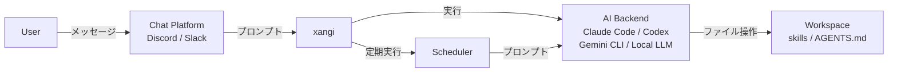

# 設計ドキュメント

xangiのアーキテクチャと設計思想について説明します。

## 概要

xangiは「AI CLI（Claude Code / Codex CLI / Gemini CLI）やローカルLLM（Ollama等）をチャットプラットフォームから使えるようにするラッパー」です。

```
User → Chat (Discord/Slack) → xangi → AI CLI → Workspace
```

## アーキテクチャ



### レイヤー構成

| レイヤー | 役割 | 実装 |
|----------|------|------|
| Chat | ユーザーインターフェース | Discord.js, Slack Bolt |
| xangi | AI CLIの統合・制御 | index.ts, agent-runner.ts, dynamic-runner.ts |
| Backend Resolution | チャンネル別バックエンド解決 | backend-resolver.ts, settings.ts |
| AI CLI | 実際のAI処理 | Claude Code, Codex CLI, Gemini CLI, Local LLM |
| Workspace | ファイル・スキル | skills/, AGENTS.md |

## コンポーネント

### エントリーポイント（index.ts）

メインのオーケストレーター。以下を統合：

- Discord/Slackクライアントの初期化
- メッセージ受信とルーティング
- AI CLIの呼び出し
- スケジューラーの管理
- コマンド処理（`xangi-cmd` CLIツール経由 + テキストパース）

### エージェントランナー（agent-runner.ts）

AI CLIを抽象化するインターフェース：

```typescript
interface AgentRunner {
  run(prompt: string, options?: RunOptions): Promise<RunResult>;
  runStream(prompt: string, callbacks: StreamCallbacks, options?: RunOptions): Promise<RunResult>;
  cancel?(channelId?: string): boolean;
  destroy?(channelId: string): boolean;
  hasRunner?(channelId: string): boolean;
  /** UIに残り時間を表示するため、現在のリクエストのタイムアウト状態を返す */
  getTimeoutState?(channelId: string): TimeoutState;
  /** +5m ボタン押下時、現在のリクエストのタイムアウトを延長する */
  extendTimeout?(channelId: string, additionalMs: number): ExtendTimeoutResult;
}
```

すべての Runner 実装 (Claude Code / Codex / Gemini / Local LLM / Dynamic) は EventEmitter
でもあり、`timeout-started` / `timeout-extended` / `timeout-cleared` を emit して
上位 (web-chat の SSE / Discord bot / Slack bot) が UI 更新に利用する。

### タイムアウトコントローラー（timeout-controller.ts）

各 Runner が抱えるチャンネル別タイムアウト状態を一箇所に集約するヘルパー：

```typescript
class TimeoutController extends EventEmitter {
  start(channelId, onTimeout): void;       // リクエスト開始 + emit 'timeout-started'
  clear(channelId, reason): void;          // 完了 / エラー + emit 'timeout-cleared'
  extend(channelId, additionalMs): ExtendTimeoutResult; // 延長 + emit 'timeout-extended'
  getState(channelId): TimeoutState;       // UI 表示用
  clearAll(reason): void;                  // shutdown 時に全 cleanup
}
```

- `start()` 時に `setTimeout(onTimeout, baseTimeoutMs)` をセット
- `extend()` で残り時間を再計算して `setTimeout` を貼り直し、`maxTimeoutAt` (リクエスト開始 + 1 時間) を超えるなら `max_timeout_exceeded` で拒否
- `onTimeout` 内で最新の AbortController / 子プロセスを引いて kill する設計にすることで、retry で実体が差し替わってもタイムアウト発火が動く

### 動的ランナーマネージャー（dynamic-runner.ts）

チャンネルごとにバックエンド・モデル・effortを動的に切り替えるラッパー：

```
メッセージ受信
  → BackendResolver.resolve(channelId)
  → { backend, model, effort } を取得
  → DynamicRunnerManager が適切なランナーにルーティング
  → 実行
```

BackendResolverの優先順位:
1. `/backend set` で設定されたchannelOverrides（メモリ上、`.env`のCHANNEL_OVERRIDESに永続化）
2. `.env` のデフォルト（`AGENT_BACKEND`, `AGENT_MODEL`）

### システムプロンプト（base-runner.ts）

xangiがAI CLIに注入するシステムプロンプトを管理：

- **チャットプラットフォーム情報** — Discord/Slack経由の会話であることを伝える短い固定テキスト
- **XANGI_COMMANDS** — `src/prompts/` からプラットフォームに応じたコマンド仕様を注入
  - 共通コマンド（`xangi-commands-common.ts`）: タイムアウト対策等
  - チャットPF共通（`xangi-commands-chat-platform.ts`）: ファイル送信（MEDIA:）・セパレータ（===）・スケジュール・システムコマンド
  - Discord専用（`xangi-commands-discord.ts`）: `xangi-cmd discord_*` CLIツール・自動展開
  - Slack専用（`xangi-commands-slack.ts`）: Slack固有の操作
  - プラットフォーム自動判別: Discordのみ有効なら Discord専用コマンドだけ注入（トークン節約）
- **プラットフォーム識別** — 各メッセージに `[プラットフォーム: Discord]` or `[プラットフォーム: Slack]` を注入。AIが適切なコマンドを使い分け

#### Runtime context 注入（runtime-context.ts）

毎ターン、ユーザープロンプトの先頭に「いま観測されている cwd と git リポ情報」を 1 行で差し込む：

```
[runtime] cwd=/home/karaage/borot/tmp/xangi-stackchan-dev repo=xangi-stackchan-dev@feat/k151-step-b
```

- **目的**: Bash tool の cwd 持続はメッセージ受信を跨いで保証されないため、AI が借りリポと本体リポを取り違えて `git push` する事故を構造的に減らす
- **取得**: `process.cwd()`（同期）+ `git rev-parse --show-toplevel` / `git branch --show-current`（5 秒キャッシュ）
- **注入タイミング**: 全 backend の `run()` / `runStream()` 入口で `prependRuntimeContext()`。常駐プロセス（`persistent-runner.ts`）は `--append-system-prompt` が起動時固定なので user message 本文に注入する
- **無効化**: `XANGI_RUNTIME_CONTEXT_ENABLED=false`（既定 true）で注入をオフにできる。雑談中心のインスタンスや、cwd ブレが事故に繋がらない用途で
- **ツール呼び出し表示**: Discord / Slack / Web Chat に出る Bash/exec ツール呼び出しの引数表示の最大長は 200 文字。env `XANGI_TOOL_DISPLAY_MAX` で変更可

AGENTS.md / CHARACTER.md / USER.md 等のワークスペース設定は、各AI CLIの自動読み込み機能に委譲：

| CLI | 自動読み込みファイル | 注入方法 |
|-----|---------------------|----------|
| Claude Code | `CLAUDE.md` | `--append-system-prompt`（一回限り） |
| Codex CLI | `AGENTS.md` | `<system-context>` タグで埋め込み |
| Gemini CLI | `GEMINI.md` | CLI側で自動読み込み（xangi側の注入なし） |
| Local LLM | `AGENTS.md`, `MEMORY.md` | システムプロンプトに直接埋め込み（`CLAUDE.md` は通常 `AGENTS.md` のシンボリックリンクのため除外） |

### AI CLIアダプター

| ファイル | 対応CLI | 特徴 |
|----------|---------|------|
| claude-code.ts | Claude Code | ストリーミング対応、セッション管理 |
| persistent-runner.ts | Claude Code（常駐） | `--input-format=stream-json` で常駐プロセス化、キュー管理、サーキットブレーカー |
| codex-cli.ts | Codex CLI | OpenAI製、0.98.0対応、cancel対応 |
| gemini-cli.ts | Gemini CLI | Google製、セッション管理、ストリーミング対応 |
| local-llm/runner.ts | Local LLM | Ollama等のローカルLLMを直接呼び出し、ツール実行・ストリーミング対応 |

#### Local LLMアダプターの詳細設計

**セッションリトライのフロー:**

```
1. ユーザーメッセージをセッション履歴に追加
   ↓
2. LLM APIにリクエスト送信
   ↓
3a. 成功 → ツールループ or 最終応答を返却
3b. エラー発生
   ↓
4. isSessionRelatedError() でエラーを判定
   - context length exceeded / too many tokens / max_tokens / context window
   - invalid message / malformed / 400 / 422
   ↓
5a. セッション起因のエラー → セッションをクリア（最後のユーザーメッセージのみ保持）→ リトライ
5b. セッション起因でない → formatLlmError() でユーザー向けメッセージを生成して返却
   ↓
6. リトライも失敗 → formatLlmError() でエラーメッセージを返却
```

**ツール呼び出しフロー（llm-client.ts）:**

LLMクライアントはOllamaネイティブAPIとOpenAI互換APIの2経路を持つ。ツール呼び出し時のメッセージフォーマットが異なる点に注意:

| 項目 | OpenAI互換API | Ollama ネイティブAPI |
|------|---------------|---------------------|
| assistantのツール呼び出し | `tool_calls[].id` で識別 | `tool_calls[].function` で識別 |
| toolメッセージの関連付け | `tool_call_id`（ID指定） | `tool_name`（名前指定） |
| 変換関数 | `toOpenAIMessages()` | `toOllamaMessages()` |

Ollamaネイティブ経由では `toolCallId` → `tool_name` の逆引きマップで関連付けを行う。`toOllamaMessages()` は `chatOllamaNative` / `chatStreamOllamaNative` の両方から共通呼び出しされ、tool 履歴が streaming 経路でも欠落しない。

**`chatStream` での tools / tool_choice（OpenAI 互換 streaming 経路）:**

`chatStream` も `chatOpenAI` と同等に `tools` / `tool_choice` を payload に乗せる。streaming で tools を渡さないと、LLM が tool 呼び出しが必要と判断した場面で擬似 tool_call 文字列（例: `<|tool_call>call:fn{args}<tool_call|>`）を text として吐く format drift が発生する（Gemma 4 26B-A4B-NVFP4 + vLLM で実測）。

`LLMChatOptions.toolChoice`:

| 値 | 用途 |
|---|---|
| `'auto'` | LLM 判断（OpenAI デフォ） |
| `'none'` | tool 呼ばずテキスト応答強制（最終応答用） |
| `'required'` | 必ず tool を呼ぶ |
| `{ type: 'function', function: { name } }` | 特定 tool を強制 |

`executeStreamLoop` の最終応答 chatStream では `toolChoice='none'` を指定し、tool ループ完了後に LLM が再度 tool を呼ぼうとして擬似 tool_call 文字列を text 漏れさせないようにする。Codex CLI は Responses API で streaming と tools/tool_choice を一体送信する設計（`codex-rs/core/src/client.rs` 参照）。xangi-dev は Chat Completions API のまま `tool_choice='none'` で同等の効果を得る。

**Ollama ネイティブ経路の tools / tool_choice:**

Ollama ネイティブ API (`/api/chat`) も `chatOllamaNative` / `chatStreamOllamaNative` の両方で同じく `tools` を payload に乗せる。`LOCAL_LLM_THINKING=false` + URL に `11434` / `ollama` を含む場合（`isOllamaUrl()` 判定）、`chatStream` は `chatStreamOllamaNative` 経路に分岐するため、ここで tools が body から欠落していると Gemma 4 vLLM 経路と同じ format drift（最終応答中に擬似 tool_call 文字列が text として漏れる / 投稿本体が生成されない）が Ollama 経由のモデル（Qwen3.6 等）でも発生する。

Ollama ネイティブ API は OpenAI の `tool_choice` パラメータを公式サポートしていない（送っても無視される）。そのため `toolChoice='none'` は **tools 自体を渡さない**ことでエミュレートする（tools が無ければ LLM は tool を呼べないので text 応答強制と同等）。`toolChoice='auto'` / `'required'` は tools を載せるが `tool_choice` 自体は body に含めない（ベストエフォート、Ollama 側で無視される）。

**共通化（4 経路の一貫性保証）:**

`chat` / `chatStream` × OpenAI / Ollama の 4 経路で tools 注入・messages 変換が漏れなく同じ挙動になるよう、以下の共通ヘルパに集約している（`src/local-llm/llm-client.ts` モジュールトップ）:

| ヘルパ | 用途 | 使用箇所 |
|---|---|---|
| `applyOpenAITools(body, options)` | OpenAI 形式 tools/tool_choice 注入 | `chatOpenAI`, `chatStream` (OpenAI 部) |
| `applyOllamaTools(body, options)` | Ollama 形式 tools 注入 + `tool_choice='none'` エミュレート | `chatOllamaNative`, `chatStreamOllamaNative` |
| `toOllamaMessages(messages)` | LLMMessage → Ollama 形式変換（images / tool_calls / tool_name 含む） | `chatOllamaNative`, `chatStreamOllamaNative` |

新しい挙動（追加 tool_choice 値・新 message フィールド・新 provider 等）を入れる際は、共通ヘルパ 1 箇所を更新すれば 4 経路に反映される。テスト (`tests/local-llm-client-ollama-tools.test.ts`) は共通ヘルパの単体検証と Ollama 経路の payload 検証の両方をカバーする。

**エラーハンドリングの設計:**

- `isSessionRelatedError()` — Error インスタンスのメッセージを小文字化して、セッション履歴に起因する既知のパターンにマッチするか判定。非Errorオブジェクトは常にfalseを返す
- `formatLlmError()` — 接続エラー・タイムアウト・認証エラー・レートリミット・サーバーエラーをそれぞれ日本語の分かりやすいメッセージに変換。非Errorオブジェクトにはデフォルトメッセージを返す
- コンテキスト刈り込み（`trimSession()`）— ツール結果の切り詰め、メッセージ数制限、合計文字数制限を直近メッセージ保護付きで実行（上限値は次節の Context budget で動的計算）

**Context budget の動的計算（runner.ts: `loadContextBudget`）:**

LLM の `--max-model-len` (vLLM) や `num_ctx` (Ollama) と xangi 側のセッション枠を整合させるため、刈り込み上限を env から動的計算する。ハードコード `CONTEXT_MAX_CHARS=120000` は廃止。

優先順位:

1. `LOCAL_LLM_CONTEXT_MAX_CHARS` が明示指定 → そのまま使う（最優先）
2. 未指定なら `LOCAL_LLM_NUM_CTX`（default 32768）から逆算:

```
historyTokens   = NUM_CTX - SYSTEM_PROMPT_BUDGET - OUTPUT_BUDGET - SAFETY_MARGIN
contextMaxChars = max(historyTokens * CHARS_PER_TOKEN, 8000)   # 1 token ≒ 3 chars 保守側
```

例: `NUM_CTX=32768` デフォ → `(32768 - 8000 - 4096 - 1000) * 3 = 59016 chars`

| env | 役割 | デフォルト |
|---|---|---|
| `LOCAL_LLM_CONTEXT_MAX_CHARS` | 明示優先（unsetなら逆算） | 自動計算 |
| `LOCAL_LLM_SYSTEM_PROMPT_BUDGET_TOKENS` | system prompt 想定枠 | `8000` |
| `LOCAL_LLM_OUTPUT_BUDGET_TOKENS` | 1 リクエストの最大出力枠 | `4096` |
| `LOCAL_LLM_SAFETY_MARGIN_TOKENS` | 安全マージン | `1000` |
| `LOCAL_LLM_CONTEXT_KEEP_LAST` | 直近 N 件は trim しない | `10` |
| `LOCAL_LLM_TOOL_RESULT_MAX_CHARS` | tool 結果の切り詰め | `4000` |
| `LOCAL_LLM_MAX_SESSION_MESSAGES` | セッション最大メッセージ数 | `50` |

`ContextBudget` には計算根拠 (`source: 'explicit' | 'derived'`、各バジェット token 数) を含み、起動時にログ出力する。テスト・チューニング時の根拠追跡用。

**チャンネル毎 LocalLlmMode override（backend-resolver.ts）:**

`ChannelOverride.localLlmMode?: 'agent' | 'lite' | 'chat'` を `backend / model / effort` と同列に並べ、`CHANNEL_OVERRIDES` JSON で per-channel に Local LLM 動作モードを切替可能。

```json
{
  "ch_id": {
    "backend": "local-llm",
    "model": "gemma4-26b-a4b-nvfp4",
    "localLlmMode": "agent"
  }
}
```

`MODE_DEFAULTS` (runner.ts):

| mode | tools | skills | xangiCommands | triggers |
|---|---|---|---|---|
| `agent` | ✅ | ✅ | ✅ | – |
| `lite`  | ✅ | – | ✅ | ✅ |
| `chat`  | – | – | – | – |

**per-call 適用フロー:**

```
RunOptions.localLlmMode (DynamicAgentRunner で resolved.localLlmMode を注入)
   ↓
runner.run() / runStream() で resolveCallModeFlags(callMode) → ModeFlags
   ↓
buildSystemPrompt(flags) と llmTools = callFlags.tools ? getAllTools() : []
が per-call で再計算される
```

起動時の個別 env (`LOCAL_LLM_TOOLS=false` 等) は per-call override 時には**無視され**、MODE_DEFAULTS が直接適用される。

**`/llmmode` slash コマンド（index.ts）:**

`/llmmode <agent|lite|chat|default|show>` で対話的に per-channel mode を切替。`agent/lite/chat` は `BackendResolver.setChannelLocalLlmMode()` で in-memory + `.env` 永続化。`default` は override 削除。`show` は現在の resolved mode を表示。`ALLOW_LLM_MODE_COMMAND=false` で無効化可能（default `true`）。

**Tool 遅延ロード（tool_search、Codex / Claude Code 流）:**

全 tool schema を毎ターン渡すと context が圧迫され、Local LLM では format drift / 誤選択の原因になる。Codex CLI の `tool_search` (stable=true、`TOOL_SEARCH_DEFAULT_LIMIT=8`) と Claude Code の `ToolSearch` を参考に、tool schema をオンデマンドでアクティブ化する仕組みを実装。

設計の核:

1. **常駐セット (per-process default)**: 起動時に `loadAlwaysLoadedToolNames(env)` が `LOCAL_LLM_ALWAYS_LOADED_TOOLS` から読み込み、未指定なら `read,write,edit,exec,glob,grep,send_file,web_fetch,tool_search` を default にする。`tool_search` は無条件で含む（deferred tool 呼び出しの入口を確保するため）
2. **Active set (per-session)**: `Session.activeToolNames: Set<string>` が常駐セットで初期化され、`tool_search` の検索結果で動的に拡張される
3. **Iteration ごとに再計算**: `executeAgentLoop` / `executeStreamLoop` の各 iteration の頭で `getActiveTools(session.activeToolNames)` を呼び、`body.tools` に渡す schema を再構成。これにより tool_search が拡張した active set が**次ターンで即時反映**
4. **Deferred catalog 表示**: `buildSystemPrompt` で「Deferred Tools (load on demand via tool_search)」セクションを追加、deferred tool の名前 + description のみ列挙（schema は載せず token 節約）

`tool_search` 検索ロジック (`scoreToolMatch`):

| マッチ種別 | スコア |
|---|---|
| name 完全一致 | 100 |
| name 部分一致 | 50 |
| name に query token 含む | +20 / token |
| description に query token 含む | +10 / token |

スコア降順で上位 N 件 (`LOCAL_LLM_TOOL_SEARCH_LIMIT`、default 8) を `context.activateTools(names)` callback でセッションに追加。

**Tool アクティブ化の callback (types.ts: `ToolContext.activateTools`):**

```ts
interface ToolContext {
  workspace: string;
  channelId?: string;
  activateTools?: (names: string[]) => void;  // tool_search が呼び出す
}
```

`runner.executeAgentLoop` が executeTool 呼出時に `(names) => session.activeToolNames.add(...names)` クロージャを context に注入する。これで tool_search → 検索 → active set 拡張 → 次 iteration の reasoning で対象 tool を呼べる、という遅延ロードのループが成立する。

env サマリ:

| env | 役割 | デフォルト |
|---|---|---|
| `LOCAL_LLM_TOOL_SEARCH_ENABLED` | 機能の有効化 | `true` |
| `LOCAL_LLM_TOOL_SEARCH_LIMIT` | 1 検索の最大ヒット数 | `8` |
| `LOCAL_LLM_ALWAYS_LOADED_TOOLS` | 常駐 tool 名 (CSV)、`tool_search` は強制 | builtin core + tool_search |

無効化したい場合は `LOCAL_LLM_TOOL_SEARCH_ENABLED=false` で従来挙動（全 tool 常駐）に戻る。

トレードオフ: deferred tool の初回利用時に「`tool_search` → 次ターンで対象 tool 呼ぶ」の +1 turn が発生する。description の質が検索精度を左右する点には注意。

**Tool 失敗→LLM 自己修正のリカバリーループ (Step A〜D):**

一部のローカル LLM は tool_search で結果を得られないと同じ query で MAX_TOOL_ROUNDS まで無限ループし、最後に擬似 tool_call テキスト (`<|channel>thought\ncall:fn{args}<channel|>` / bare `call:fn{args}`) を hallucinate して最終応答に drift が漏れる構造的問題がある。単純な post-process strip では LLM 自身は「自分が無効な擬似 tool_call を吐いた」ことを知らず再発するので、**LLM にフィードバックして自己修正させるリカバリーループ**を実装。

| Step | トリガー | 動作 |
|---|---|---|
| **A** (`tools.ts: toolSearchToolHandler`) | tool_search 実行 | tool マッチに加えて **skill** もマッチ対象に。skill hit があれば `read("skills/<name>/SKILL.md")` を案内。ノーヒット時は「同 query 繰り返し禁止 / 直接 read で skill 読め / plain text 応答」のガイダンスを返す |
| **B** (`runner.ts: recordToolCallAndCheckLoop`) | 同一 (name, args) tool_call が 3 回連続 | `executeTool` をスキップして synthetic error result (`Tool '...' has been called 3 times consecutively...`) を LLM に返し、「Try: 別 args / 別 tool / plain text 応答」を強制 feedback |
| **C** (`runner.ts: 最終 chatStream + pseudo-toolcall.ts: containsPseudoToolCall`) | 最終 chatStream に **strict drift** (`call:fn{}` / `<\|channel\|>...<\|channel\|>` / `<\|tool_call\|>...<\|tool_call\|>`) を検出 | assistant に raw drift を積み、system に `PSEUDO_TOOLCALL_FEEDBACK_PROMPT` (本物の tool_call 構造で呼ぶか plain text で答えよ) を積んで chatStream を 1 回再生成 |
| **D** (`runner.ts: 最終出力差し替え + FRIENDLY_FALLBACK_MESSAGE`) | Step C retry でも strict drift しか出ない | `FRIENDLY_FALLBACK_MESSAGE` (「ごめん、うまく応答を組み立てられなかった。質問をシンプルにして、もう一度試してくれる？」) に差し替え。raw 内容は `console.warn` でログに残す |

drift 分類:

- **Strict drift** (`STRICT_DRIFT_PATTERNS`): 実応答が欠けているか置き換えられている可能性が高い構造 → Step C で LLM に retry 要求
- **Cosmetic leak** (`COSMETIC_LEAK_PATTERNS`): 先頭/末尾の bare `thought\n` 等、本文は通常通り出ているが marker だけ漏れた状態 → Step C 不要、`stripPseudoToolCalls` で silent strip だけ

Session に `recentToolCallSigs: string[]` (バッファ 8 件、push 押し出し) を追加して `toolCallSignature(name, args)` で正規化 (key sort) シグネチャを記録。`REPEATED_TOOL_CALL_THRESHOLD=3` で連続検出。

設計上の決定打: Step A の skill 案内で「次に何をすべきか」が tool_search 結果に書き込まれることが多くのケースで decisive。LLM は skill 経由で正規ルート (`read SKILL.md` → SKILL 内のスクリプト実行) に乗ることで、B/C/D の出番は最終フェイルセーフに留まる。1 つの仕組みに全部負わせず、A→B→C→D の段階的フォールバックで層を分けてある。

### スケジューラー（scheduler.ts）

定期実行とリマインダーを管理：

```
┌─────────────────────────────────────────────────────┐
│ Scheduler                                           │
├─────────────────────────────────────────────────────┤
│ - schedules: Schedule[]     # スケジュールデータ     │
│ - cronJobs: Map<id, CronJob> # 実行中のcronジョブ   │
│ - senders: Map<platform, fn> # メッセージ送信関数   │
│ - agentRunners: Map<platform, fn> # AI実行関数     │
├─────────────────────────────────────────────────────┤
│ + add(schedule): Schedule                          │
│ + remove(id): boolean                              │
│ + toggle(id): Schedule                             │
│ + list(): Schedule[]                               │
│ + startAll(): void                                 │
│ + stopAll(): void                                  │
└─────────────────────────────────────────────────────┘
```

**スケジュールの種類:**
- `cron`: cron式による定期実行
- `once`: 単発リマインダー（指定時刻に1回実行）

**永続化:**
- JSONファイル（`${DATA_DIR}/schedules.json`）
- ファイル変更を監視して自動リロード（debounce付き）

**タイムゾーン:**
- サーバーのシステムタイムゾーン（`TZ` 環境変数）に従う
- Docker環境では `TZ=Asia/Tokyo` 等を設定推奨

### Tool Server（tool-server.ts）

AI CLIが xangi の機能（Discord操作・スケジュール・システム）を安全に呼び出すための HTTP API サーバー。

```
AI CLI（Claude Code等）
  → xangi-cmd（シェルスクリプト）
  → HTTP POST http://localhost:<port>/api/execute
  → tool-server（xangiプロセス内）
  → Discord REST API / スケジューラー / 設定
```

**ポート管理:**
- ポート0でバインド（OS自動割り当て、複数インスタンスでも競合なし）
- 起動したURLを `XANGI_TOOL_SERVER` として子プロセスへ注入
- `xangi-cmd` は `XANGI_TOOL_SERVER` を使って接続
- 現在のチャンネルIDなどの実行文脈は HTTP リクエストの `context` に載せて tool-server へ渡す

**セキュリティ:**
- DISCORD_TOKEN 等のシークレットは xangi プロセス内のみ
- AI CLI には `safe-env.ts` のホワイトリストで安全な環境変数のみ渡す
- GitHub App秘密鍵は起動時にメモリに読み込み、トークン生成は tool-server の `/github-token` エンドポイント経由（短寿命トークンのみ取得可能）

### 承認フロー（approval.ts / approval-server.ts）

AIが実行しようとするコマンドの中から危険なもの（`rm -rf`、`git push --force` 等）を検知し、実行前にユーザーの承認を求める仕組み。

```
AI CLI がコマンド出力
  → approval.ts がパターンマッチ（approval-patterns.json）
  → 危険コマンド検知
  → approval-server.ts がDiscord/Slackにボタン付きメッセージ送信
  → ユーザーが承認/拒否
  → 結果をAI CLIに返却
```

- `APPROVAL_ENABLED=true` で有効化（デフォルト無効）
- パターンは `src/approval-patterns.json` で定義

### GitHub App認証（github-auth.ts）

GitHub Appの秘密鍵を使ってInstallation Token（短寿命・1時間有効）を生成し、`gh` CLIをラップする。

```
gh コマンド実行（AI CLI内）
  → /tmp/xangi-gh-wrapper/gh（ラッパー）
  → curl で tool-server の /github-token エンドポイントにリクエスト
  → github-auth.ts がメモリ上の秘密鍵でトークン生成
  → GH_TOKEN として注入 → 本物の gh を exec
```

- 秘密鍵は起動時にファイルからメモリに読み込み、以降ファイルアクセス不要
- AIエージェント（子プロセス）からは秘密鍵に直接アクセスできない
- トークン生成失敗時はPATへのフォールバックなし（エラー）

### トリガー機能（local-llm/triggers.ts）

Local LLMのchatモードで、LLM応答テキスト内のマジックワードを検出してスクリプトを自動実行する。

```
triggers/
├── my-trigger/
│   ├── trigger.yaml    # name, description, handler を定義
│   └── handler.sh      # 実行スクリプト
```

- ワークスペースの `triggers/` ディレクトリから `trigger.yaml` を読み込み
- LLM応答テキストにトリガーワードが含まれていれば handler を実行

### スキルシステム（skills.ts）

ワークスペースの `skills/` ディレクトリからスキルを読み込み、スラッシュコマンドとして登録。

```
skills/
├── my-skill/
│   ├── SKILL.md      # スキル定義
│   └── scripts/      # 実行スクリプト
└── another-skill/
    └── SKILL.md
```

## データフロー

### メッセージ処理フロー

```
1. ユーザーがメッセージ送信
   ↓
2. Discord/Slackクライアントが受信
   ↓
3. 権限チェック（allowedUsers）
   ↓
4. 特殊コマンド判定
   - /command → スラッシュコマンド処理
   ↓
5. チャンネル情報・発言者情報を付与
   ↓
6. AI CLIに転送（processPrompt）
   ↓
7. レスポンス処理
   - ストリーミング表示
   - ファイル添付抽出（MEDIA:パターン）
   ↓
8. ユーザーに返信
```

### スケジュール実行フロー

```
1. cron/タイマーがトリガー
   ↓
2. Scheduler.executeSchedule()
   ↓
3. agentRunner(prompt, channelId)
   - AI CLIでプロンプト実行
   ↓
4. sender(channelId, result)
   - 結果をチャンネルに送信
   ↓
5. 単発の場合は自動削除
```

## 設計思想

### ユーザー管理

xangiのユーザー管理はシンプルな許可リスト方式：

- `DISCORD_ALLOWED_USER` / `SLACK_ALLOWED_USER` でアクセス制御
- カンマ区切りで複数ユーザー指定可能、`*` で全員許可
- セッションはチャンネル単位で管理
- プロンプトに発言者情報（表示名・Discord ID）が自動注入される

### AI CLIの抽象化

AI CLIの実装詳細を隠蔽し、交換可能に：

```typescript
// 設定でバックエンドを切り替え
AGENT_BACKEND=claude-code  # or codex or gemini or local-llm
```

将来的に新しいAI CLIが登場しても、アダプターを追加するだけで対応可能。

### コマンドの自律実行

AIが出力する特殊コマンドを検出して自動実行：

| 方式 | コマンド例 | 動作 |
|------|----------|------|
| CLIツール | `xangi-cmd discord_send --channel ID --message "..."` | Discord操作 |
| CLIツール | `xangi-cmd discord_buttons --channel ID --message "..." --buttons "..."` | ボタン付きメッセージ送信 |
| CLIツール | `xangi-cmd schedule_add --input "毎日 9:00 ..."` | スケジュール操作 |
| CLIツール | `xangi-cmd system_restart` | プロセス再起動 |
| テキストパース | `MEDIA:/path/to/file` | ファイル送信 |
| テキストパース | `\n===\n` | メッセージ分割 |
| スラッシュコマンド | `/autoreply` | チャンネルごとのメンションなし応答トグル |
| スラッシュコマンド | `/respondtobots` | bot 同士の応答 ON/OFF トグル（ホワイトリストは `RESPOND_TO_BOTS`、連続上限は `RESPOND_TO_BOTS_MAX_CONSECUTIVE`） |

CLIツール（`xangi-cmd`）は xangi 内蔵の tool-server（HTTPエンドポイント）経由で実行される。
DISCORD_TOKEN 等のシークレットは xangi プロセス内に閉じ込められ、AI CLI からはアクセスできない。

### 永続化戦略

| データ | 保存先 | 形式 |
|--------|--------|------|
| スケジュール | `${DATA_DIR}/schedules.json` | JSON |
| ランタイム設定 | `${WORKSPACE}/settings.json` | JSON |
| セッション | `${DATA_DIR}/sessions.json` | JSON（appSessionId方式、activeByContext + sessions） |
| トランスクリプト | `logs/sessions/{appSessionId}.jsonl` | JSONL（セッション単位の会話ログ） |
| DATA_DIR ロック | `${DATA_DIR}.lock/` | `proper-lockfile` が管理するロックディレクトリ（同 `DATA_DIR` を複数 xangi で握ろうとした際の重複検知用、30s ハートビート + 60s stale で自動回収） |

### セッション管理

xangi独自の `appSessionId` でセッションを管理。backendの `providerSessionId`（Claude Code等）は後付けで保存。

**sessions.json の構造：**
```json
{
  "activeByContext": { "<contextKey>": "<appSessionId>" },
  "sessions": {
    "<appSessionId>": {
      "id": "<appSessionId>",
      "title": "...",
      "platform": "discord|slack|web",
      "contextKey": "<channelId>",
      "agent": { "backend": "claude-code", "providerSessionId": "..." }
    }
  }
}
```

### トランスクリプトログ

セッション単位のAI会話ログをJSONL形式で自動保存。デバッグ・障害分析・WebUI閲覧に使用。

**ディレクトリ構成：**
```
logs/sessions/
  m4abc123_def456.jsonl   # セッション単位のログ
  m4xyz789_ghi012.jsonl
```

**記録される内容：**
- `user`: ユーザーから送信されたプロンプト
- `assistant`: AI の最終応答
- `error`: タイムアウト、API エラーなど

**注意事項：**
- ログは `.gitignore` で除外されている
- 自動ローテーション（日付ごとにディレクトリ分割）
- ログ書き込み失敗は無視（本体の動作に影響させない）

## ファイル構成

```
bin/
└── xangi-cmd           # CLIラッパー（シェルスクリプト、tool-serverに中継）

src/
├── index.ts            # エントリーポイント、Discord統合
├── slack.ts            # Slack統合
├── agent-runner.ts     # AI CLIインターフェース
├── base-runner.ts      # システムプロンプト生成
├── claude-code.ts      # Claude Codeアダプター（per-request）
├── persistent-runner.ts # Claude Codeアダプター（常駐プロセス）
├── codex-cli.ts        # Codex CLIアダプター
├── gemini-cli.ts       # Gemini CLIアダプター
├── web-chat.ts         # WebチャットUI（HTTPサーバー）
├── tool-server.ts      # Tool Server（AI CLI向けHTTP API）
├── approval.ts         # 危険コマンド検知（パターンマッチ）
├── approval-server.ts  # 承認サーバー（Discord/Slack対話的承認フロー）
├── github-auth.ts      # GitHub App認証（秘密鍵メモリ管理・トークン生成）
├── backend-resolver.ts # チャンネル別バックエンド解決
├── dynamic-runner.ts   # 動的ランナーマネージャー
├── safe-env.ts         # 環境変数ホワイトリスト
├── constants.ts        # アプリケーション定数
├── schedule-cli.ts     # スケジューラCLI（レガシー、tool-server移行済み）
├── cli/                # CLIモジュール（tool-serverから呼ばれる）
│   ├── discord-api.ts  #   Discord REST API直叩き
│   ├── schedule-cmd.ts #   スケジュール操作
│   ├── system-cmd.ts   #   システム操作
│   └── xangi-cmd.ts    #   Node.js版CLIエントリーポイント
├── local-llm/          # Local LLMアダプター
│   ├── runner.ts       #   メインランナー（セッション管理・ツール実行ループ）
│   ├── llm-client.ts   #   LLM APIクライアント（Ollama native + OpenAI互換）
│   ├── context.ts      #   ワークスペースコンテキスト読み込み
│   ├── tools.ts        #   ビルトインツール（exec/read/write/edit/glob/grep/send_file/web_fetch）
│   ├── xangi-tools.ts  #   xangi専用ツール（function calling版）
│   ├── image-utils.ts  #   画像処理ユーティリティ（マルチモーダル対応）
│   ├── triggers.ts     #   トリガー機能（chatモードのマジックワード検出・実行）
│   └── types.ts        #   型定義
├── prompts/            # プロンプト定義
│   ├── index.ts                   # エクスポート集約
│   ├── xangi-commands.ts          # プラットフォーム別組み立て
│   ├── xangi-commands-common.ts   # 共通（タイムアウト等）
│   ├── xangi-commands-chat-platform.ts # チャットPF共通（MEDIA:/スケジュール/システム）
│   ├── xangi-commands-discord.ts  # Discord専用（xangi-cmd discord_*）
│   ├── xangi-commands-slack.ts    # Slack専用
│   ├── xangi-commands-web.ts      # Web専用
│   ├── chat-system-persistent.ts  # 常駐プロセス用システムプロンプト
│   ├── chat-system-resume.ts      # セッション再開用システムプロンプト
│   ├── platform-labels.ts         # プラットフォーム表示名
│   └── tools-usage.ts             # Local LLM用ツール使い方プロンプト
├── scheduler.ts        # スケジューラー
├── skills.ts           # スキルローダー
├── config.ts           # 設定読み込み
├── settings.ts         # ランタイム設定
├── sessions.ts         # セッション管理
├── file-utils.ts       # ファイル操作ユーティリティ
├── process-manager.ts  # プロセス管理
├── runner-manager.ts   # 複数チャンネル同時処理（RunnerManager）
├── timeout-controller.ts # チャンネル別タイムアウト管理（start/clear/extend を共通化）
└── transcript-logger.ts # セッション単位トランスクリプトログ
```

## Docker構成

### コンテナ構成

```
┌─────────────────────────────────────────┐
│ xangi-max / xangi-gpu container         │
├─────────────────────────────────────────┤
│ - Node.js 22 + AI CLI + uv + Python    │
│ - xangi-gpu はさらに CUDA + PyTorch    │
└───────────────┬─────────────────────────┘
                │ docker network
┌───────────────▼─────────────────────────┐
│ ollama container                        │
├─────────────────────────────────────────┤
│ - Ollama公式イメージ                     │
│ - GPU パススルー                         │
│ - ollama:11434 で接続                   │
└─────────────────────────────────────────┘

┌─────────────────────────────────────────┐
│ llama-server container（オプション）     │
├─────────────────────────────────────────┤
│ - llama.cpp 公式イメージ                 │
│ - GPU パススルー                         │
│ - llama-server:18080 で接続             │
└─────────────────────────────────────────┘
```

### セキュリティ方針

- 非rootユーザー（UID 1000）で実行
- ワークスペースのみマウント
- AIエージェントへの環境変数はホワイトリスト方式で制限（`src/safe-env.ts`）
- ホストネットワークへの直接アクセスなし（ollamaコンテナ経由のみ）

詳細（環境変数一覧・Docker操作方法等）は [使い方ガイド](usage.md) を参照。

## 拡張ポイント

### 新しいチャットプラットフォーム追加

1. クライアント初期化コードを追加
2. メッセージハンドラを実装
3. `scheduler.registerSender()` で送信関数を登録
4. `scheduler.registerAgentRunner()` でAI実行関数を登録

### 新しいAI CLI追加

1. `AgentRunner` インターフェースを実装
2. `config.ts` にバックエンド設定を追加
3. `index.ts` で初期化処理を追加
