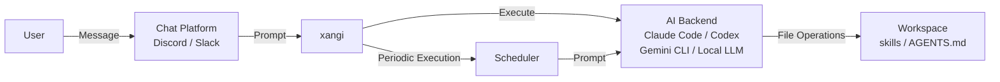

[日本語](../design.md) | **English**

# Design Document

This document explains the architecture and design philosophy of xangi.

## Overview

xangi is "a wrapper that makes AI CLIs (Claude Code / Codex CLI / Gemini CLI) and local LLMs (Ollama, etc.) accessible from chat platforms."

```
User → Chat (Discord/Slack) → xangi → AI CLI → Workspace
```

## Architecture



### Layer Structure

| Layer | Role | Implementation |
|-------|------|----------------|
| Chat | User interface | Discord.js, Slack Bolt |
| xangi | AI CLI integration & control | index.ts, agent-runner.ts, dynamic-runner.ts |
| Backend Resolution | Per-channel backend resolution | backend-resolver.ts, settings.ts |
| AI CLI | Actual AI processing | Claude Code, Codex CLI, Gemini CLI, Local LLM |
| Workspace | Files & skills | skills/, AGENTS.md |

## Components

### Entry Point (index.ts)

The main orchestrator. Integrates the following:

- Discord / Slack / Web Chat / LINE client initialization
- Message reception and routing
- AI CLI invocation
- Scheduler management
- Command handling (via `xangi-cmd` CLI tool + text parsing)

### LINE Bot Integration (line.ts)

1:1 chat via LINE Messaging API. Design:

- `http.createServer`-based (matches `web-chat.ts`, avoids the Express dependency)
- Uses `@line/bot-sdk`'s `validateSignature` for raw-body + `X-Line-Signature` HMAC-SHA256 verification
- Passes text messages through `runWithBubbleEvents` to the Runner, then replies via `LineBotClient.replyMessage`
- Per-userId session isolation (`contextKey = line:<userId>`)
- `LINE_ALLOWED_USER` whitelist (`*` allows all, empty causes a startup error)
- Acks the webhook immediately (LINE expects HTTP 200 within 30 s; the rest is async)

#### Two-stage responsiveness defense (loading animation + reply→push auto-switch)

LINE has no thread or "new chat" UI boundary like Slack or Discord, and reply tokens expire 60 s after the inbound event. Long thinking time or local-LLM tool loops can easily turn into "ghosted" experiences. Two layered defenses cover this:

1. **Instant ACK — Loading animation API**: Right after the allowlist check (before the runner starts), `handleEvent` calls `client.showLoadingAnimation({ chatId, loadingSeconds })` which hits LINE's official `POST /v2/bot/chat/loading/start`. The "typing…" indicator appears in the chat immediately and disappears when the bot sends its next message. Failure is non-fatal (`console.warn` only). DM-only feature (groups are ignored by LINE, but the API call still succeeds). Duration is controlled by `LINE_LOADING_ANIMATION_SECONDS` (default 60; `snapLoadingSeconds` snaps to one of 5/10/15/20/25/30/40/50/60). Disable with `LINE_LOADING_ANIMATION_ENABLED=false`.

2. **Reply→Push auto-switch — Slow response fallback**: A `setTimeout` armed with `LINE_SLOW_RESPONSE_THRESHOLD_MS` (default 45000 ms). When it fires, the reply token is consumed by sending `🤔 ちょっと待ってね、考えてる…` (the `slowFiredRef` flag is set). After the runner finishes, the send path is chosen from `slowFiredRef.value` and `elapsedMs`:
   - `slowFiredRef.value === true` → reply token consumed; must use Push API
   - `slowFiredRef.value === false` and `elapsedMs < threshold` → reply token still valid → use reply
   - Otherwise → safe fallback to Push

   If reply fails afterwards, push is retried as a secondary fallback (both failures are logged via `console.error`). Set `LINE_SLOW_RESPONSE_ENABLED=false` to disable, but responses over 60 s would then be lost entirely (not recommended).

   The Push API is free for the first 200 messages/month on personal Official Accounts; usage beyond is billed. If slow responses are frequent on a local LLM (Gemma, etc.), increase the threshold or use a faster inference backend.

#### Session boundaries (idle reset + reset command)

LINE has no explicit conversation boundary UI like Slack's threads or Discord's "new chat" button. xangi switches sessions using a two-layer time-based + command-based approach:

1. **Reset-command detection**: In `handleEvent`, right after the allowlist check and before the loading animation or runner, `isResetCommand(text, patterns)` checks for an exact match (case-insensitive, whitespace stripped). On match, the active session is archived via `archiveSession()`, a new one is created via `ensureSession()`, "最初からお話するね！何かあった？" is sent via `replyMessage`, and the function returns without invoking the runner. Default patterns are limited to three unambiguous slash commands: `/reset` `/new` `/clear`. The idle reset (time-based) is the primary boundary; commands serve as a manual escape hatch. Japanese natural-language phrases have fuzzy boundaries against neighboring phrases ("リセットってどういう意味？", "最初からお話したい"), so they are excluded from defaults and must be added explicitly via `LINE_RESET_TEXT_PATTERNS` (CSV) if needed.
2. **Idle session reset**: For non-reset messages, if the current session's `updatedAt` is older than `LINE_IDLE_RESET_HOURS` (default 4 h), `hasSessionGoneIdle()` returns true → `archiveSession()` is called, then `ensureSession()` creates a new session. Children's conversations cluster naturally around school / sleep / meal patterns, so 4 h is a good cut. The `logs/sessions/*.jsonl` files are kept after archiving, so history is preserved.

Both features can be disabled independently (`LINE_IDLE_RESET_ENABLED=false`, `LINE_RESET_TEXT_PATTERNS=`). Combined with Rich Menu button bindings ("Start over" → sends `リセット` → reset-command detection path), this gives a clean integrated experience.

The public endpoint is provided externally (Tailscale Funnel / Cloudflare Tunnel). See [`docs/en/line-setup.md`](line-setup.md).

### Agent Runner (agent-runner.ts)

An interface that abstracts AI CLIs:

```typescript
interface AgentRunner {
  run(prompt: string, options?: RunOptions): Promise<RunResult>;
  runStream(prompt: string, callbacks: StreamCallbacks, options?: RunOptions): Promise<RunResult>;
  cancel?(channelId?: string): boolean;
  destroy?(channelId: string): boolean;
  hasRunner?(channelId: string): boolean;
  /** Returns the active request's timeout state for UI countdown */
  getTimeoutState?(channelId: string): TimeoutState;
  /** Called by the +5m button to extend the active request's timeout */
  extendTimeout?(channelId: string, additionalMs: number): ExtendTimeoutResult;
}
```

Every Runner implementation (Claude Code / Codex / Gemini / Local LLM / Dynamic) is also
an `EventEmitter` and emits `timeout-started` / `timeout-extended` / `timeout-cleared`
events so upstream consumers (web-chat SSE / Discord bot / Slack bot) can refresh the UI.

### Timeout Controller (timeout-controller.ts)

A shared helper that centralizes per-channel timeout state for every runner:

```typescript
class TimeoutController extends EventEmitter {
  start(channelId, onTimeout): void;       // start request + emit 'timeout-started'
  clear(channelId, reason): void;          // completed / error + emit 'timeout-cleared'
  extend(channelId, additionalMs): ExtendTimeoutResult; // extend + emit 'timeout-extended'
  getState(channelId): TimeoutState;       // UI consumption
  clearAll(reason): void;                  // shutdown cleanup
}
```

- `start()` schedules `setTimeout(onTimeout, baseTimeoutMs)`
- `extend()` reschedules the timer and rejects with `max_timeout_exceeded` if the new
  deadline would exceed `maxTimeoutAt` (request start time + 1 hour)
- `onTimeout` looks up the *current* AbortController / child process so that retries
  swapping out the underlying resource still get killed on timeout

### Dynamic Runner Manager (dynamic-runner.ts)

A wrapper that dynamically switches backend, model, and effort per channel:

```
Message received
  → BackendResolver.resolve(channelId)
  → Retrieve { backend, model, effort }
  → DynamicRunnerManager routes to the appropriate runner
  → Execute
```

BackendResolver priority:
1. channelOverrides set via `/backend set` (in-memory, persisted to CHANNEL_OVERRIDES in `.env`)
2. Defaults from `.env` (`AGENT_BACKEND`, `AGENT_MODEL`)

### System Prompt (base-runner.ts)

Manages the system prompts that xangi injects into AI CLIs:

- **Chat platform info** — A short fixed text indicating the conversation is via Discord/Slack
- **XANGI_COMMANDS** — Injects platform-specific command specifications from `src/prompts/`
  - Common commands (`xangi-commands-common.ts`): Timeout handling, etc.
  - Chat platform common (`xangi-commands-chat-platform.ts`): File sending (MEDIA:), message separators (===), scheduling, system commands
  - Discord-specific (`xangi-commands-discord.ts`): `xangi-cmd discord_*` CLI tools, auto-expand
  - Slack-specific (`xangi-commands-slack.ts`): Slack-specific operations
  - Automatic platform detection: If only Discord is active, only Discord-specific commands are injected (saves tokens)
- **Platform identification** — Each message is annotated with `[Platform: Discord]` or `[Platform: Slack]`. The AI uses the appropriate commands accordingly

AGENTS.md / CHARACTER.md / USER.md and other workspace settings are delegated to each AI CLI's auto-loading feature:

| CLI | Auto-loaded Files | Injection Method |
|-----|-------------------|------------------|
| Claude Code | `CLAUDE.md` | `--append-system-prompt` (one-time) |
| Codex CLI | `AGENTS.md` | Embedded via `<system-context>` tag |
| Gemini CLI | `GEMINI.md` | Auto-loaded by CLI (no xangi-side injection) |
| Local LLM | `AGENTS.md`, `MEMORY.md` | Directly embedded in system prompt (`CLAUDE.md` is typically a symlink to `AGENTS.md`, so it's excluded) |

### AI CLI Adapters

| File | Supported CLI | Features |
|------|---------------|----------|
| claude-code.ts | Claude Code | Streaming support, session management |
| persistent-runner.ts | Claude Code (persistent) | Persistent process via `--input-format=stream-json`, queue management, circuit breaker |
| codex-cli.ts | Codex CLI | Made by OpenAI, 0.98.0 compatible, cancel support |
| gemini-cli.ts | Gemini CLI | Made by Google, session management, streaming support |
| local-llm/runner.ts | Local LLM | Direct calls to local LLMs like Ollama, tool execution & streaming support |

#### Local LLM Adapter Detailed Design

**Session Retry Flow:**

```
1. Add user message to session history
   ↓
2. Send request to LLM API
   ↓
3a. Success → Return tool loop or final response
3b. Error occurred
   ↓
4. Evaluate error with isSessionRelatedError()
   - context length exceeded / too many tokens / max_tokens / context window
   - invalid message / malformed / 400 / 422
   ↓
5a. Session-related error → Clear session (keep only last user message) → Retry
5b. Not session-related → Generate user-facing message with formatLlmError() and return
   ↓
6. Retry also failed → Return error message via formatLlmError()
```

**Tool Calling Flow (llm-client.ts):**

The LLM client has two API paths: Ollama native API and OpenAI-compatible API. Note the different message formats for tool calling:

| Item | OpenAI-compatible API | Ollama Native API |
|------|----------------------|-------------------|
| Assistant tool calls | Identified by `tool_calls[].id` | Identified by `tool_calls[].function` |
| Tool message association | `tool_call_id` (by ID) | `tool_name` (by name) |
| Conversion function | `toOpenAIMessages()` | `toOllamaMessages()` |

In the Ollama native path, a reverse lookup map from `toolCallId` to `tool_name` is used for association. `toOllamaMessages()` is shared by both `chatOllamaNative` and `chatStreamOllamaNative` so tool history is never dropped on the streaming path.

**`chatStream` with tools / tool_choice (OpenAI-compatible streaming path):**

`chatStream` carries `tools` / `tool_choice` in the payload, same as `chatOpenAI`. Without `tools` on the streaming path, when the LLM decides a tool call is needed it falls back to emitting a pseudo tool_call string as plain text (e.g. `<|tool_call>call:fn{args}<tool_call|>`) — a format drift observed in practice with Gemma 4 26B-A4B-NVFP4 on vLLM.

`LLMChatOptions.toolChoice`:

| Value | Purpose |
|---|---|
| `'auto'` | LLM decides (OpenAI default) |
| `'none'` | Forces text-only reply (used for the final answer) |
| `'required'` | Forces a tool call |
| `{ type: 'function', function: { name } }` | Forces a specific tool |

`executeStreamLoop` sets `toolChoice='none'` on the final chatStream call so the model cannot try to call another tool — preventing the pseudo tool_call text leak after the tool loop has completed. Codex CLI's Responses API sends streaming and tools/tool_choice as a single integrated request (`codex-rs/core/src/client.rs`); xangi-dev stays on Chat Completions but achieves the equivalent effect via `tool_choice='none'`.

**Ollama native path: tools / tool_choice:**

The Ollama native API (`/api/chat`) also carries `tools` in the payload in both `chatOllamaNative` and `chatStreamOllamaNative`. When `LOCAL_LLM_THINKING=false` and the URL contains `11434` / `ollama` (the `isOllamaUrl()` check), `chatStream` dispatches to `chatStreamOllamaNative`. If `tools` were missing on this path, the same format drift seen on the Gemma 4 / vLLM path (pseudo tool_call strings leaking as text in the final answer; the actual reply body not being generated) would occur for Ollama-hosted models like Qwen3.6 as well.

The Ollama native API does not officially support the OpenAI `tool_choice` parameter (it is silently ignored). Therefore `toolChoice='none'` is **emulated by not sending `tools` at all** — with no tools available, the LLM cannot call one, which is equivalent to forcing a text reply. `toolChoice='auto'` / `'required'` keeps `tools` in the body but omits `tool_choice` itself (best-effort; Ollama ignores it).

**Shared helpers (4-path consistency guarantee):**

To ensure the four paths (`chat` / `chatStream` × OpenAI / Ollama) inject tools and convert messages identically with no drift, the following helpers are consolidated at the top of `src/local-llm/llm-client.ts`:

| Helper | Purpose | Callers |
|---|---|---|
| `applyOpenAITools(body, options)` | Inject OpenAI-style tools/tool_choice | `chatOpenAI`, `chatStream` (OpenAI branch) |
| `applyOllamaTools(body, options)` | Inject Ollama-style tools + emulate `tool_choice='none'` | `chatOllamaNative`, `chatStreamOllamaNative` |
| `toOllamaMessages(messages)` | Convert LLMMessage → Ollama format (images / tool_calls / tool_name) | `chatOllamaNative`, `chatStreamOllamaNative` |

Adding new behavior (extra tool_choice values, new message fields, new providers) only requires touching one helper to reflect across all four paths. The test suite (`tests/local-llm-client-ollama-tools.test.ts`) covers both the helper units and the Ollama payload at the integration level.

**Error Handling Design:**

- `isSessionRelatedError()` — Lowercases the Error instance message and checks if it matches known patterns caused by session history. Always returns false for non-Error objects
- `formatLlmError()` — Converts connection errors, timeouts, authentication errors, rate limits, and server errors into clear user-friendly messages. Returns a default message for non-Error objects
- Context trimming (`trimSession()`) — Executes tool result truncation, message count limiting, and total character limiting with recent message protection (limits are computed dynamically; see the Context Budget section below)

**Context Budget Dynamic Calculation (runner.ts: `loadContextBudget`):**

To align xangi's session limit with the LLM's `--max-model-len` (vLLM) or `num_ctx` (Ollama), trimming thresholds are derived from env vars. The hardcoded `CONTEXT_MAX_CHARS=120000` is removed.

Priority:

1. If `LOCAL_LLM_CONTEXT_MAX_CHARS` is set explicitly → use it (highest priority)
2. Otherwise, derive from `LOCAL_LLM_NUM_CTX` (default 32768):

```
historyTokens   = NUM_CTX - SYSTEM_PROMPT_BUDGET - OUTPUT_BUDGET - SAFETY_MARGIN
contextMaxChars = max(historyTokens * CHARS_PER_TOKEN, 8000)   # 1 token ≈ 3 chars (conservative for JA-mixed)
```

Example: with `NUM_CTX=32768` → `(32768 - 8000 - 4096 - 1000) * 3 = 59016 chars`.

| env | Role | Default |
|---|---|---|
| `LOCAL_LLM_CONTEXT_MAX_CHARS` | Explicit override (skip derivation) | Auto-derived |
| `LOCAL_LLM_SYSTEM_PROMPT_BUDGET_TOKENS` | Tokens reserved for the system prompt | `8000` |
| `LOCAL_LLM_OUTPUT_BUDGET_TOKENS` | Max output tokens per request | `4096` |
| `LOCAL_LLM_SAFETY_MARGIN_TOKENS` | Safety margin | `1000` |
| `LOCAL_LLM_CONTEXT_KEEP_LAST` | Most recent N messages are never trimmed | `10` |
| `LOCAL_LLM_TOOL_RESULT_MAX_CHARS` | Tool result truncation | `4000` |
| `LOCAL_LLM_MAX_SESSION_MESSAGES` | Max messages per session | `50` |

The `ContextBudget` value includes derivation details (`source: 'explicit' | 'derived'`, per-token budgets) and is logged at startup for tuning/debugging traceability.

**Per-channel LocalLlmMode Override (backend-resolver.ts):**

`ChannelOverride.localLlmMode?: 'agent' | 'lite' | 'chat'` sits alongside `backend / model / effort`, allowing per-channel Local LLM mode via `CHANNEL_OVERRIDES` JSON.

```json
{
  "ch_id": {
    "backend": "local-llm",
    "model": "gemma4-26b-a4b-nvfp4",
    "localLlmMode": "agent"
  }
}
```

`MODE_DEFAULTS` (runner.ts):

| mode | tools | skills | xangiCommands | triggers |
|---|---|---|---|---|
| `agent` | ✅ | ✅ | ✅ | – |
| `lite`  | ✅ | – | ✅ | ✅ |
| `chat`  | – | – | – | – |

**Per-call application flow:**

```
RunOptions.localLlmMode (DynamicAgentRunner injects resolved.localLlmMode)
   ↓
runner.run() / runStream() calls resolveCallModeFlags(callMode) → ModeFlags
   ↓
buildSystemPrompt(flags) and llmTools = callFlags.tools ? getAllTools() : []
are recomputed per-call
```

Note: individual env vars at startup (e.g. `LOCAL_LLM_TOOLS=false`) are **ignored** when a per-call override is supplied — `MODE_DEFAULTS` are applied directly.

**`/llmmode` slash command (index.ts):**

`/llmmode <agent|lite|chat|default|show>` flips the per-channel mode interactively. `agent/lite/chat` invokes `BackendResolver.setChannelLocalLlmMode()` for in-memory + `.env` persistence. `default` clears the override. `show` displays the currently resolved mode. The command is disabled by `ALLOW_LLM_MODE_COMMAND=false` (default `true`).

**Tool Deferred Loading (`tool_search`, Codex / Claude Code style):**

Passing every tool schema on every turn pressures the context and triggers format drift / mis-selection on Local LLMs. Inspired by Codex CLI's `tool_search` (stable=true, `TOOL_SEARCH_DEFAULT_LIMIT=8`) and Claude Code's `ToolSearch`, we activate tool schemas on demand.

Design pillars:

1. **Always-loaded set (per-process default)**: `loadAlwaysLoadedToolNames(env)` reads `LOCAL_LLM_ALWAYS_LOADED_TOOLS` at startup. If unset, the default is `read,write,edit,exec,glob,grep,send_file,web_fetch,tool_search`. `tool_search` is always included unconditionally (it is the entry point to call deferred tools)
2. **Active set (per-session)**: `Session.activeToolNames: Set<string>` is initialised from the always-loaded set and is dynamically extended by `tool_search` results
3. **Recomputed each iteration**: At the top of each `executeAgentLoop` / `executeStreamLoop` iteration, `getActiveTools(session.activeToolNames)` rebuilds the schema list passed to `body.tools`. Newly activated tools become callable **on the next turn**
4. **Deferred catalog rendering**: `buildSystemPrompt` adds a "Deferred Tools (load on demand via tool_search)" section listing the names + descriptions of deferred tools (no schemas — token-saving)

`tool_search` scoring (`scoreToolMatch`):

| Match type | Score |
|---|---|
| Exact name match | 100 |
| Substring of name | 50 |
| Query token in name | +20 / token |
| Query token in description | +10 / token |

Top N results (`LOCAL_LLM_TOOL_SEARCH_LIMIT`, default 8) are sorted by descending score and added to the session via the `context.activateTools(names)` callback.

**Tool activation callback (types.ts: `ToolContext.activateTools`):**

```ts
interface ToolContext {
  workspace: string;
  channelId?: string;
  activateTools?: (names: string[]) => void;  // invoked from tool_search
}
```

`runner.executeAgentLoop` injects `(names) => session.activeToolNames.add(...names)` into the context when calling executeTool. This completes the loop: `tool_search` → search → expand active set → next iteration's reasoning can call the targeted tool.

env summary:

| env | Role | Default |
|---|---|---|
| `LOCAL_LLM_TOOL_SEARCH_ENABLED` | Enable deferred loading | `true` |
| `LOCAL_LLM_TOOL_SEARCH_LIMIT` | Max hits per search | `8` |
| `LOCAL_LLM_ALWAYS_LOADED_TOOLS` | Always-loaded tool names (CSV); `tool_search` is always added | builtin core + tool_search |

To revert to the legacy behaviour (all tools always loaded), set `LOCAL_LLM_TOOL_SEARCH_ENABLED=false`.

Trade-off: a deferred tool's first call requires a `tool_search` round-trip → +1 turn. Description quality directly affects search accuracy.

**Tool failure → LLM self-correction recovery loop (Step A–D):**

Some local LLMs loop on the same `tool_search` query up to `MAX_TOOL_ROUNDS` when no useful results come back, then hallucinate pseudo tool_call text (`<|channel>thought\ncall:fn{args}<channel|>` / bare `call:fn{args}`) in the final chatStream — leaking drift into the final response. A naive post-process strip would just hide the symptom; the LLM never learns it produced invalid output and re-emits the same drift next turn. Instead we **feed the failure back to the LLM and let it self-correct**.

| Step | Trigger | Behaviour |
|---|---|---|
| **A** (`tools.ts: toolSearchToolHandler`) | `tool_search` executes | Match against **skills** in addition to tools. When a skill matches, return `read("skills/<name>/SKILL.md")` as next-step guidance. On no matches, return guidance: don't repeat the same query, load the skill directly via `read`, or respond to the user in plain text. |
| **B** (`runner.ts: recordToolCallAndCheckLoop`) | Same `(name, args)` tool_call repeated 3 times consecutively | Skip `executeTool` and return a synthetic error result (`Tool '...' has been called 3 times consecutively...`) instructing the LLM to try different args, a different tool, or plain-text response. |
| **C** (`runner.ts` final chatStream + `pseudo-toolcall.ts: parsePseudoToolCall / isSafeForRescue / buildStructuredFeedback`) | Final chatStream output contains **strict drift** (`call:fn{}` / `<\|channel\|>...<\|channel\|>` / `<\|tool_call\|>...<\|tool_call\|>`) | Try to parse `(name, args)` from the drift. **(i) Parse OK + read-only allowlist OK** → run the parsed tool with the real `executeTool`, inject the result as `[RESCUED TOOL RESULT]` system message, and regenerate. **(ii) Parse OK + side-effect/unsafe** → push a structured error record `{kind, attempted_tool, attempted_args, reason, hint, allowed_actions}` wrapped in `[SYSTEM ERROR RECORD]` delimiters and regenerate. **(iii) Parse fail / idempotent-cache HIT / loop detected** → return the matching `kind` (`unparseable_pseudo_call` / `already_executed`) as a structured record. Repeated up to `Kmax=2` times. |
| **D** (`runner.ts` output replacement + `FRIENDLY_FALLBACK_MESSAGE`) | Step C exhausted `Kmax=2` retries and strict drift persists | After `stripPseudoToolCalls`, use any meaningful leftover text; if empty, replace with `FRIENDLY_FALLBACK_MESSAGE` ("ごめん、うまく応答を組み立てられなかった…"). Raw content is preserved via `console.warn` for debugging. |

Drift classification:

- **Strict drift** (`STRICT_DRIFT_PATTERNS`): structurally suggests the real response is missing or replaced → triggers Step C feedback.
- **Cosmetic leak** (`COSMETIC_LEAK_PATTERNS`): bare leading/trailing `thought\n` etc., the body itself is fine but a marker leaked → silent strip via `stripPseudoToolCalls`, no retry.

The session tracks `recentToolCallSigs: string[]` (capped at 8, FIFO). `toolCallSignature(name, args)` normalises with sorted JSON keys to make the signature order-independent. `REPEATED_TOOL_CALL_THRESHOLD=3` triggers the loop detection.

**Layered loop detection / drift suppression / context compaction:**

Step B (exact 3-times) is the starting point; six cooperating mechanisms cover "same tool being repeated", "pseudo tool_call drift surfacing to Discord", "bot intent lost on drift", and "context bloat from accumulated tool results":

| Mechanism | Trigger | Action |
|---|---|---|
| exact detection | Same `(name, args)` tool_call repeated 3 times consecutively (`REPEATED_TOOL_CALL_THRESHOLD=3`) | `repeatedToolCallErrorMessage`: force feedback "try different args / a different tool / plain-text answer" |
| idempotent cache | `exec` / `bash` / `python` `command` / `script` / `code` contains an idempotent pattern (`wc -[clmw]` / `base64` / `(md5\|sha1\|sha224\|sha256\|sha384\|sha512)sum` / `urllib.parse.(quote\|unquote)` / `hashlib` / `printf '%[bs]'`) and no side-effect pattern (`> redirect` / `rm` / `mv` / `curl` / `git` / `docker` / `kill` etc.) | Skip `exec` from the second call on and return the cached result. `Session.idempotentResultCache: Map<string, string>` (FIFO, capped at `IDEMPOTENT_CACHE_LIMIT=32`) |
| similar detection | The trigram Jaccard similarity of the normalised signature (lowercase / digits→`n` / ASCII punctuation→space / collapsed whitespace) against the last `RECENT_TOOL_CALL_BUFFER=8` entries clears `SIMILAR_SIGNATURE_THRESHOLD=0.85` for `SIMILAR_LOOP_MATCH_COUNT=2` or more entries | `similarToolCallErrorMessage`: states explicitly that small wording tweaks won't change the result, prompts a different intent / tool / stop. `Session.recentNormSigs: string[]` keeps the normalised history |
| streaming hold buffer | While streaming, a partial drift pattern (`<\|channel` open only / trailing `call:fn{...` / trailing `thought\n`) appears at the buffer tail | Hold the partial section (don't flush to Discord). On the next chunk, drop it if it becomes a fully matched strict drift; release it once a normal-text boundary is reached. At stream end, `flush()` releases any remainder into the final `fullText` for Step C/D verification |
| context prune | During `trimSession`, any `tool` message older than the last `contextKeepLast` (=10) entries | Replace the old tool result body with a one-line summary `[<tool>] (M chars, pruned from old turn)`. Multiple `read` calls on the same file path keep only the latest body; older ones become `(deduped - see latest read of same path below)`. Skips short results (< 200 chars) and already-pruned entries, making it idempotent. Improves KV-cache utilisation. |
| pseudo tool_call rescue + structured feedback | Strict drift detected in the final chatStream (Step C) | Parse `(name, args)` from the drift → check `isSafeForRescue`. **(i) Safe** → run the parsed tool with the real `executeTool` and inject the result as `[RESCUED TOOL RESULT]` system message. **(ii) Unsafe** → push a structured `{kind, attempted_tool, attempted_args, reason, hint, allowed_actions}` record wrapped in `[SYSTEM ERROR RECORD]` delimiters. **(iii) Parse fail / cache HIT / loop detected** → return the matching `kind` (`unparseable_pseudo_call` / `already_executed`) record. Loop up to `Kmax=2`; on exhaustion fall through to `FRIENDLY_FALLBACK_MESSAGE` (Step D) |

API: `recordToolCallAndDetectLoop(session, sig)` returns `{ kind: 'none' \| 'exact' \| 'similar', repeats? }` so `executeRunLoop` / `executeStreamLoop` can pick `repeatedToolCallErrorMessage` vs `similarToolCallErrorMessage` based on `kind`. `recordToolCallAndCheckLoop` is preserved as a boolean wrapper for backward compatibility. `compactOldToolResults(session, recentKeepCount)` returns `{ compactedCount, bytesReclaimed }` and runs at the top of `trimSession`. `parsePseudoToolCall(text)` decomposes `call:fn{args}` into `{name, args}` via anchored grammar (returns `null` on failure). `isSafeForRescue(name, args)` returns `{safe, reason?}`.

Role separation across the six mechanisms:

- **exact**: identical args 3 times in a row → definite loop. Counted via `Session.recentToolCallSigs`.
- **idempotent cache**: same computation/encoding with identical args → skip `exec`, return cached result on the 2nd call (the loop never reaches detection).
- **similar**: tiny wording tweaks repeating the "same intent" → broader net than exact (trigram Jaccard).
- **hold buffer**: suppress pseudo tool_call rendering during streaming → blocks chunks before they leave for Discord, sitting in front of Step C/D.
- **context prune**: compact old tool results into one-line summaries → even when the same intent slips past the loop guards, the conversation context stops bloating, leaving headroom under `trimSession`'s total char budget.
- **rescue + structured feedback**: salvage the bot's intent when it leaked as a pseudo tool_call instead of dropping it — execute it if safe, otherwise return a structured error that guides the LLM toward proper function calling. Acts as the final layer before falling back to a generic apology.

Generic guidance lives in `TOOLS_USAGE_PROMPT` ("don't repeat the same tool with tiny arg tweaks", "the idempotent cache and loop detection are watching", "if results are thin: different args / different tool / stop"). Skill-specific constraints (the 195-character limit for `sns-post-*`, URL encoding for `note-taking`, etc.) belong in each skill's `SKILL.md`; the shared `TOOLS_USAGE_PROMPT` no longer carries skill-specific `wc -c` / `urllib.parse` / `base64` examples, keeping the separation of concerns.

Design rationale: Step A's skill hinting is usually decisive — by surfacing "what to do next" in the `tool_search` result, the LLM is routed into the canonical path (`read SKILL.md` → run the script described in the skill). B / C / D act as fail-safes layered behind A, with the six-stage defence (exact / idempotent cache / similar / hold buffer / context prune / rescue + structured feedback) splitting responsibility so no single mechanism has to handle every failure mode.

#### Rescue allowlist (safety gate)

`isSafeForRescue(name, args)` decides whether a parsed pseudo tool_call may be executed. We avoid a denylist approach (rejecting specific dangerous commands like `rm/curl/git`) because such lists are easy to bypass; instead, only an explicit allowlist is permitted:

| Category | Allowed |
|---|---|
| Direct read-only tools | `read` / `glob` / `grep` / `tool_search` / `discord_history` / `web_history` / `slack_history` / `discord_channels` / `discord_search` / `schedule_list` |
| `exec` / `bash` subcommands | Only commands starting with `xangi-cmd {discord_history,web_history,slack_history,discord_channels,discord_search,schedule_list,system_settings}` |
| Shell metacharacters | If the command contains any of `\|` / `&` / `;` / `` ` `` / `$` / `<` / `>` / `$(...)` / `&&` / `\|\|` / `>` redirect → immediate reject |

Anything else returns `{safe: false, reason}`, leading to an `unsafe_tool_in_pseudo_format` structured error that nudges the LLM toward the proper function_calling structure.

#### Structured error record

`buildStructuredFeedback(record)` produces a system message wrapping `{kind, attempted_tool?, attempted_args?, reason, hint, allowed_actions}` with `[SYSTEM ERROR RECORD] ... [END SYSTEM ERROR RECORD]` delimiters. The delimiters discourage the LLM from copy-pasting the JSON into its own reply.

`kind` enum:

- `pseudo_format_drift`: generic drift detected
- `unsafe_tool_in_pseudo_format`: parsed successfully but rejected by the safety gate
- `already_executed`: same signature hit the idempotent cache or loop detection (no re-execution)
- `unparseable_pseudo_call`: drift detected but parsing failed (malformed args / unknown format)

### Scheduler (scheduler.ts)

Manages periodic execution and reminders:

```
┌─────────────────────────────────────────────────────┐
│ Scheduler                                           │
├─────────────────────────────────────────────────────┤
│ - schedules: Schedule[]      # Schedule data        │
│ - cronJobs: Map<id, CronJob> # Running cron jobs    │
│ - senders: Map<platform, fn> # Message send funcs   │
│ - agentRunners: Map<platform, fn> # AI exec funcs   │
├─────────────────────────────────────────────────────┤
│ + add(schedule): Schedule                          │
│ + remove(id): boolean                              │
│ + toggle(id): Schedule                             │
│ + list(): Schedule[]                               │
│ + startAll(): void                                 │
│ + stopAll(): void                                  │
└─────────────────────────────────────────────────────┘
```

**Schedule Types:**
- `cron`: Periodic execution via cron expressions
- `once`: One-time reminder (executes once at a specified time)

**Persistence:**
- JSON file (`${DATA_DIR}/schedules.json`)
- Monitors file changes for automatic reload (with debounce)

**Timezone:**
- Follows the server's system timezone (`TZ` environment variable)
- In Docker environments, setting `TZ=Asia/Tokyo` etc. is recommended

### Tool Server (tool-server.ts)

An HTTP API server that allows AI CLIs to safely invoke xangi features (Discord operations, scheduling, system control).

```
AI CLI (Claude Code, etc.)
  → xangi-cmd (shell script)
  → HTTP POST http://localhost:<port>/api/execute
  → tool-server (inside xangi process)
  → Discord REST API / Scheduler / Settings
```

**Port Management:**
- Binds to port 0 (OS auto-assigns, no conflicts with multiple instances)
- The started URL is injected into child processes as `XANGI_TOOL_SERVER`
- `xangi-cmd` connects using `XANGI_TOOL_SERVER`
- Execution context such as the current channel ID is passed to tool-server via the `context` field of the HTTP request

**Security:**
- Secrets such as DISCORD_TOKEN remain inside the xangi process only
- AI CLIs receive only safe environment variables via the whitelist in `safe-env.ts`
- GitHub App private keys are loaded into memory at startup; token generation is handled via the tool-server's `/github-token` endpoint (only short-lived tokens are accessible)

### Approval Flow (approval.ts / approval-server.ts)

Detects dangerous commands (e.g., `rm -rf`, `git push --force`) in AI output and requires user approval before execution.

```
AI CLI outputs command
  → approval.ts pattern matches (approval-patterns.json)
  → Dangerous command detected
  → approval-server.ts sends button-attached message to Discord/Slack
  → User approves/rejects
  → Result returned to AI CLI
```

- Enabled via `APPROVAL_ENABLED=true` (disabled by default)
- Patterns defined in `src/approval-patterns.json`

### GitHub App Authentication (github-auth.ts)

Generates Installation Tokens (short-lived, 1-hour validity) using a GitHub App private key and wraps the `gh` CLI.

```
gh command execution (inside AI CLI)
  → /tmp/xangi-gh-wrapper/gh (wrapper)
  → curl to tool-server's /github-token endpoint
  → github-auth.ts generates token using in-memory private key
  → Injected as GH_TOKEN → exec real gh
```

- Private key is read from file into memory at startup; file access is no longer needed
- AI agent (child processes) cannot directly access the private key
- No fallback to PAT on token generation failure (errors out)

### Trigger Feature (local-llm/triggers.ts)

In Local LLM chat mode, detects magic words in LLM response text and automatically executes scripts.

```
triggers/
├── my-trigger/
│   ├── trigger.yaml    # Defines name, description, handler
│   └── handler.sh      # Execution script
```

- Reads `trigger.yaml` from the workspace's `triggers/` directory
- Executes the handler when trigger words are found in LLM response text

### Skill System (skills.ts)

Loads skills from the `skills/` directory in the workspace and registers them as slash commands.

```
skills/
├── my-skill/
│   ├── SKILL.md      # Skill definition
│   └── scripts/      # Execution scripts
└── another-skill/
    └── SKILL.md
```

## Data Flow

### Message Processing Flow

```
1. User sends a message
   ↓
2. Discord/Slack client receives it
   ↓
3. Permission check (allowedUsers)
   ↓
4. Special command detection
   - /command → Slash command handling
   ↓
5. Attach channel info and sender info
   ↓
6. Forward to AI CLI (processPrompt)
   ↓
7. Response processing
   - Streaming display
   - File attachment extraction (MEDIA: pattern)
   ↓
8. Reply to user
```

### Schedule Execution Flow

```
1. Cron/timer triggers
   ↓
2. Scheduler.executeSchedule()
   ↓
3. agentRunner(prompt, channelId)
   - Execute prompt via AI CLI
   ↓
4. sender(channelId, result)
   - Send result to channel
   ↓
5. Auto-delete if one-time
```

## Design Philosophy

### User Management

xangi's user management uses a simple allowlist approach:

- Access control via `DISCORD_ALLOWED_USER` / `SLACK_ALLOWED_USER`
- Multiple users can be specified with commas; `*` allows everyone
- Sessions are managed per channel
- Sender info (display name, Discord ID) is automatically injected into the prompt

### AI CLI Abstraction

Hides AI CLI implementation details and makes them interchangeable:

```typescript
// Switch backends via configuration
AGENT_BACKEND=claude-code  // or codex or gemini or local-llm
```

When new AI CLIs emerge in the future, support can be added simply by creating a new adapter.

### Autonomous Command Execution

Detects and automatically executes special commands output by the AI:

| Method | Command Example | Action |
|--------|----------------|--------|
| CLI tool | `xangi-cmd discord_send --channel ID --message "..."` | Discord operations |
| CLI tool | `xangi-cmd discord_buttons --channel ID --message "..." --buttons "..."` | Button-attached message |
| CLI tool | `xangi-cmd schedule_add --input "Daily 9:00 ..."` | Schedule operations |
| CLI tool | `xangi-cmd system_restart` | Process restart |
| Text parsing | `MEDIA:/path/to/file` | File sending |
| Text parsing | `\n===\n` | Message splitting |
| Slash command | `/autoreply` | Toggle mention-free auto-reply per channel |
| Slash command | `/respondtobots` | Toggle bot-to-bot reply (whitelist via `RESPOND_TO_BOTS`, capped by `RESPOND_TO_BOTS_MAX_CONSECUTIVE`) |

CLI tools (`xangi-cmd`) are executed via xangi's built-in tool-server (HTTP endpoint).
Secrets such as DISCORD_TOKEN are confined to the xangi process and cannot be accessed from AI CLIs.

### Persistence Strategy

| Data | Storage Location | Format |
|------|-----------------|--------|
| Schedules | `${DATA_DIR}/schedules.json` | JSON |
| Runtime settings | `${WORKSPACE}/settings.json` | JSON |
| Sessions | `${DATA_DIR}/sessions.json` | JSON (appSessionId-based, activeByContext + sessions) |
| Transcripts | `logs/sessions/{appSessionId}.jsonl` | JSONL (per-session conversation logs) |
| DATA_DIR lock | `${DATA_DIR}.lock/` | Lock directory managed by `proper-lockfile` (detects duplicate xangi instances sharing the same DATA_DIR; 30s heartbeat + 60s stale auto-reclaim) |
| Environment file (`.env`) | Default: `process.cwd()/.env` / Override: `XANGI_ENV_PATH` env var | KEY=VALUE lines |

#### Environment file persistence and Docker security design

What "settings persistence" means in xangi has **two layers** that are easy to confuse, so we spell them out:

**Layer 1: Startup-time env var injection (always active)**

Values in the host `.env` are injected into the container as env vars at startup via Docker's `env_file` directive. This is independent of file write-back and works the same way in Docker and locally:

- Host `.env` initial values like `AUTO_REPLY_CHANNELS=...` are guaranteed to land in `process.env.AUTO_REPLY_CHANNELS` at startup.
- Every container restart re-injects the same env vars, so **initial values survive restarts**.
- To change them in production, edit host `.env` and restart the container (the canonical deploy path).

**Layer 2: Runtime write-back (skipped by default in Docker)**

When a slash command like `/autoreply` flips an in-memory setting, whether that change is written back to the host `.env` is decided by `resolveEnvFilePath()` in `src/env-persist.ts`:

| Environment | Default behaviour |
|-------------|-------------------|
| Local direct execution | Read/write `process.cwd()/.env` → dynamic changes are persisted and survive restarts. |
| Docker | `process.cwd() = /app`, but `/app/.env` does not exist, so write-back fails → only the in-memory state is updated, and a restart reverts to Layer 1's initial value (safe default). |

Skipping write-back inside Docker is intentional: container images shouldn't have `.env` mutated by chat-driven slash commands from outside, so the image-rebuild / re-deploy lifecycle is preserved as the source of truth. `updateEnvKeyValue()` returns `{ok: false, reason}` instead of throwing on ENOENT; the caller emits a `console.warn` noting "not persisted" while keeping the in-memory state updated.

**Opt-in to enable Layer 2 in Docker**: when the operator explicitly wants chat-driven write-back (e.g., a closed home network with clearly bounded trust), mount a writable `.env` and set `XANGI_ENV_PATH`:

```yaml
services:
  xangi:
    volumes:
      - ./.env:/workspace/.env:rw
    environment:
      - XANGI_ENV_PATH=/workspace/.env
```

`XANGI_ENV_PATH` is opt-in — without it, the safe default (skip write) remains in effect.

### Session Management

Sessions are managed using xangi's own `appSessionId`. The backend's `providerSessionId` (e.g., Claude Code's session_id) is saved after the response.

**sessions.json Structure:**
```json
{
  "activeByContext": { "<contextKey>": "<appSessionId>" },
  "sessions": {
    "<appSessionId>": {
      "id": "<appSessionId>",
      "title": "...",
      "platform": "discord|slack|web",
      "contextKey": "<channelId>",
      "agent": { "backend": "claude-code", "providerSessionId": "..." }
    }
  }
}
```

### Transcript Logs

Automatically saves per-session AI conversation logs in JSONL format. Used for debugging, incident analysis, and WebUI browsing.

**Directory Structure:**
```
logs/sessions/
  m4abc123_def456.jsonl   # Per-session logs
  m4xyz789_ghi012.jsonl
```

**Recorded Content:**
- `user`: Prompt sent by the user
- `assistant`: AI's final response
- `error`: Timeouts, API errors, etc.

**Notes:**
- Logs are excluded via `.gitignore`
- Automatic rotation (directory split by date)
- Log write failures are ignored (no impact on core functionality)

## File Structure

```
bin/
└── xangi-cmd           # CLI wrapper (shell script, relays to tool-server)

src/
├── index.ts            # Entry point, Discord integration
├── slack.ts            # Slack integration
├── agent-runner.ts     # AI CLI interface
├── base-runner.ts      # System prompt generation
├── claude-code.ts      # Claude Code adapter (per-request)
├── persistent-runner.ts # Claude Code adapter (persistent process)
├── codex-cli.ts        # Codex CLI adapter
├── gemini-cli.ts       # Gemini CLI adapter
├── web-chat.ts         # Web Chat UI (HTTP server)
├── tool-server.ts      # Tool Server (HTTP API for AI CLIs)
├── approval.ts         # Dangerous command detection (pattern matching)
├── approval-server.ts  # Approval server (Discord/Slack interactive approval flow)
├── github-auth.ts      # GitHub App authentication (in-memory key management & token generation)
├── backend-resolver.ts # Per-channel backend resolution
├── dynamic-runner.ts   # Dynamic runner manager
├── safe-env.ts         # Environment variable whitelist
├── constants.ts        # Application-wide constants
├── schedule-cli.ts     # Scheduler CLI (legacy, migrated to tool-server)
├── cli/                # CLI modules (called from tool-server)
│   ├── discord-api.ts  #   Discord REST API calls
│   ├── schedule-cmd.ts #   Schedule operations
│   ├── system-cmd.ts   #   System operations
│   └── xangi-cmd.ts    #   Node.js CLI entry point
├── local-llm/          # Local LLM adapter
│   ├── runner.ts       #   Main runner (session management, tool execution loop)
│   ├── llm-client.ts   #   LLM API client (Ollama native + OpenAI compatible)
│   ├── context.ts      #   Workspace context loading
│   ├── tools.ts        #   Built-in tools (exec/read/write/edit/glob/grep/send_file/web_fetch)
│   ├── xangi-tools.ts  #   xangi-specific tools (function calling version)
│   ├── image-utils.ts  #   Image processing utilities (multimodal support)
│   ├── triggers.ts     #   Trigger feature (magic word detection & execution in chat mode)
│   └── types.ts        #   Type definitions
├── prompts/            # Prompt definitions
│   ├── index.ts                   # Export aggregation
│   ├── xangi-commands.ts          # Per-platform assembly
│   ├── xangi-commands-common.ts   # Common (timeout handling, etc.)
│   ├── xangi-commands-chat-platform.ts # Chat platform common (MEDIA:/schedule/system)
│   ├── xangi-commands-discord.ts  # Discord-specific (xangi-cmd discord_*)
│   ├── xangi-commands-slack.ts    # Slack-specific
│   ├── xangi-commands-web.ts      # Web-specific
│   ├── chat-system-persistent.ts  # System prompt for persistent process
│   ├── chat-system-resume.ts      # System prompt for session resume
│   ├── platform-labels.ts         # Platform display name labels
│   └── tools-usage.ts             # Tool usage prompt for Local LLM
├── scheduler.ts        # Scheduler
├── skills.ts           # Skill loader
├── config.ts           # Configuration loading
├── settings.ts         # Runtime settings
├── sessions.ts         # Session management
├── file-utils.ts       # File operation utilities
├── process-manager.ts  # Process management
├── runner-manager.ts   # Multi-channel concurrent processing (RunnerManager)
├── timeout-controller.ts # Shared per-channel timeout state (start/clear/extend)
└── transcript-logger.ts # Per-session transcript logging
```

## Docker Architecture

### Container Structure

```
┌─────────────────────────────────────────┐
│ xangi-max / xangi-gpu container         │
├─────────────────────────────────────────┤
│ - Node.js 22 + AI CLI + uv + Python    │
│ - xangi-gpu additionally has CUDA +    │
│   PyTorch                               │
└───────────────┬─────────────────────────┘
                │ docker network
┌───────────────▼─────────────────────────┐
│ ollama container                        │
├─────────────────────────────────────────┤
│ - Ollama official image                 │
│ - GPU passthrough                       │
│ - Connect via ollama:11434              │
└─────────────────────────────────────────┘

┌─────────────────────────────────────────┐
│ llama-server container (optional)       │
├─────────────────────────────────────────┤
│ - llama.cpp official image              │
│ - GPU passthrough                       │
│ - Connect via llama-server:18080        │
└─────────────────────────────────────────┘
```

### Security Policy

- Runs as non-root user (UID 1000)
- Only the workspace is mounted
- Environment variables for the AI agent are restricted via whitelist (`src/safe-env.ts`)
- No direct access to host network (only via ollama container)

For details (environment variable reference, Docker operation methods, etc.), see the [Usage Guide](usage.md).

## Extension Points

### Adding a New Chat Platform

1. Add client initialization code (see `src/line.ts` for a minimal `http.createServer`-based webhook implementation)
2. Implement the message handler (use `ensureSession` + `runWithBubbleEvents` to connect to the existing Runner)
3. Extend the `Platform` type (`events-emitter.ts`) and `ChatPlatform` type (`prompts/index.ts`) with the new platform name
4. Add platform settings (`enabled` / token / allowed users / etc.) to `config.ts`
5. Add the startup branch in `main()` inside `index.ts`
6. If needed, register the send/AI execution callbacks via `scheduler.registerSender()` / `scheduler.registerAgentRunner()`

### Adding a New AI CLI

1. Implement the `AgentRunner` interface
2. Add backend configuration to `config.ts`
3. Add initialization logic to `index.ts`
