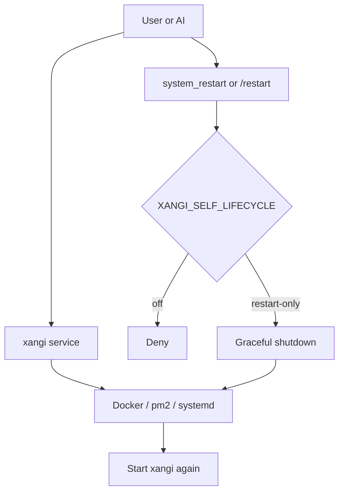

# 使い方ガイド

xangiの詳細な使い方ガイドです。

## 目次

- [基本操作](#基本操作)
- [チャンネルトピック注入](#チャンネルトピック注入)
- [タイムスタンプ注入](#タイムスタンプ注入)
- [セッション管理](#セッション管理)
- [スケジューラー](#スケジューラー)
- [Terminal CLI（xangi）](#terminal-clixangi)
- [チャット操作（xangi-cmd）](#チャット操作xangi-cmd)
- [イベントトリガー](#イベントトリガー)
- [ランタイム設定](#ランタイム設定)
- [AIによる自律操作](#aiによる自律操作)
- [Docker実行](#docker実行)
- [Local LLM](#local-llm)
- [ワークスペース hooks（Stop hook）](#ワークスペース-hooksstop-hook)
- [Tool Trajectory Logger](#tool-trajectory-logger)
- [セキュリティ](#セキュリティ)
- [環境変数一覧](#環境変数一覧)
- [複数インスタンスの運用](#複数インスタンスの運用)
- [セッションの保持期間](#セッションの保持期間)
- [オプション](#オプション)
- [トラブルシューティング](#トラブルシューティング)

## 基本操作

### メンションで呼び出し

```
@xangi 質問内容
```

### 専用チャンネル

`/autoreply` で有効化したチャンネルではメンション不要で応答します。設定は `settings.json` に保存されます。

## チャンネルトピック注入

Discordチャンネルのトピック（概要）が設定されている場合、その内容がプロンプトに自動注入されます。

チャンネルごとに異なるコンテキストや指示をAIに渡すことができます。

### 設定方法

Discordのチャンネル設定 → 「トピック」に自然言語で指示を記述します。

### 活用例

- `作業前に必ず ~/project/README.md を読むこと`
- `このチャンネルでは日本語で返答すること`
- `常にmemory-RAGを検索してから返答すること`

トピックが空の場合は何も注入されません。

## タイムスタンプ注入

プロンプトの先頭に現在時刻（JST）を自動注入します。AIが時間経過を認識でき、経過時間の把握や時間に関連する判断が正確になります。

デフォルトで有効です。無効にするには：

```bash
INJECT_TIMESTAMP=false
```

注入フォーマット: `[現在時刻: 2026/3/8 12:34:56]`

## セッション管理

| コマンド              | 説明                   |
| --------------------- | ---------------------- |
| `/new`, `!new`, `new` | 新しいセッションを開始 |

### Discordボタン操作

応答メッセージにボタンが表示されます。

- **処理中**: `Stop` / `延長` / `⏱ MM:SS` ボタン
  - `Stop` — `/stop` と同等。タスクを中断
  - `延長` — タイムアウトを「**残り時間 2 倍**」に延長（`TIMEOUT_MAX_MS` 上限内）
  - `⏱ MM:SS` — 残り時間表示（クリック無効、残り 30 秒以下で赤色に）
- **完了後**: `New` ボタン — `/new` と同等。セッションをリセット
- **Discordスレッド内の完了後**: `Leave` ボタン — 押したユーザー自身をスレッドから退出させ、そのユーザーのサイドバーから消す。BotにDiscordの「スレッドの管理」権限が必要

`DISCORD_SHOW_BUTTONS=false` でボタンを非表示にできます。

返信候補は既定OFFです。ONにすると、Discord / Slackの完了後メッセージには `返信候補` ボタンを1つだけ表示します。押すと候補と数字ボタンが本人だけに表示され、選択すると同じセッションへ送信されます。Web Chatも回答下の `返信候補` から候補を展開して送信できます。Discordの `/replysuggestions mode:on|off|show|default` で全プラットフォームを一括切替できます。OFF時は候補生成指示をAIプロンプトへ追加しないため、追加トークンや生成待ち時間は発生しません。各プラットフォームの `*_REPLY_SUGGESTIONS=true` で起動時にON、`*_REPLY_SUGGESTIONS_COUNT=1..5` で件数を変更できます（既定3件）。

### タイムアウト動的延長

長時間タスク（コード生成、調査タスク等）が初期タイムアウト（`TIMEOUT_MS`、デフォルト 30 分）に
ぶつかる前に、`延長` ボタンで残り時間を 2 倍にして引き伸ばせます。

- 初期タイムアウト: `TIMEOUT_MS` (デフォルト 30 分)
- 延長動作: 押下時点の残り時間を加算 → 結果として残り時間が **2 倍**
  - 例: 残り 3 分の状態で押すと残り 6 分に
  - 例: 残り 30 秒の状態で押すと残り 1 分に（緊急対応）
- 絶対上限: `TIMEOUT_MAX_MS` (デフォルト 10 時間 = 36000000ms)
  - さらに長く / 短く制限したい場合は `TIMEOUT_MAX_MS` で調整できる (例: `TIMEOUT_MAX_MS=3600000` = 1h)
- 機能 ON/OFF: `TIMEOUT_EXTEND_ENABLED` (デフォルト `true`)
  - `false` にすると `延長` ボタンが UI から消え、extendTimeout API は `unsupported` を返す
- UI:
  - Web Chat — 入力欄の `⏹` 右に `[延長][⏱ MM:SS]` が出る（送信中のみ）
  - Discord — 「考え中.」メッセージのボタン行に `[Stop][延長][⏱ MM:SS]` の順。通常メッセージ起点だけでなく schedule / trigger 起点のターンでも表示
  - Slack — メッセージ末尾の Block Kit actions に同様。通常メッセージ起点だけでなく schedule / trigger 起点のターンでも表示
- 残り 30 秒以下で表示が赤色 + パルスアニメーション
- 上限到達後は `延長` が disabled / 非表示

対応バックエンド:

- Claude Code (`persistent-runner`): タイマーをスケジュール再設定して延長
- Codex / Cursor / Grok / Antigravity: 子プロセスの kill タイマーを再設定
- Local LLM: AbortController を最新参照経由で延長
- Dynamic Runner: 内部 Runner にパススルー

API（プログラマブル操作）:

- `GET /api/sessions/:id/timeout` — 現在のタイムアウト状態 `{active, timeoutAt, maxTimeoutAt, remainingMs, timeoutMs}`
- `POST /api/sessions/:id/timeout/extend` — `{additionalMs?: number}` で延長（デフォルト 5 分）

> 💡 危険コマンドの実行前に Discord/Slack で承認を求めるオプションもあります（デフォルト無効）。詳しくは [オプション > 危険コマンドの承認フロー](#危険コマンドの承認フロー) を参照してください。

## スケジューラー

定期実行やリマインダーを設定できます。AI に自然言語で頼むと、AI が `xangi-cmd schedule_add` などを呼び出してスケジュールを登録します。

### 操作方法

| 入り口                           | 説明                                            |
| -------------------------------- | ----------------------------------------------- |
| `/schedule` (Discord スラッシュ) | GUI でスケジュールを追加・一覧・削除・切替      |
| `xangi-cmd schedule_*`           | AI または CLI から操作（下記）                  |
| 自然言語                         | 「毎日 9 時におはようって言って」等で AI が登録 |

### 時間指定の書き方

#### 単発リマインダー

```
30分後 〇〇をリマインド
1時間後 会議の準備
15:30 今日の15時半に通知
```

#### 繰り返し（自然言語）

```
毎日 9:00 朝の挨拶
毎日 18:00 日報を書く
毎週月曜 10:00 週次レポート
毎週金曜 17:00 週末の予定確認
```

#### cron式

より細かい制御が必要な場合はcron式も使えます：

```
0 9 * * * 毎日9時
0 */2 * * * 2時間ごと
30 8 * * 1-5 平日8:30
0 0 1 * * 毎月1日
```

| フィールド | 値   | 説明                |
| ---------- | ---- | ------------------- |
| 分         | 0-59 |                     |
| 時         | 0-23 |                     |
| 日         | 1-31 |                     |
| 月         | 1-12 |                     |
| 曜日       | 0-6  | 0=日曜, 1=月曜, ... |

### `xangi-cmd schedule_*`

AI ／ シェルから直接スケジュール操作できます。xangi 上で AI が実行する場合 `--channel` は省略可（現在のチャンネル ID が使われる）。

```bash
# スケジュール追加（自然言語）
xangi-cmd schedule_add --input "毎日 9:00 おはよう"
xangi-cmd schedule_add --input "30分後 ミーティング"
xangi-cmd schedule_add --input "15:00 レビュー"
xangi-cmd schedule_add --input "毎週月曜 10:00 週次MTG"
xangi-cmd schedule_add --input "cron 0 9 * * * おはよう"

# 別チャンネルに送りたい場合
xangi-cmd schedule_add --input "毎日 9:00 おはよう" --channel <channelId>

# 一覧表示
xangi-cmd schedule_list

# 削除（ID 指定）
xangi-cmd schedule_remove --id <スケジュールID>

# 有効/無効切り替え
xangi-cmd schedule_toggle --id <スケジュールID>
```

### データ保存

スケジュールデータは `${DATA_DIR}/schedules.json` に保存されます。

- デフォルト: `/workspace/.xangi/schedules.json`
- 環境変数 `DATA_DIR` で変更可能

## Gitを使わない初回インストール

macOS、Linux、WSL2で共通のコマンドです。

```bash
curl -fsSL https://github.com/karaage0703/xangi/releases/latest/download/install.sh | bash
```

共通`install.sh`がOSとCPUを判定し、同じGitHub Releaseにあるtarget installerを選択します。WSL2はLinuxとして扱います。`curl ... | bash`のpipeから起動した場合はxangi本体の配置だけを完了し、AI setupとservice起動を延期します。installer終了後、通常のTerminalから表示された`xangi setup`を実行してください。pipe内のshell/readlineからCodexなどのTUIへ端末を引き継がないことで、platform固有の端末初期化エラーを避けます。managed版は`~/.local/bin/xangi`を作成し、そのdirectoryがPATHに無い場合は現在のshell用の`export PATH=...`とzshへの永続設定方法を表示します。

## Terminal CLI（xangi）

`xangi` は人間が端末から xangi Web セッションに接続するための薄いクライアントです。既存の Even Terminal 互換 API (`/api/sessions` / `/api/prompt` / `/api/messages` / `/api/status`) を使い、Claude Code / Codex CLI などのバックエンドを直接起動しません。実際の backend / model は xangi 本体の設定または `XANGI_EVEN_TERMINAL_BACKEND` 系の設定で決まります。

`xangi-cmd` は AI エージェント内部や運用スクリプト向けの管理CLIです。`xangi` はセッション読み書きだけを行うユーザー向けCLIなので、権限境界を分けています。

```bash
# 開発中に xangi コマンドを PATH に通す
cd ~/xangi-dev
npm link

# npm link を使わない場合（単一 clone のとき）
mkdir -p ~/.local/bin
ln -sf ~/xangi-dev/bin/xangi ~/.local/bin/xangi

# 複数 clone を使う場合は名前付き symlink にする
ln -sf ~/xangi-dev/bin/xangi ~/.local/bin/xangi-dev
ln -sf ~/xangi-prod/bin/xangi ~/.local/bin/xangi-prod

# セッション一覧
xangi sessions --url http://127.0.0.1:18888

# 新規セッションに送信して応答まで待つ
xangi send "このリポジトリの状態を見て"

# 標準入力から送信
git diff | xangi send -

# 既存セッションへ送信して応答まで待つ
xangi send --session <sessionId> "続きお願いします"

# 送信だけして session ID を受け取る
xangi send --detach "あとで確認するタスクを投げる"

# 対話REPL
xangi chat --session <sessionId>

# macOS・Linux・WSL2初期設定
xangi setup

# config / service healthの診断（秘密値は表示しない）
xangi doctor

# 署名済みreleaseへ安全に更新（installerが保存した公開鍵とmanifest URLを使用）
xangi update

# 更新後、反映したいタイミングでserviceを明示的に再起動
xangi service restart

# managed版を削除（workspace・設定・token・履歴は保持）
xangi uninstall

# 設定・token・履歴も削除（workspaceは保持）
xangi uninstall --purge --yes

# Notion同期はデフォルトOFF。状態確認と明示的な切り替え
xangi notion-sync status
xangi notion-sync enable
xangi notion-sync run
xangi notion-sync disable

# OFFのまま一度だけ同期
xangi notion-sync run --once
```

`xangi setup` は最初にPATH上のCodex、Claude Code、Cursor Agent、Grok CLI、Antigravityをルールベースで検出し、`--version`が成功した候補だけを表示します。候補が複数なら利用するAIを選び、0件なら独立したAIツールセットアップを案内して終了します。Local LLMは通常利用できますが、ファイル操作を伴う初回オンボーディング役には選びません。

AIコーディングツールだけをセットアップする場合は、xangiをインストールせずに次のワンライナーを実行できます。

```bash
bash <(curl -fsSL https://github.com/karaage0703/xangi/releases/latest/download/setup-ai-tools.sh) codex
```

最後の引数は`codex`、`claude-code`、`cursor`、`grok`、`antigravity`から選びます。状態確認だけなら`check`を指定します。

選択したAIは日本語の対話モードで起動し、workspaceを一問ずつ確認します。Web Chatはアクセス範囲も確認し、`local`（既定・loopbackのみ）、`tailscale`（loopbackを同一portのTailscale Serve TCP転送でTailnet内へ公開）、`lan`（`0.0.0.0`、認証なしの警告付き）から明示選択します。Tailscaleを選んだ時だけ`tailscale serve --bg --tcp=<PORT> tcp://127.0.0.1:<PORT>`を設定し、`doctor`が転送先を検証します。agent UIへ表示する初回メッセージは短い開始案内だけで、詳細手順はmode 0600の一時ファイルからAIが読み、終了時に削除します。既知workspaceが無い場合は`ai-assistant-workspace`を最初に推奨します。利用者が選ぶと、GitHub repositoryの`main`最新commitを解決し、そのcommitのarchiveをGitなしで取得します。別の空workspaceや別の絶対pathにある既存workspaceも選べます。AIは回答後に`xangi setup --apply`を呼びますが、絶対path・backend・workspace mode・Web Chat accessの検証、mode 0600のatomic config保存、repository template適用、空workspace用BOOTSTRAP.md生成はxangi側が行います。最低限のBOOTSTRAPが終わるまでは`xangi setup --complete`を拒否します。完了後は、そのまま使い始めるか、Discord、Notion、他platform、schedule、skillの追加設定へ進むかをAIが確認します。これらxangi自体の設定はworkspace内の手順を探さず、xangi本体に同梱したREADME、`docs/usage.md`、各platformの公式documentを正本として案内します。終了前には、checkout版なら`service start`の後に`doctor`を実行し、service、health、runtime-workspaceが正常になってからだけ完了を案内します。Gitなし配布版はinstallerがOS serviceを起動し、`doctor`で確認します。Notion同期は明示的に選ぶまでOFFです。template適用時はrepository・commit SHA・archive SHA-256・適用時刻をstateへ保存し、その後の更新でworkspaceを上書きしません。

AIオンボーディングを置き換えるsetup用browser UIはありません。ただしtoken入力だけは`xangi settings`のローカル専用GUIを使います。対応AIが無い場合は上記の単体セットアップを表示して終了するため、導入後に`xangi setup`をやり直してください。LinuxはXDG Base Directory準拠、常駐化は`systemd --user`を使います。WSL2はsystemdを有効化した環境が対象です。

`setup`、`update`、`doctor`はGitなし配布版とGit checkout版の両方で使えます。checkout版の`setup`が保存した共通設定はPM2起動時にも読み込まれるため、`.env`へ`WORKSPACE_PATH`を重複記入する必要はありません。`doctor`はPM2、Web Chatのhealth、`/api/sessions`が報告する実際のworkspaceを確認し、設定と違えばERRORで終了します。

checkout版の`./bin/xangi update`は、未commit変更、detached HEAD、upstreamなしを先に拒否し、`git pull --ff-only`、`npm ci`、`npm run build`を順に実行します。署名済みmanaged appのupdaterをcheckoutから明示的に呼ぶ場合は`./bin/xangi update --managed`を使います。

managed版の`xangi uninstall`は定期update、OS service、xangi本体の順に削除します。workspace、設定、token、履歴は保持するため、表示されたinstall commandを再実行すれば以前の設定を使って再インストールできます。設定、token、履歴も削除する場合だけ`xangi uninstall --purge --yes`を使います。`--purge`は`--yes`が無ければ何も削除せず終了し、どちらの方法でもworkspaceは削除しません。

開発checkoutの`./bin/xangi`は、`git pull`後もGit管理外の古い`dist/`を実行しないよう、`npm ci`で入れたlocal `tsx`から現在のsourceを起動します。配布bundleはsourceを含まないため、同梱`dist`とNode runtimeを使い、AIが参照するREADMEと利用者向けdocsも同梱します。

Discord、Slack、LINE、Telegram、Notionのtokenと、Notion同期先の親ページIDまたはURLは`xangi settings`で入力します。一時GUIは`127.0.0.1`だけにbindし、one-time URLとHost検証を使い、保存済み値をbrowserへ返しません。保存後はserverを閉じ、OS別config directoryの`secrets.json`へmode 0600でatomic保存します。利用者が`read`や`printf`を組み立てたり、tokenをAIとの会話へ貼り付けたりする必要はありません。明示的な環境変数は互換性のため引き続き優先されます。

Notion同期はデフォルトOFFです。`xangi settings`でtokenと親ページを保存し、`xangi notion-sync enable`を実行するとONになります。`xangi notion-sync run`はworkspace内のMarkdownを自動検出し、workspaceを正本、Notionを閲覧用ミラーとしてフォルダ階層ごと作成・更新します。`.git`、`.xangi`、依存物、build成果物、logs、hidden pathは対象外です。個別ファイルpath、方向選択、`notion-sync.yaml`は標準利用では不要です。OFF中の`status` / `disable`はNotionへ接続せず、通常の`run`も通信前に拒否されます。`run --once`だけはOFFのまま一度実行できます。

GitHub Releaseでは共通入口を`install.sh`として公開します。`packaging/bootstrap.sh`がOSとCPUを検出し、同じReleaseにある`xangi-installer-<darwin|linux>-<arm64|x64>.sh`を選びます。pipe起動時はtarget installerへ`XANGI_INSTALL_DEFER_SETUP=1`を渡し、署名検証済みCLIの配置だけを完了して、AI setupとservice起動を別の`xangi setup`へ分離します。target installerは`packaging/build-installer.mjs`で生成し、xangi本体のEd25519署名済みmanifest/artifactを照合します。検証前にarchiveを展開せず、公開鍵と`releases/latest`の更新確認用manifest URLをversion領域外へ保存し、検証済みbundle、`current`、launcher、`~/.local/bin/xangi`を確定します。setupやservice起動が失敗してもxangi本体はrollbackせず、`xangi setup`または`xangi install`で再開できます。artifact URLはrelease versionへ固定し、更新時はlatest manifestの署名を検証してから新しいartifactを取得します。AIコーディングツールはRelease assetの`setup-ai-tools.sh`でxangiとは独立して導入・認証できます。通常のTerminalから実行した`xangi setup`が対話型オンボーディングを担当し、完了後にserviceを起動します。初回install後はLaunchAgentまたはsystemd user timerが6時間ごとに`xangi update`を実行します。workspaceテンプレートは選択時にrepositoryの最新commitを取得して空の初回だけ適用し、利用者の編集を更新・merge・上書きしません。

主なオプション:

| オプション       | 説明                                                                                                                               |
| ---------------- | ---------------------------------------------------------------------------------------------------------------------------------- |
| `--url`          | xangi Web Chat URL。未指定時は `XANGI_URL` / `XANGI_CLI_URL` / `~/.config/xangi/config.json` / `http://127.0.0.1:18888` の順で解決 |
| `--token`        | Even Terminal 互換 API token。未指定時は `.env` / `XANGI_TOKEN` / `XANGI_EVEN_TERMINAL_TOKEN` / config を使う                      |
| `--provider`     | Even Terminal 互換ラベル (`claude` / `codex`)。実 backend 選択ではなく互換用                                                       |
| `--session`      | attach する Web session ID                                                                                                         |
| `--detach`, `-d` | `send` 後に応答を待たず、session ID だけを返す                                                                                     |

`send` はデフォルトで `/api/messages` をポーリングして最終応答を表示します。待たずに戻したい場合だけ `--detach` を指定します。

起動時には `XANGI_ENV_PATH`、`XANGI_DIR/.env`、カレントディレクトリの `.env` も自動で読みます。`~/xangi-dev` で実行する場合は、通常 `--token` を手で渡す必要はありません。

`~/.local/bin` が PATH に入っていない場合は、shell の設定ファイルに `export PATH="$HOME/.local/bin:$PATH"` を追加してください。

設定ファイル例:

```json
{
  "url": "http://127.0.0.1:18888",
  "token": "your-token",
  "provider": "codex",
  "sessionId": "optional-default-session"
}
```

## チャット操作（xangi-cmd）

AIが `xangi-cmd` CLIツール経由でDiscord / Slack操作を実行します。xangi内蔵のtool-server（HTTP API）を介するため、DISCORD_TOKEN / SLACK_BOT_TOKEN 等のシークレットはAI CLIからアクセスできません。

| コマンド                                                                        | 説明                                                                                                       |
| ------------------------------------------------------------------------------- | ---------------------------------------------------------------------------------------------------------- |
| `xangi-cmd discord_history --channel <ID> [--count N] [--offset M]`             | チャンネル履歴取得                                                                                         |
| `xangi-cmd discord_message --channel <ID> --message-id <ID>`                    | 特定メッセージの全文取得                                                                                   |
| `xangi-cmd discord_send --channel <ID> --message "text"`                        | メッセージ送信                                                                                             |
| `xangi-cmd discord_channels --guild <ID>`                                       | チャンネル一覧                                                                                             |
| `xangi-cmd discord_search --channel <ID> --keyword "text"`                      | メッセージ検索                                                                                             |
| `xangi-cmd discord_edit --channel <ID> --message-id <ID> --content "text"`      | メッセージ編集                                                                                             |
| `xangi-cmd discord_delete --channel <ID> --message-id <ID>`                     | メッセージ削除                                                                                             |
| `xangi-cmd discord_thread_leave --user <ID> [--channel <ID>]`                   | スレッドから指定ユーザーを退出させる＝そのユーザーのサイドバーから消す（`--channel` 省略で現在のスレッド） |
| `xangi-cmd media_send --channel <ID> --file /path/to/file`                      | ファイル送信                                                                                               |
| `xangi-cmd web_history [--session <id>] [--count N]`                            | Web Chat 現ペイン履歴取得（`XANGI_CHANNEL_ID=web-chat:<id>` 自動解決）                                     |
| `xangi-cmd slack_history [--channel <id>] [--count N]`                          | Slack 現チャンネル履歴取得（`XANGI_CHANNEL_ID=<channel>` 自動解決）                                        |
| `xangi-cmd slack_send --channel <id> --message "text" [--thread-ts <ts>]`       | Slackメッセージ送信                                                                                        |
| `xangi-cmd slack_channels [--types public_channel,private_channel] [--limit N]` | Slackチャンネル一覧                                                                                        |
| `xangi-cmd slack_search --channel <id> --keyword "text" [--count N]`            | Slackメッセージ検索                                                                                        |
| `xangi-cmd slack_edit --channel <id> --message-ts <ts> --content "text"`        | Slackメッセージ編集                                                                                        |
| `xangi-cmd slack_delete --channel <id> --message-ts <ts>`                       | Slackメッセージ削除                                                                                        |

Slack では `SLACK_REACTION_DELETE_ENABLED=true`（デフォルト）かつ Slack App が `reaction_added` event / `reactions:read` scope を持つ場合、許可ユーザーが bot 投稿に `:wastebasket:` または `:x:` リアクションを付けると、その投稿を削除できます。対象リアクションは `SLACK_DELETE_REACTIONS=wastebasket,x` で変更できます。

### 使用例

```bash
# チャンネル履歴を取得
xangi-cmd discord_history --count 10
xangi-cmd discord_history --channel 1234567890 --count 10
xangi-cmd discord_history --channel 1234567890 --count 30 --offset 30  # 遡り
xangi-cmd discord_message --channel 1234567890 --message-id 111222333  # 履歴で省略された本文を全文取得

# 別チャンネルにメッセージ送信
xangi-cmd discord_send --channel 1234567890 --message "作業完了しました！"

# チャンネル一覧
xangi-cmd discord_channels --guild 9876543210

# メッセージ検索
xangi-cmd discord_search --channel 1234567890 --keyword "PR"

# Slack操作
xangi-cmd slack_send --channel C01234567 --message "作業完了しました！"
xangi-cmd slack_send --channel C01234567 --thread-ts 1719876543.000100 --message "スレッド返信"
xangi-cmd slack_channels --types public_channel,private_channel --limit 100
xangi-cmd slack_search --channel C01234567 --keyword "PR" --count 15
```

`--channel` を省略した場合、xangi上で実行中なら現在のチャンネルIDが使われます。CLI単体実行では `--channel` が必要です。

```bash
# メッセージ編集・削除
xangi-cmd discord_edit --channel 1234567890 --message-id 111222333 --content "修正後の内容"
xangi-cmd discord_delete --channel 1234567890 --message-id 111222333

# スレッドから指定ユーザーを退出させる＝そのユーザーのサイドバーから消す（--channel 省略で現在のスレッド）
xangi-cmd discord_thread_leave --user 111222333
xangi-cmd discord_thread_leave --user 111222333 --channel 1234567890
xangi-cmd slack_edit --channel C01234567 --message-ts 1719876543.000100 --content "修正後の内容"
xangi-cmd slack_delete --channel C01234567 --message-ts 1719876543.000100
```

### Tool Server

xangi-cmdはxangiプロセス内のtool-server（HTTP API）に中継します。

- ポートはOS自動割り当て（複数インスタンスでも競合なし）
- xangi本体が起動時に `XANGI_TOOL_SERVER` を子プロセスへ注入
- `xangi-cmd` は `XANGI_TOOL_SERVER` を使って接続先を解決
- 現在のチャンネルIDなど、xangi実行時の文脈は `context` としてtool-serverに引き渡されます

## イベントトリガー

外部の出来事（ビルド完了・CI 結果・新着検知など）をきっかけに、エージェントターンを起動できます。定期スケジュールでの確認（ポーリング）を「イベント発生時だけ起動」（プッシュ）に置き換えることで、即応性が上がり、空振りターンのトークン消費もなくなります。

### 有効化

`.env` に以下を設定します（デフォルトは無効）:

```bash
TRIGGER_ENABLED=true
XANGI_TRIGGER_TOKEN=<ランダムな長い文字列>   # 例: openssl rand -hex 32
# TRIGGER_MIN_INTERVAL_MS=10000             # 同一 source の最短発火間隔（デフォルト 10 秒）
```

トークンは必須です。`XANGI_TRIGGER_TOKEN` が未設定の場合、`TRIGGER_ENABLED=true` でも HTTP 経由のリクエストはすべて拒否されます（tool-server はネットワークに開いているため、認証なしの受け付けは任意プロンプト注入の入口になります）。

### HTTP で発火する

```bash
curl -X POST "$XANGI_TOOL_SERVER/api/trigger" \
  -H "Authorization: Bearer $XANGI_TRIGGER_TOKEN" \
  -H "Content-Type: application/json" \
  -d '{
    "channel": "<チャンネルID>",
    "message": "docker build が完了した。結果を確認して報告して",
    "source": "docker-build"
  }'
```

- `channel`（必須）: ターンを起動して結果を投稿するチャンネル ID
- `message`（必須）: エージェントへの指示（最大 4000 文字）
- `source`（任意）: 発火元の識別子（英数と `_.:-`、最大 64 文字）。表示ラベル・レート制限の単位になる
- `platform`（任意）: `discord`（デフォルト）または `slack`

成功すると `202 { "ok": true, "triggerId": "trg_..." }` が即座に返ります（ターンの完了は待ちません）。チャンネルには `⚡ trigger: <source>` のラベルが投稿され、続けてエージェントの応答が流れます。

### xangi-cmd で発火する

ローカルのスクリプトからは `xangi-cmd` でも発火できます（トークン不要、`TRIGGER_ENABLED=true` は必要）:

```bash
xangi-cmd trigger --channel <チャンネルID> --message "ビルドが終わった。結果を報告して" --source build
```

`TRIGGER_ENABLED=true` のときは、エージェント自身のシステムプロンプト（XANGI_COMMANDS）にもこの使い方が注入されます。共通プロンプトは、長時間処理が現在のtool実行やターンの終了後も存続すること、起動と存続を確認すること、ログと終了状態を残すことを要求します。具体的な永続実行・確認方法はOSや実行バックエンドによって異なるため、各ワークスペースで定義します。完了・失敗時の処理からtriggerを呼ぶことで、新しいターンを起動できます。

### 活用例

```bash
# 長時間ビルドの完了を即報告
docker build -t myapp . && \
  curl -X POST "$XANGI_TOOL_SERVER/api/trigger" \
    -H "Authorization: Bearer $XANGI_TRIGGER_TOKEN" \
    -H "Content-Type: application/json" \
    -d '{"channel":"...","message":"docker build 完了。イメージを確認して報告して","source":"docker-build"}'

# GitHub Actions の最後に 1 ステップ足して CI 結果を即通知
# 新着監視 cron が「新着があった時だけ」エージェントを起こす（空振りゼロ）
```

### 暴走防止

- 同一 `source` は `TRIGGER_MIN_INTERVAL_MS`（デフォルト 10 秒）以内の連続発火を拒否（`429`）
- 同一 `source` のターンが実行中の間は新規発火を拒否（`409`）

## ランタイム設定

`${DATA_DIR}/settings.json`（既定: `${WORKSPACE_PATH}/.xangi/settings.json`）にランタイム設定が保存されます。

```json
{
  "discordAutoReplyChannels": {
    "123456789012345678": true
  },
  "discordCompletionNotifyChannels": {
    "123456789012345678": "mention"
  },
  "discordThreadModeChannels": {
    "123456789012345678": true
  }
}
```

| 設定                              | 説明                                                               | デフォルト |
| --------------------------------- | ------------------------------------------------------------------ | ---------- |
| `discordAutoReplyChannels`        | チャンネルごとのメンションなし応答設定（`true` / `false`）         | なし       |
| `discordCompletionNotifyChannels` | チャンネルごとの完了通知 override（`off` / `message` / `mention`） | なし       |
| `discordThreadModeChannels`       | チャンネルごとの Discord スレッド返信 override（`true` / `false`） | なし       |

### 設定の確認・変更

| コマンド                                         | 説明                                                                                                 |
| ------------------------------------------------ | ---------------------------------------------------------------------------------------------------- |
| `/settings`                                      | 現在の設定を表示                                                                                     |
| `/restart`                                       | ボットを再起動（`.env` の `XANGI_SELF_LIFECYCLE` が `restart-only` の場合のみ）                      |
| `/autoreply <on\|off\|default\|show>`            | このチャンネルのメンションなし応答を切替（再起動不要、`settings.json` に永続化）                     |
| `/notify <off\|message\|mention\|default\|show>` | このチャンネルの完了通知を切替（再起動不要、`settings.json` に永続化）                               |
| `/respondtobots`                                 | bot メッセージへの応答を ON/OFF トグル（反応対象は `RESPOND_TO_BOTS` 環境変数で事前指定）            |
| `/threadmode <on\|off\|default\|show>`           | このチャンネルの Discord 発言ごとスレッド返信モードを切替（再起動不要、`settings.json` に永続化）    |
| `/llmmode <agent\|lite\|chat\|default\|show>`    | このチャンネルの Local LLM 動作モードを per-channel で切替（`.env` の `CHANNEL_OVERRIDES` に永続化） |

### バックエンド動的切り替え

チャンネルごとにバックエンド・モデル・effortレベルを切り替えられます。

| コマンド                                         | 説明                               |
| ------------------------------------------------ | ---------------------------------- |
| `/backend show`                                  | 現在のバックエンド・モデルを表示   |
| `/backend set claude-code`                       | Claude Codeに切り替え              |
| `/backend set cursor`                            | Cursor CLIに切り替え               |
| `/backend set grok`                              | Grok CLIに切り替え                 |
| `/backend set antigravity`                       | Antigravity CLIに切り替え          |
| `/backend set local-llm --model nemotron-3-nano` | Local LLM + モデル指定             |
| `/backend set claude-code --effort high`         | effort指定付きで切り替え           |
| `/backend reset`                                 | デフォルト（.env設定）に戻す       |
| `/backend list`                                  | 利用可能なバックエンド・モデル一覧 |

切り替え時は自動的に新しいセッションが開始されます（会話履歴は引き継がれません）。

#### 環境変数で制限

```bash
# 切り替え許可バックエンド（未設定=全バックエンド許可）
ALLOWED_BACKENDS=claude-code,cursor,grok,antigravity,local-llm

# 切り替え許可モデル（未設定=制限なし）
ALLOWED_MODELS=nemotron-3-nano,nemotron-3-super,qwen3.5:9b

# チャンネル別バックエンド設定（JSON）
CHANNEL_OVERRIDES={"チャンネルID":{"backend":"local-llm","model":"nemotron-3-nano"}}
```

#### 永続化

`/backend set` で変更した設定は `.env` の `CHANNEL_OVERRIDES` に自動保存されます。再起動後も設定が維持されます。
Discord スレッド内では、`/backend` と `/llmmode` は親チャンネルの `CHANNEL_OVERRIDES` を読み書きします。通常の会話セッションや実行ロックはスレッドIDで分離したまま、モデル・バックエンド設定だけ親チャンネルから継承します。

Docker環境では `.env` はコンテナ外にあるため、AI（Claude Code等）から変更されることはありません。

#### effort オプション（Claude Code用）

Claude Code の `--effort` オプション（`low` / `medium` / `high` / `max`）をチャンネルごとに設定可能。persistent モードではプロセス再起動が必要なため、切り替え時にセッションがリセットされます。`/backend set claude-code --effort デフォルト` で未指定状態に戻せます。

## AIによる自律操作

### 設定変更（ローカル実行時のみ）

AIは `.env` ファイルを編集して設定を変更できます：

```
「このチャンネルでも応答して」
→ AIが `/autoreply` 相当の設定を `settings.json` に保存
```

`/autoreply mode:on|off|default|show` で、このチャンネルのメンションなし応答を稼働中に確認・切替できます（再起動不要、`settings.json` に永続化）。`default` はチャンネル設定を削除し、デフォルトの OFF に戻します。
このコマンドを無効にするには `.env` に `ALLOW_AUTOREPLY_COMMAND=false` を設定してください（デフォルト: 有効）。

`/threadmode mode:on|off|default|show` で、このチャンネルの Discord 発言ごとスレッド返信モードを稼働中に確認・切替できます（再起動不要、`settings.json` に永続化）。`default` はチャンネル設定を削除し、全体デフォルトの `DISCORD_REPLY_IN_THREAD` に戻します。
既存スレッド内で受けた発言では、スレッドの元メッセージを `🧵 スレッド元` としてプロンプトに自動追加します。これにより、親チャンネル側の starter message がスレッド履歴に出ない場合でも、最初の話題を文脈として扱えます。
スレッド内のpromptには、親チャンネル名/IDとスレッド名/IDを常に併記します。AIは追加検索なしで、親チャンネルと現在のスレッドを区別して操作できます。
Discord スレッド内では、`/autoreply` / `/notify` / `/threadmode` とチャンネル topic 注入は親チャンネル設定を継承します。
このコマンドを無効にするには `.env` に `ALLOW_THREAD_MODE_COMMAND=false` を設定してください（デフォルト: 有効）。

`/notify` コマンドで、長い Discord ターン完了時の別メッセージ通知をチャンネルごとに切り替えられます。起動時の `DISCORD_COMPLETION_NOTIFY` はデフォルト値として使われ、チャンネル override は `settings.json` に保存されます。対象は通常の Discord メッセージターンのみで、スケジュール起点ターンは通知しません。

### 他 bot のメッセージへの応答（A/B 比較等）

デフォルトでは他の bot メッセージには反応しません。応答対象は `RESPOND_TO_BOTS` 環境変数で事前にホワイトリスト指定し、有効/無効は `RESPOND_TO_BOTS_ENABLED` か `/respondtobots` で切り替えます。

```
# 反応対象 (事前設定)
RESPOND_TO_BOTS=*                       # 全 bot
RESPOND_TO_BOTS=1469919453155164160     # 特定 bot のみ

# 機能 ON/OFF
RESPOND_TO_BOTS_ENABLED=true            # ON
RESPOND_TO_BOTS_ENABLED=false           # OFF (default)

# 連続返信の上限 (default 3、0 で無制限)
RESPOND_TO_BOTS_MAX_CONSECUTIVE=3
```

自分自身の bot ID は常に除外されます（無限ループ防止）。許可された bot からのメッセージは `DISCORD_ALLOWED_USER` チェックをバイパスします。

同じ bot との連続応答は `RESPOND_TO_BOTS_MAX_CONSECUTIVE` 回（default 3）で打ち切られます。別 bot や人間のメッセージが入ると連鎖カウンタはリセットされます。bot 同士の無限往復を防ぐ安全装置です。

`/respondtobots` で機能の ON/OFF を動的に切替でき、`.env` にも永続化されます。コマンドを無効化するには `ALLOW_RESPOND_TO_BOTS_COMMAND=false` を設定してください（デフォルト: 有効）。

ユースケース: 複数の xangi インスタンス（例: xangi-prod=Claude / xangi-dev=Local LLM）を同じチャンネルに常駐させて、同じプロンプトに対する応答を並べて品質比較する。

#### 制約・既知の制限

- bot メッセージへの応答は **メンション・DM・`/autoreply` で有効化したチャンネル経由** でのみ発火する。bot メッセージだからといってチャンネル全体で勝手に反応する仕様ではない。bot 同士の応答テストを行う場合は対象チャンネルで `/autoreply` を有効化する必要がある。
- `xangi-cmd discord_send` は通知抑止のため `allowed_mentions: { parse: [] }` 固定で送信する。そのため xangi-cmd 経由で送信されたメッセージ中の `<@user_id>` / `<@&role_id>` / `@everyone` は受信側の `message.mentions` に含まれない (Discord 公式仕様)。bot 同士のテストでメンション経由のトリガーは現状動かない。
- 上記の `xangi-cmd discord_send` の mention 抑制を一時的に解除したい場合は別途オプトイン機能の追加が必要（このスキル/機能のスコープ外）。

### メッセージ分割セパレータ

AIの応答テキストに `\n===\n`（前後に改行を含む `===`）が含まれている場合、そこで分割して別メッセージとして送信します。スケジューラー経由の応答だけでなく、Discordメンションからの直接メッセージでも機能します。1回のLLM応答で複数の独立した投稿を生成したい場合に便利です。

```
📝 ツイート解説1
> ツイート本文...

===
📝 ツイート解説2
> ツイート本文...
```

上記の応答はDiscordに2つの別メッセージとして送信されます。

### 再起動の仕組み

`xangi service start|stop|restart|status`と`xangi service autostart enable|disable`はmanaged版とcheckout版で共通です。managed版ではOS service、checkout版ではPM2を操作します。`stop`は自動起動登録を残したまま一時停止し、`start`で再開します。`autostart enable`だけがOSログイン・再起動後の自動起動を登録し、`autostart disable`で解除します。解除しても現在動いているxangiは停止しません。`xangi install`と`service start`は現在のセッションで起動するだけで、自動起動を勝手に有効化しません。checkout版ではcloneの`.env`にある`XANGI_PROCESS_NAME`のプロセスを対象にします。

`/restart` や `xangi-cmd system_restart` は、起動中の xangi 自身に graceful shutdown を要求する低レベル操作です。実際に再起動して復帰させるのは、xangiの外側にある Docker / pm2 / systemd などの supervisor です。

現在の会話を処理しているxangi自身を再起動するときは、子プロセスやスケジューラへ遅延委譲せず、`xangi-cmd system_restart`を直接使います。このコマンドの成功は再起動リクエストの受付を表し、再起動完了は新しいプロセスのstatus・起動時刻・起動ログで確認します。別cloneのサービス操作には、対象cloneの`./bin/xangi service restart`を直接実行して完了を待ちます。

自己再起動の許可は管理者が `.env` の `XANGI_SELF_LIFECYCLE` で設定します。AI が runtime setting で変更するものではありません。停止は xangi 内部からは保証できないため、Docker / pm2 / systemd など外側のライフサイクル管理で行います。



- `off`: xangi自身による再起動を拒否
- `restart-only`: xangi自身による再起動だけ許可
- 自己停止は xangi 内部ではなく外側の supervisor / lifecycle manager で実行
- **Docker**: `restart: always` により自動復帰
- **ローカル**: pm2等のプロセスマネージャが必要
- `.env` 変更後は xangi プロセスの再起動が必要

```bash
# pm2での運用例
./bin/xangi service start
./bin/xangi service status
./bin/xangi service restart
./bin/xangi service stop
```

OS 再起動後も自動起動したい場合は、一度だけ明示的に以下を実行します。managed版は`xangi`、checkout版は対象cloneの`./bin/xangi`を使います。

```bash
xangi service start
xangi service autostart enable
```

解除する場合は`xangi service autostart disable`を実行します。managed版ではmacOS LaunchAgentまたはLinux systemd user serviceの自動起動登録だけを追加・削除します。checkout版では有効化時に`pm2 save`と`pm2 startup`、解除時に`pm2 unstartup`を実行します。PM2が`sudo ...`コマンドを表示した場合は、そのコマンドを一度だけ実行してください。

複数 clone を運用する場合は、各 clone のディレクトリで `./bin/xangi service ...` を実行します。PATH から使いたい場合は、単一の `xangi` symlink ではなく `xangi-dev` / `xangi-prod` のような名前付き symlink を使うと対象が明確です。

```bash
ln -sf /home/user/xangi-dev/bin/xangi ~/.local/bin/xangi-dev
ln -sf /home/user/xangi-prod/bin/xangi ~/.local/bin/xangi-prod

xangi-dev service status
xangi-prod service restart
```

`--dir <xangi-dir>` は、PATH 上の `xangi` から別 clone を明示的に操作したい場合の補助オプションです。通常は対象 clone の `./bin/xangi` か名前付き symlink を使ってください。

`ecosystem.config.cjs` は PM2 のアプリ定義ファイルです。`.env` の `XANGI_PROCESS_NAME`（未指定時は `XANGI_INSTANCE_ID` → ディレクトリ名）を PM2 のプロセス名に使い、実行ファイル、`node --env-file=.env` などをまとめて定義します。`./bin/xangi service start` はこの設定を使って PM2 に起動を依頼します。`.cjs` にしているのは、このパッケージが ESM (`"type": "module"`) でも PM2 設定を CommonJS (`module.exports`) として確実に読ませるためです。

### pm2で環境変数を変更する場合

xangiは `node --env-file=.env` で環境変数を読み込みます。環境変数を変更したい場合は **`.env` ファイルを編集してから `./bin/xangi service restart`** してください。

```bash
# 正しい方法: .envを編集してrestart
vim .env  # TIMEOUT_MS=60000 を追加
./bin/xangi service restart
```

> **⚠️ `pm2 restart --update-env` は使わないこと！**
> `--update-env` はシェルの全環境変数をpm2に保存します。複数のxangiインスタンスを動かしている場合、別インスタンスの `DISCORD_TOKEN` 等が混入し、同じbotトークンで二重ログインする原因になります。
> `node --env-file=.env` は既存の環境変数を上書きしないため、pm2が先にセットした値が優先されてしまいます。

## Docker実行

コンテナ隔離環境で実行できます。3つのコンテナが用意されています：

| コンテナ    | Dockerfile       | 用途                                                                    |
| ----------- | ---------------- | ----------------------------------------------------------------------- |
| `xangi`     | `Dockerfile`     | 軽量版（Claude Code / Codex / Cursor CLI / Grok CLI / Antigravity CLI） |
| `xangi-max` | `Dockerfile.max` | フル版（uv + Python対応、Local LLM向け）                                |
| `xangi-gpu` | `Dockerfile.gpu` | GPU版（CUDA + PyTorch、画像生成・音声処理向け）                         |

### Claude Code バックエンド

```bash
docker compose up xangi -d --build

# Claude Code 認証
docker compose exec xangi claude
```

`docker-compose.yml` には `restart: unless-stopped` が設定されています。`docker compose stop` / `docker compose down` で明示停止しない限り、Docker daemon の起動時に xangi コンテナも自動復帰します。OS 再起動後も自動起動したい場合は、ホスト側で Docker daemon 自体の自動起動を有効にしてください。

Claude Code を Anthropic API key 課金で動かす場合は、`.env` に `ANTHROPIC_API_KEY` を設定します。
この値は Claude Code 子プロセスにのみ渡され、通常の環境変数ホワイトリストには含めません。
OAuth / keychain を使わず API key 認証に固定したい場合は `CLAUDE_CODE_BARE=true` を設定します。
API 呼び出しの上限額を付けたい場合は `CLAUDE_CODE_MAX_BUDGET_USD` を設定します。

```env
AGENT_BACKEND=claude-code
ANTHROPIC_API_KEY=sk-ant-...
CLAUDE_CODE_BARE=true
CLAUDE_CODE_MAX_BUDGET_USD=0.25
```

### Local LLM バックエンド（Ollama）

Ollamaコンテナが同梱されているため、ホストにOllamaをインストールする必要はありません。

```bash
# .env を設定
AGENT_BACKEND=local-llm
LOCAL_LLM_MODEL=nemotron-3-nano

# 起動（ollama + xangi-max）
docker compose up xangi-max -d --build
```

### GPU版（CUDA + Python + PyTorch）

PyTorch（CUDA対応）が利用可能で、DGX Spark（ARM64）でも動作します。

```bash
# 起動（xangi-gpu + ollama）
docker compose up xangi-gpu -d --build

# Claude Code 認証
docker compose exec xangi-gpu claude

# GPU確認
docker compose exec xangi-gpu python3 -c "import torch; print(torch.cuda.is_available())"
```

> **💡 ヒント**: `xangi-gpu` は `xangi-max` の上位互換です。GPU/PyTorchが必要なスキル（音声文字起こし、画像生成等）を使う場合はこちらを選択してください。

### Docker操作

```bash
# 停止
docker compose down

# 再起動（.env変更後など）
docker compose up xangi-max -d --force-recreate

# ログ確認
docker compose logs -f xangi-max
```

`docker compose down` はコンテナを明示停止・削除するため、再度 `docker compose up ... -d` するまで自動復帰しません。一時停止だけにしたい場合は `docker compose stop`、再開は `docker compose start` を使えます。

### ワークスペースのマウント

| 環境     | 変数              | 説明                                               |
| -------- | ----------------- | -------------------------------------------------- |
| ローカル | `WORKSPACE_PATH`  | エージェントが直接使うパス                         |
| Docker   | `XANGI_WORKSPACE` | ホスト側のパス（コンテナ内は `/workspace` に固定） |

Docker実行時は `.env` に `XANGI_WORKSPACE` を設定します：

```bash
XANGI_WORKSPACE=/home/user/my-workspace
```

> **⚠️ `WORKSPACE_PATH` は使わないこと。** ホストのシェル環境変数と衝突する可能性があります。

### セキュリティ

- コンテナはホストネットワークに**直接アクセスできません**
- Ollamaコンテナは同じdocker network内で隔離
- AIエージェントへの環境変数はホワイトリスト方式で制限（`DISCORD_TOKEN` 等はアクセス不可）

## Local LLM

xangiのLocal LLMバックエンドはOpenAI互換API（`/v1/chat/completions`）を使用します。OllamaとvLLM、その他のOpenAI互換サーバー（LM Studio、llama.cpp等）に対応しています。

### ローカル実行（Ollama）

```bash
# .env を設定
AGENT_BACKEND=local-llm
LOCAL_LLM_MODEL=gpt-oss:20b
# LOCAL_LLM_BASE_URL=http://localhost:11434  # デフォルト
```

Ollamaが起動していればそのまま動作します。

### vLLM（OpenAI互換高速サーバー）

vLLMはOpenAI互換のAPIを提供する高速推論サーバー。大規模モデル・長コンテキスト・MTP (Multi-Token Prediction) drafter など、Ollamaよりも本格的な運用に向いています。

#### 起動コマンド例（Gemma 4 26B-A4B-NVFP4 + MTP）

```bash
vllm serve nvidia/Gemma-4-26B-A4B-NVFP4 \
  --host 0.0.0.0 --port 8001 \
  --served-model-name gemma-4-26b-a4b \
  --max-num-batched-tokens 131072 \
  --max-model-len 131072 \
  --gpu-memory-utilization 0.85 \
  --kv-cache-dtype fp8 \
  --enable-auto-tool-choice --tool-call-parser gemma4 \
  --speculative-config '{"method":"mtp","num_speculative_tokens":2,"model":"google/gemma-4-26B-A4B-it-assistant"}'
```

#### .env での接続設定

```bash
AGENT_BACKEND=local-llm
LOCAL_LLM_BASE_URL=http://localhost:8001
# Docker から接続する場合: http://host.docker.internal:8001
LOCAL_LLM_MODEL=gemma-4-26b-a4b
LOCAL_LLM_NUM_CTX=131072  # vLLM の --max-model-len と揃える
```

#### チューニング指針

| オプション                                               | 推奨値                   | 説明                                                                                            |
| -------------------------------------------------------- | ------------------------ | ----------------------------------------------------------------------------------------------- |
| `--max-model-len`                                        | `131072`                 | arxiv全文 (~70k tokens)・site-patrol等の長プロンプトを安定処理。65536では論文全文読解が入らない |
| `--kv-cache-dtype`                                       | `fp8`                    | context wide化でKV-cacheが膨張するため fp8 圧縮で吸収。GB10 80GiB クラスで余裕                  |
| `--gpu-memory-utilization`                               | `0.85`                   | 0.6だとKV-cache不足、0.85で安定                                                                 |
| `--max-num-batched-tokens`                               | `--max-model-len` と同値 | バッチング上限                                                                                  |
| `--enable-auto-tool-choice` `--tool-call-parser <model>` | モデル依存               | tool calling有効化。Gemma 4は `gemma4` パーサー                                                 |
| `--speculative-config` (MTP)                             | モデル依存               | MTP drafter利用時に指定。応答速度向上                                                           |

`LOCAL_LLM_NUM_CTX` は xangi 側のクライアント上限。vLLM の `--max-model-len` と揃えないと、xangi 側で先にプロンプト切り詰めて拡大の恩恵を失う。

#### 確認

```bash
# モデル一覧 (vLLM)
curl -s http://localhost:8001/v1/models | jq '.data[] | {id, max_model_len}'

# Discord 上で
/backend list  # サーバー側のモデル一覧を表示 (Ollama + vLLM 両対応)
/backend show  # 現在のチャンネルの Local LLM 詳細設定を表示
```

### ログ

全バックエンドでセッション単位のトランスクリプトログ（`logs/sessions/<appSessionId>.jsonl`）が保存されます。プロンプト・応答・エラーがセッションごとのJSONLファイルに記録されます。

Docker実行については [Docker実行](#docker実行) セクションを参照してください。

### 機能の個別制御

Local LLMの各機能は環境変数で個別にon/offできます。

```bash
# .env — 例: ツールだけ無効にする
LOCAL_LLM_TOOLS=false

# 例: 雑談ボット（全部off）
LOCAL_LLM_TOOLS=false
LOCAL_LLM_SKILLS=false
LOCAL_LLM_XANGI_COMMANDS=false

# 例: トリガー付き雑談
LOCAL_LLM_TOOLS=false
LOCAL_LLM_SKILLS=false
LOCAL_LLM_XANGI_COMMANDS=false
LOCAL_LLM_TRIGGERS=true
```

| 変数                       | 説明                                                             | デフォルト |
| -------------------------- | ---------------------------------------------------------------- | ---------- |
| `LOCAL_LLM_TOOLS`          | ツール実行（exec/read/write/edit/glob/grep/send_file/web_fetch） | `true`     |
| `LOCAL_LLM_SKILLS`         | スキル一覧注入                                                   | `true`     |
| `LOCAL_LLM_XANGI_COMMANDS` | XANGI_COMMANDS注入                                               | `true`     |
| `LOCAL_LLM_TRIGGERS`       | トリガー（!コマンド）                                            | `false`    |

`LOCAL_LLM_MODE` でプリセットも使えます（個別設定が優先）：

- `agent`（デフォルト）— tools / skills / xangi_commands ON、triggers OFF
- `chat` — 全部 OFF（純粋雑談ボット）
- `lite` — tools / xangi_commands / triggers ON、skills OFF（軽めだが Discord/Slack 操作はできるチャットボット向け）

ワークスペースコンテキスト（AGENTS.md等）はどの設定でも注入されます。

### Triggers（カスタムツール）

ワークスペースの `triggers/` ディレクトリにシェルスクリプトを置くだけで、LLMが使えるカスタムツールを追加できます。`LOCAL_LLM_TRIGGERS=true` で有効化。

LLMがfunction callingでトリガーを呼び出し、handler.shを実行して結果を返します。

#### セットアップ

ワークスペースに `triggers/` ディレクトリを作成し、コマンドごとにサブディレクトリを配置します。

```
workspace/
  triggers/
    weather/
      trigger.yaml    # トリガー定義
      handler.sh      # 実行スクリプト
    search/
      trigger.yaml
      handler.sh
```

#### trigger.yaml フォーマット

```yaml
name: weather
description: '天気予報を取得する（例: weather 名古屋）'
handler: handler.sh
```

| フィールド    | 必須 | 説明                                              |
| ------------- | ---- | ------------------------------------------------- |
| `name`        | Yes  | ツール名（LLMがfunction callingで呼ぶ名前）       |
| `description` | No   | ツールの説明（LLMに渡されるツール定義に含まれる） |
| `handler`     | Yes  | 実行スクリプトのファイル名                        |

#### handler の仕様

- ワークスペースルートを `cwd` として `bash handler.sh [引数...]` で実行
- 引数はLLMがfunction callingで渡した`args`をスペース区切りで渡す
- タイムアウト: `EXEC_TIMEOUT_MS`（デフォルト120秒）
- `stdout` の内容がLLMに返され、LLMが自然な文章で応答を生成

#### 動作フロー

1. xangi起動時にワークスペースの `triggers/` をスキャンしてツール定義を自動生成
2. LLMにカスタムツールとして登録
3. LLMがfunction callingでツールを呼び出し
4. handler.shが実行され、結果がLLMに返される
5. LLMが結果を踏まえて自然な文章で応答

#### 注意事項

- ツールが有効なモード（lite/agent）で動作します
- 新しいトリガーを追加したらxangiを再起動してください

### マルチモーダル（画像入力）

Local LLMバックエンドは画像入力に対応しています。Discord/Slackで画像を添付してメッセージを送ると、画像の内容をLLMに渡して分析・説明を求めることができます。

#### 対応画像形式

JPEG (.jpg, .jpeg)、PNG (.png)、GIF (.gif)、WebP (.webp)

#### 対応LLMサーバー

- **Ollama** — `/api/chat` の `images` フィールド（base64形式）で画像を送信
- **OpenAI互換API（vLLM等）** — `messages[].content` を配列形式（`text` + `image_url`）で送信

エンドポイントのURLにポート `11434` または `ollama` が含まれる場合はOllama形式、それ以外はOpenAI互換形式が使用されます。

#### 使用例

```
@xangi この画像について説明して
（画像を添付）
```

画像以外のファイル（PDF、テキスト等）は従来通りファイルパスとしてプロンプトに渡されます。

#### 注意事項

- マルチモーダル対応モデル（例: `llava`, `llama3.2-vision` 等）が必要です
- 画像はbase64エンコードしてそのまま送信されます（リサイズなし）
- 画像がない場合は従来通りテキストのみで動作します（後方互換性あり）

### セッション管理と自動リトライ

Local LLMバックエンドはチャンネルごとにセッション（会話履歴）を保持します。コンテキスト長超過や不正メッセージ形式などセッション履歴に起因するエラーが発生した場合、自動的にセッションをクリアして最後のユーザーメッセージだけでリトライします。

### エラーハンドリング

| エラー                      | メッセージ                                                                    |
| --------------------------- | ----------------------------------------------------------------------------- |
| ECONNREFUSED / fetch failed | LLMサーバーに接続できませんでした。サーバーが起動しているか確認してください。 |
| timeout / aborted           | LLMからの応答がタイムアウトしました。しばらくしてから再試行してください。     |
| 401 / 403                   | LLMサーバーへの認証に失敗しました。APIキーを確認してください。                |
| 429                         | LLMサーバーのレートリミットに達しました。しばらくしてから再試行してください。 |
| 500 / 502 / 503             | LLMサーバーで内部エラーが発生しました。しばらくしてから再試行してください。   |
| その他                      | LLMエラー: （元のエラーメッセージ）                                           |

### 対応モデル例

| モデル             | サイズ | 特徴                           | 備考             |
| ------------------ | ------ | ------------------------------ | ---------------- |
| `gpt-oss:20b`      | 13GB   | MoE、高品質・ツールコール対応  | 推奨             |
| `gpt-oss:120b`     | 65GB   | MoE（アクティブ12B）、最高品質 | 大容量メモリ必要 |
| `nemotron-3-nano`  | 24GB   | Mambaハイブリッド、高速        |                  |
| `nemotron-3-super` | 86GB   | Mambaハイブリッド、高精度      | 大容量メモリ必要 |
| `qwen3.5:9b`       | 6.6GB  | 軽量・Thinking対応             |                  |
| `Qwen3.5-27B-FP8`  | 29GB   | ツールコール高精度、約6tok/s   | vLLM推奨         |

その他Ollama/vLLMで利用可能なモデルに対応しています。

## ワークスペース hooks（Stop hook）

エージェントループのターン終了時に外部検証プロセス（hook）を挟む機構。Claude Code / Codex CLI の Stop hook と互換の契約を採用しているため、同じ hook スクリプトを複数のランタイムで共用できる。現在対応しているのは Local LLM バックエンドのターン終了（`Stop` イベント）のみ。

使い所の例: 「あとで確認して報告します」と約束したのにスケジュール登録ツールを呼んでいない応答を block し、登録を促すフィードバックを返す（やりっぱなし防止）。

### 設定

hooks はデフォルト有効です。ワークスペースに `hooks/hooks.json` を置くだけで動きます（無ければ何もしない no-op）。skills / triggers と同じ「置いたら効く」の慣行です。

```bash
# 一時的に止めたい場合のみ（キルスイッチ）
# XANGI_HOOKS_ENABLED=false
# 設定ファイルの場所を変える場合のみ（既定: <workspace>/hooks/hooks.json）
# XANGI_HOOKS_FILE=/path/to/hooks.json
```

ワークスペースに `hooks/hooks.json` を置く:

```json
{
  "hooks": {
    "Stop": [{ "command": "python3 hooks/check-promise/hook.py", "timeoutMs": 10000 }]
  }
}
```

### hook の契約（Claude Code 互換）

hook はターン終了時にコマンドとして実行され（cwd = ワークスペース）、stdin に JSON を受け取る:

```json
{
  "hook_event_name": "Stop",
  "session_id": "...",
  "cwd": "/path/to/workspace",
  "stop_hook_active": false,
  "last_assistant_message": "（このターンの最終応答テキスト）",
  "channel_id": "...",
  "tools_called": ["exec", "schedule_add"]
}
```

`channel_id` / `tools_called` は xangi 拡張。transcript を parse しなくても「このターンで実際に実行されたツール」を hook 側が直接判定できる。

block の返し方（どちらでも可）:

- exit 0 + stdout に `{"decision": "block", "reason": "..."}`（reason 必須）
- exit 2 + stderr に理由テキスト

それ以外（出力なし / JSON 以外 / 他の exit code / タイムアウト / spawn 失敗）はすべて素通り（フェイルオープン）。hook の異常で本体の応答が止まることはない。

### block されたときの動作

1. hook の reason を `[STOP HOOK FEEDBACK]` として system message で LLM に注入
2. 同じセッションで 1 回だけ継続ラウンドを実行（ツール呼び出し可。例: ここで `schedule_add` を呼んで約束を実体化できる）
3. ユーザーに返る最終応答は「元の応答 + 継続ラウンドの応答」の連結
4. 継続ラウンドの結果は再チェックしない（1 ターン 1 ナッジ、block 無限ループ防止）

### 環境変数

| 変数                  | デフォルト                     | 説明                                          |
| --------------------- | ------------------------------ | --------------------------------------------- |
| `XANGI_HOOKS_ENABLED` | `true`                         | `false` で hooks 機構を無効化（キルスイッチ） |
| `XANGI_HOOKS_FILE`    | `<workspace>/hooks/hooks.json` | hooks 設定ファイルのパス                      |

### オン/オフの制御

- 全体: `XANGI_HOOKS_ENABLED`（既定 `true`。`false` でキルスイッチ、`hooks.json` を残したまま一時停止できる）
- モード連動: ツール無効モード（`chat`）ではゲート自体を自動スキップする。継続ラウンドで LLM がフィードバックに対処する手段（`schedule_add` 等のツール呼び出し）を持たないため
- チャンネル別: `CHANNEL_OVERRIDES` の `localLlmMode` や `/llmmode` でチャンネルを `chat` に切り替えれば、そのチャンネルだけ hooks が無効になる

### 制限

- 対応イベントは `Stop` のみ（`PreToolUse` 等は将来拡張）
- 対応バックエンドは `local-llm` のみ。`claude-code` / `codex` バックエンドでは各 CLI 自身の hooks 機構（Claude Code の `.claude/settings.json` / Codex の lifecycle hooks）を使う
- 複数 hook は登録順に直列実行し、最初に block を返した hook で確定
- hook の stdout/stderr の取り込みは 64KB まで、タイムアウトは既定 10 秒・上限 60 秒

## Tool Trajectory Logger

Local LLM の tool 使用挙動 (drift / loop / tool_search 採用ミス) を構造化 jsonl で記録する観測ロガー。既存 `transcript-logger` (会話の正史) とは独立して動き、session restore とは完全分離されている。

### 出力先

```
logs/tool-trajectory/<appSessionId>.jsonl
```

1 line = 1 event。既存 `logs/sessions/<appSessionId>.jsonl` (transcript) とは別ディレクトリで干渉しない。

### 記録される event 種別

| kind            | 何を記録するか                                                                      |
| --------------- | ----------------------------------------------------------------------------------- |
| `session_start` | backend / model / baseUrl / features / logger 設定 (per appSession 1 回)            |
| `tool_call`     | tool_name / args_sanitized / result_truncated / duration_ms / status / round        |
| `tool_search`   | query / candidates_top5 / activated_tools / activated_skills                        |
| `drift_rescue`  | raw_text_head / parsed_name / safety_verdict / executed                             |
| `loop_detected` | loop_kind (exact / similar / idempotent_cache_hit) / signature / action             |
| `runner_event`  | streaming_hold_buffer_drop / context_prune / session_retry / idempotent_cache_store |

全 event に共通 fields: `ts` / `event_id` / `kind` / `schema_version=1` / `appSessionId` / `seq` / `turn_index` / `round` / `platform` / `backend` / `model` / `channelId_hash`。

### 強制 sanitize

OSS 公開前提のため log の中身が後で公開されても問題ない設計:

- secret 系 key (`token` / `apiKey` / `bearer` / `cookie` / `authorization` / `password` 等) の値 → `[REDACTED_SECRET]` 固定文字列に置換
- Discord channelId / userId / LINE userId → salt 付き sha256 hash (12 字、`h_` prefix)
- 絶対 path home prefix → `$HOME` に置換
- URL の secret-like query → redact
- 長文 args / result → head/tail 方式で切り詰め (args 8KB / result 16KB / drift raw 2KB がデフォルト)

### Retention

- default では削除しない (TTL / size cap いずれも env で明示指定された時のみ動作)
- 観察データを残す前提なので、自動削除はオプトイン
- env で TTL 日数を指定すると起動時に超過分を削除
- env で size cap MB を指定すると超えた分を古いファイルから削除
- 1 session = 1 file の構造は維持 (rotation 無し)

### 設定 env

| env                                    | default          | 説明                                                                             |
| -------------------------------------- | ---------------- | -------------------------------------------------------------------------------- |
| `XANGI_TOOL_TRAJECTORY_LOG`            | `true`           | `false` で完全 no-op、ファイル作成もしない                                       |
| `TOOL_TRAJECTORY_LOG_HASH_SALT`        | (起動毎ランダム) | Discord/LINE ID hash 用の固定 salt。プロセス跨ぎで ID 相関を追いたい場合のみ指定 |
| `TOOL_TRAJECTORY_LOG_MAX_ARGS_CHARS`   | `8192`           | args 切り詰め上限                                                                |
| `TOOL_TRAJECTORY_LOG_MAX_RESULT_CHARS` | `16384`          | tool 結果切り詰め上限                                                            |
| `TOOL_TRAJECTORY_LOG_RETENTION_DAYS`   | (未設定)         | 削除しない。設定時のみ TTL 日数として動作                                        |
| `TOOL_TRAJECTORY_LOG_SIZE_CAP_MB`      | (未設定)         | 上限なし。設定時のみ全体サイズ上限 (MB) として動作                               |

### fail-safe

ロガー書き込みエラーは `console.warn` で出力されるだけで例外を投げない。jsonl 破損・ディスクフル等が起きても runner は落とさない。session restore は `logs/tool-trajectory/` を一切見ないので、このログ側の障害は会話継続に影響しない。

### 設計意図

- 観察対象: Local LLM の多段防御 (loop / 冪等キャッシュ / streaming hold buffer / pseudo tool_call rescue / context prune の 5+1 機構) がどう発火しているか、tool_search の採用結果、drift_rescue の安全判定内訳
- runner 本体には dataset 都合を一切混ぜず、観測ログの生成だけを行う。蓄積データを別形式に変換したい場合は、この jsonl を入力に後段で別途処理する

## セキュリティ

### 環境変数のホワイトリスト

AIエージェント（CLI spawn / Local LLM exec）に渡す環境変数は `src/safe-env.ts` で管理。ホワイトリストに記載された変数のみ渡され、`DISCORD_TOKEN` 等のシークレットはAIからアクセス不可。

**許可される変数:** `PATH`, `HOME`, `USER`, `SHELL`, `LANG`, `LC_*`, `TERM`, `TMPDIR`, `TZ`, `NODE_ENV`, `NODE_PATH`, `WORKSPACE_PATH`, `AGENT_BACKEND`, `AGENT_MODEL`, `SKIP_PERMISSIONS`, `DATA_DIR`, `XANGI_TOOL_SERVER`, `XANGI_CHANNEL_ID`

`ANTHROPIC_API_KEY`、`CURSOR_API_KEY`、`XAI_API_KEY` は通常のホワイトリストには含めず、それぞれ Claude Code / Cursor CLI / Grok CLI の子プロセスにだけ渡されます。

**渡されない変数（例）:** `DISCORD_TOKEN`, `SLACK_BOT_TOKEN`, `SLACK_APP_TOKEN`, `LOCAL_LLM_API_KEY`, `GH_TOKEN`

ホワイトリストを変更する場合は `src/safe-env.ts` の `ALLOWED_ENV_KEYS` を編集。

## 環境変数一覧

### 初回履歴先読み（Discord / Slack / Web 共通）

| 変数                       | 説明                                                       | デフォルト |
| -------------------------- | ---------------------------------------------------------- | ---------- |
| `HISTORY_PREFETCH_ENABLED` | providerセッションの初回ターン前に直近会話履歴を先読みする | `true`     |
| `HISTORY_PREFETCH_COUNT`   | 先読みするメッセージ件数（`1`〜`100`）                     | `10`       |

先読みはproviderセッションIDが無い初回だけ実行します。継続ターンは既存providerセッションが会話文脈を持つため再取得しません。`HISTORY_PREFETCH_ENABLED=false` で無効化すると初回履歴を注入しません。システムプロンプトから履歴取得を指示しないため、履歴が必要な運用では先読みを有効にしてください。

プラットフォーム・返信モードごとの取得範囲:

- Discord 通常モード: 現在の発言より前にある同一チャンネルの直近N件
- Discord スレッドモード:
  - 新規作成したスレッド: 過去0件として注入。現在の発言がスレッド元になる
  - 既存スレッド内の初回: 同一スレッド内の直近N件。親チャンネル側のスレッド元は従来どおり別途注入
- Slack 通常モード: `conversations.history` で同一チャンネルの直近N件
- Slack スレッドモード:
  - 新規スレッド: 過去0件
  - 既存スレッド: `conversations.replies` でroot＋現在より前の返信から直近N件
- Web Chat: 同一ペインのsession JSONLから直近N件。新規ペインは過去0件

先読み履歴は引用データ境界内へ入れ、履歴内の命令文をsystem指示として扱わないよう明示します。さらに古い履歴が必要な場合、エージェントは従来のhistoryコマンドを追加実行できます。

### Discord

| 変数                                 | 説明                                                                                           | デフォルト |
| ------------------------------------ | ---------------------------------------------------------------------------------------------- | ---------- |
| `DISCORD_TOKEN`                      | Discord Bot Token                                                                              | **必須**   |
| `DISCORD_ALLOWED_USER`               | 許可ユーザーID（カンマ区切りで複数可、`*`で全員許可）                                          | **必須**   |
| `DISCORD_REPLY_IN_THREAD`            | 返信をチャンネルではなく発言ごとに作成したスレッドへ投稿                                       | `false`    |
| `DISCORD_STREAMING`                  | ストリーミング出力                                                                             | `true`     |
| `DISCORD_SHOW_THINKING`              | 思考過程を表示                                                                                 | `true`     |
| `DISCORD_SHOW_BUTTONS`               | Stop/New Sessionボタン表示                                                                     | `true`     |
| `DISCORD_REPLY_SUGGESTIONS`          | 本人だけに候補を展開する `返信候補` ボタンを表示                                               | `false`    |
| `DISCORD_REPLY_SUGGESTIONS_COUNT`    | 返信候補数（1〜5）                                                                             | `3`        |
| `DISCORD_TOOL_HISTORY_MODE`          | ツール利用履歴表示（`button` / `inline` / `off`）                                              | `button`   |
| `DISCORD_SHOW_TOOL_BUTTON`           | `button` モード時に Tools ボタンを表示                                                         | `true`     |
| `DISCORD_SHOW_LIVE_TOOL_USE`         | 実行中だけ raw ツール履歴を表示                                                                | `true`     |
| `TOOL_HISTORY_MAX_LINES`             | ツール履歴の最大表示行数（超過分は `… (+N 件省略)`、`0` 以下で無制限）                         | `10`       |
| `DISCORD_SHOW_TOOL_USE`              | 互換設定。`false` は `off`、`true` は `inline` として扱う                                      | -          |
| `DISCORD_COMPLETION_NOTIFY`          | 一定時間以上かかった Discord ターン完了時に別メッセージで通知（`off` / `message` / `mention`） | `message`  |
| `DISCORD_COMPLETION_NOTIFY_AFTER_MS` | 完了通知を出す最短経過時間（ms）                                                               | `10000`    |
| `ALLOW_AUTOREPLY_COMMAND`            | `/autoreply` コマンドの有効化                                                                  | `true`     |
| `XANGI_SELF_LIFECYCLE`               | xangi自身による再起動の許可（`off` / `restart-only`）                                          | `off`      |
| `RESPOND_TO_BOTS`                    | 反応対象 bot ID のホワイトリスト（`*` で全 bot）                                               | -          |
| `RESPOND_TO_BOTS_ENABLED`            | bot メッセージ応答機能の ON/OFF（`/respondtobots` で動的切替）                                 | `false`    |
| `RESPOND_TO_BOTS_MAX_CONSECUTIVE`    | 同じ bot との連続応答の上限（0 で無制限）                                                      | `3`        |
| `ALLOW_RESPOND_TO_BOTS_COMMAND`      | `/respondtobots` コマンドの有効化                                                              | `true`     |
| `ALLOW_THREAD_MODE_COMMAND`          | `/threadmode` コマンドの有効化                                                                 | `true`     |
| `ALLOW_LLM_MODE_COMMAND`             | `/llmmode` コマンド（Local LLM 動作モード切替）の有効化                                        | `true`     |
| `INJECT_CHANNEL_TOPIC`               | チャンネルトピックをプロンプトに注入                                                           | `true`     |
| `INJECT_TIMESTAMP`                   | 現在時刻をプロンプトに注入                                                                     | `true`     |

### AIエージェント

| 変数                         | 説明                                                                                                                    | デフォルト              |
| ---------------------------- | ----------------------------------------------------------------------------------------------------------------------- | ----------------------- |
| `AGENT_BACKEND`              | バックエンド（`claude-code` / `codex` / `cursor` / `grok` / `antigravity` / `local-llm`）                               | `claude-code`           |
| `AGENT_MODEL`                | 使用するモデル                                                                                                          | -                       |
| `WORKSPACE_PATH`             | 作業ディレクトリ（ローカル実行時）                                                                                      | `./workspace`           |
| `XANGI_WORKSPACE`            | ワークスペースのホスト側パス（Docker実行時）                                                                            | `./workspace`           |
| `SKIP_PERMISSIONS`           | デフォルトで許可スキップ（非対話実行で待ち状態を防ぐため既定有効。明示的に `false` で無効化）                           | `true`                  |
| `TIMEOUT_MS`                 | リクエストの初期タイムアウト（ミリ秒）                                                                                  | `1800000`               |
| `XANGI_TOOL_SERVER_PORT`     | 内部ツールサーバーの固定ポート。未設定時は前回ポートを再利用（使用中なら自動割り当て）                                  | 前回ポート再利用        |
| `XANGI_CONFIG_STRICT`        | 環境変数の不正値（数値でない・範囲外・enum typo 等）を起動エラーに格上げ。デフォルトは警告 + デフォルト値フォールバック | `false`                 |
| `TIMEOUT_MAX_MS`             | タイムアウト延長の絶対上限（ミリ秒）                                                                                    | `36000000`              |
| `TIMEOUT_EXTEND_ENABLED`     | 延長ボタン (`[延長]`) の有効/無効                                                                                       | `true`                  |
| `WEB_CHAT_UPLOAD_ACCEPT`     | Web Chat 受信ファイル許可リスト（カンマ区切り、HTML `<input accept>` 互換）                                             | 全許可                  |
| `WEB_CHAT_DOWNLOAD_ACCEPT`   | Web Chat ダウンロード許可拡張子リスト（`.html,.txt` 等）                                                                | 全許可                  |
| `ALLOWED_BACKENDS`           | `/backend` で切り替え許可するバックエンド（カンマ区切り）。未設定なら全バックエンド許可                                 | 全バックエンド          |
| `ALLOWED_MODELS`             | `/backend` で切り替え許可するモデル（カンマ区切り）                                                                     | -                       |
| `CHANNEL_OVERRIDES`          | チャンネル別バックエンド設定（JSON）。Discord スレッドでは親チャンネルIDの設定を継承                                    | -                       |
| `ANTHROPIC_API_KEY`          | Claude Code backend に渡す Anthropic API key（Claude Code利用時のみ）                                                   | -                       |
| `CLAUDE_CODE_BARE`           | Claude Code に `--bare` を渡し、OAuth/keychain ではなく API key 認証に固定                                              | `false`                 |
| `CLAUDE_CODE_MAX_BUDGET_USD` | Claude Code に `--max-budget-usd` を渡し、API呼び出しの上限額を設定                                                     | -                       |
| `CURSOR_API_KEY`             | Cursor CLI backend に渡す API key（Cursor CLI利用時のみ）                                                               | -                       |
| `CURSOR_FORCE`               | Cursor CLI に `--force` を渡す（明示的に `false` で無効化）                                                             | `true`                  |
| `CURSOR_TRUST_WORKSPACE`     | Cursor CLI に `--trust` を渡す（明示的に `false` で無効化）                                                             | `true`                  |
| `XAI_API_KEY`                | Grok CLI backend に渡す API key（Grok CLI利用時のみ。`grok login` 済みなら不要）                                        | -                       |
| `PERSISTENT_MODE`            | 常駐プロセスモード                                                                                                      | `true`                  |
| `MAX_PROCESSES`              | 同時実行プロセス数の上限                                                                                                | `10`                    |
| `IDLE_TIMEOUT_MS`            | アイドルプロセスの自動終了時間                                                                                          | `1800000`               |
| `DATA_DIR`                   | データ保存ディレクトリ（スケジュール・セッション等）                                                                    | `WORKSPACE_PATH/.xangi` |
| `GH_TOKEN`                   | GitHub CLIトークン                                                                                                      | -                       |

### ワークスペース hooks

| 変数                  | 説明                                                                                                                 | デフォルト                     |
| --------------------- | -------------------------------------------------------------------------------------------------------------------- | ------------------------------ |
| `XANGI_HOOKS_ENABLED` | ターン終了時の Stop hook 実行（[ワークスペース hooks](#ワークスペース-hooksstop-hook) 参照）。`false` でキルスイッチ | `true`                         |
| `XANGI_HOOKS_FILE`    | hooks 設定ファイルのパス                                                                                             | `<workspace>/hooks/hooks.json` |

### ツール承認

| 変数                   | 説明                                            | デフォルト |
| ---------------------- | ----------------------------------------------- | ---------- |
| `APPROVAL_ENABLED`     | 危険コマンド実行前にDiscord/Slackで承認を求める | `false`    |
| `APPROVAL_SERVER_PORT` | 承認サーバーのリッスンポート                    | `18181`    |

### WebチャットUI

| 変数                          | 説明                                                                                                                                                                                                       | デフォルト        |
| ----------------------------- | ---------------------------------------------------------------------------------------------------------------------------------------------------------------------------------------------------------- | ----------------- |
| `WEB_CHAT_ENABLED`            | WebチャットUIの有効化。`true` で `http://localhost:<WEB_CHAT_PORT>` を公開                                                                                                                                 | `false`           |
| `WEB_REPLY_SUGGESTIONS`       | 回答下に折りたたみ返信候補を表示                                                                                                                                                                           | `false`           |
| `WEB_REPLY_SUGGESTIONS_COUNT` | 返信候補数（1〜5）                                                                                                                                                                                         | `3`               |
| `WEB_CHAT_PORT`               | WebチャットUIのポート                                                                                                                                                                                      | `18888`           |
| `WEB_CHAT_HOST`               | bindするホスト。`127.0.0.1`は同じ端末だけから到達可能で、別端末から使うにはSSH port forwardingやTailscale Serveが必要。`0.0.0.0`は全インターフェースへ公開する。Web UI自体には認証がない | `0.0.0.0`         |
| `WEB_CHAT_UPLOAD_ACCEPT`      | アップロード許可リスト (HTML `accept` 形式)。未設定なら全許可。`.ext` 部分はサーバでも検証される                                                                                                           | (未設定 / 全許可) |

Webチャットを有効にすると、同じサーバで `http://localhost:<WEB_CHAT_PORT>/monitor` も利用できる。`/monitor` は読み取り専用のセッション監視ページで、Web / Discord / Slack セッションの実行状態、現在ターンの要約、直近ツール行、経過秒を一覧表示する。

### スケジューラ

| 変数                | 説明                       | デフォルト |
| ------------------- | -------------------------- | ---------- |
| `SCHEDULER_ENABLED` | スケジューラ有効化         | `true`     |
| `STARTUP_ENABLED`   | スタートアップタスク有効化 | `true`     |

### 外部イベントストリーム（pull 型 SSE）

応答ライフサイクル（`turn.started` / `message.delta` / `turn.complete` / `turn.aborted` / `agent.error`）を SSE で配信する。consumer は web-chat サーバの `GET /api/events/stream` に接続して購読する。詳細は [外部イベントストリーム](events.md) を参照。

| 変数                   | 説明                                                                                      | デフォルト |
| ---------------------- | ----------------------------------------------------------------------------------------- | ---------- |
| `XANGI_EVENTS_ENABLED` | `false` で SSE 配信を完全無効化（接続要求は 503）                                         | `true`     |
| `XANGI_INSTANCE_ID`    | 送信元インスタンスの識別子。未指定なら `xangi-<hostname>-<sha1(DATA_DIR)[:6]>` で自動採番 | `auto`     |

### Pet / Device からの入力 (`POST /api/*/inbox`)

`xangi-pet` や Even G2 などの consumer 側 UI からテキストを 1 行投げ込むための書き込み endpoint。`/api/pet/inbox` / `/api/device/inbox` / `/api/terminal/inbox` を提供する。受理されたら 202 が即返り、応答は既存の events SSE 経由で broadcast される。Web Chatの回答候補が有効なら、生成候補は `GET /api/sessions/:id` の `replySuggestions` から取得できる。詳細とリクエスト形式は [外部イベントストリーム#Pet / Device からの入力経路](events.md#pet--device-からの入力経路-post-apiinbox) を参照。

| 変数                         | 説明                                                                                                                                                 | デフォルト |
| ---------------------------- | ---------------------------------------------------------------------------------------------------------------------------------------------------- | ---------- |
| `XANGI_PET_INBOX_ENABLED`    | `false` で書き込み経路を完全無効化（503 を返す）                                                                                                     | `true`     |
| `XANGI_PET_INBOX_TOKEN`      | 設定時は `Authorization: Bearer <token>` 必須。未設定時は loopback + LAN (RFC1918) + Tailscale (CGNAT 100.64/10) からのみ許可 (グローバル IP は 403) | (未設定)   |
| `XANGI_DEVICE_INBOX_ENABLED` | `false` で device/terminal 書き込み経路を無効化（503 を返す）                                                                                        | `true`     |
| `XANGI_DEVICE_INBOX_TOKEN`   | device/terminal 用 token。未設定時は `XANGI_PET_INBOX_TOKEN` に fallback                                                                             | (未設定)   |

### Even Terminal 互換 API

Even G2 の公式ターミナルモード（`@evenrealities/even-terminal` 互換）から xangi Web Chat サーバを直接 host として使うための API。`/api/prompt` / `/api/events` / `/api/messages` などを提供する。詳細は [外部イベントストリーム#Even Terminal 互換 API](events.md#even-terminal-互換-api) を参照。

Even 側の provider 選択は `claude` / `codex` ラベルとして受け取るだけで、実際の backend は xangi の `AGENT_BACKEND` が決める。Even Terminal 経由だけ別 backend / model / Local LLM mode にしたい場合は `XANGI_EVEN_TERMINAL_BACKEND` / `XANGI_EVEN_TERMINAL_MODEL` / `XANGI_EVEN_TERMINAL_LOCAL_LLM_MODE` を使う。`CHANNEL_OVERRIDES` の `web-chat:<appSessionId>` 個別設定がある場合は、個別設定が専用 default より優先される。

| 変数                                 | 説明                                                                                                                 | デフォルト                      |
| ------------------------------------ | -------------------------------------------------------------------------------------------------------------------- | ------------------------------- |
| `XANGI_EVEN_TERMINAL_TOKEN`          | Even Terminal 互換 API 専用 token。未設定時は `XANGI_DEVICE_INBOX_TOKEN` → `XANGI_PET_INBOX_TOKEN` に fallback       | (未設定)                        |
| `XANGI_EVEN_TERMINAL_BACKEND`        | Even Terminal 経由だけの backend default (`claude-code` / `codex` / `cursor` / `grok` / `antigravity` / `local-llm`) | `AGENT_BACKEND`                 |
| `XANGI_EVEN_TERMINAL_MODEL`          | Even Terminal 経由だけの model default                                                                               | `AGENT_MODEL` / backend側の既定 |
| `XANGI_EVEN_TERMINAL_LOCAL_LLM_MODE` | Even Terminal 経由だけの Local LLM mode default (`agent` / `lite` / `chat`)                                          | `LOCAL_LLM_MODE` / `agent`      |

### Terminal / Device セッション (`xangi-cmd terminal_session`)

`xangi-cmd terminal_session` は Web Chat セッションを作成し、外部 device / terminal 側が使う inbox URL と thread filter 付き events URL を表示する。Even G2 向けには alias として `xangi-cmd g2_session` も使える。

```bash
xangi-cmd terminal_session --base-url http://127.0.0.1:18888 --title "Terminal Session"
xangi-cmd g2_session --base-url http://127.0.0.1:18888 --title "Even G2 Terminal"
```

### GitHub App認証（オプション）

GitHub App設定があれば、`gh` CLI実行時にインストールトークンを自動生成。PATや `gh auth login` が不要に。

| 変数                          | 説明               |
| ----------------------------- | ------------------ |
| `GITHUB_APP_ID`               | GitHub App ID      |
| `GITHUB_APP_INSTALLATION_ID`  | インストールID     |
| `GITHUB_APP_PRIVATE_KEY_PATH` | 秘密鍵ファイルパス |

設定しなければ従来の `gh` 認証（`gh auth login` / `GH_TOKEN`）をそのまま使用。

**Docker環境:** 秘密鍵は `/secrets/github-app.pem` に自動マウントされます。`.env` にはホスト側のパスを設定してください。

**`gh` / `git` ラッパー:** GitHub App 認証が有効な場合、xangi は `/tmp/xangi-gh-wrapper/gh` と `/tmp/xangi-gh-wrapper/git` を生成し、AI エージェントに渡す `PATH` の先頭へ固定します。さらに `BASH_ENV` でも同じ設定を再適用するため、非対話 shell が起動時に `PATH` を組み直しても通常の `gh` / `git` に戻りにくくなります。

`gh` ラッパーは実行ごとに `/github-token` から短寿命の installation token を取得し、`GH_TOKEN` として本物の `gh` に渡します。`git` ラッパーは既存の `gh auth git-credential` を bypass し、GitHub HTTPS の credential 要求時だけ `/github-token` から取得した installation token を `x-access-token` ユーザーとして返します。SSH remote は対象外です。

**実行時確認:**

```bash
curl -i "$XANGI_TOOL_SERVER/github-token"
```

- `200 OK`: GitHub App 認証が有効
- `404 {"error":"GitHub App is not configured"}`: 実装不足ではなく、起動中プロセスに `GITHUB_APP_*` が未設定または未反映。`.env` 設定後に xangi を再起動してください
- `500`: 秘密鍵、App ID、Installation ID、GitHub API 呼び出しのいずれかで失敗

**セキュリティ:**

- 秘密鍵は起動時にメモリに読み込まれ、AIエージェントからはファイルとして直接アクセスできません
- トークン生成はtool-serverのHTTPエンドポイント（`/github-token`）経由で行われ、AIエージェントが取得できるのは短寿命のインストールトークン（1時間有効）のみです
- トークン生成に失敗した場合、PATへのフォールバックは行わずエラーになります

### Cursor CLI（`AGENT_BACKEND=cursor` 時）

Cursor CLI backend は `cursor-agent` コマンドを使用します。非対話実行は `cursor-agent -p ... --output-format json`、ストリーミングは `--output-format stream-json --stream-partial-output` です。

Cursor CLI の自動化認証が必要な場合は `CURSOR_API_KEY` を設定してください。この値は Cursor CLI 子プロセスにのみ渡されます。

Cursor CLI backend は、非対話実行で workspace trust 待ちにならないよう、デフォルトで `--trust` を渡します。信頼できない workspace で実行する場合は `CURSOR_TRUST_WORKSPACE=false` を明示してください。

Cursor CLI backend は、Codex / Claude Code の `SKIP_PERMISSIONS=true` 既定と同じく、非対話運用で permission 待ちにならないよう、デフォルトで `--force` も渡します。通常の対話運用や信頼できない workspace では `CURSOR_FORCE=false` を明示してください。

### Grok CLI（`AGENT_BACKEND=grok` 時）

Grok CLI backend は xAI の `grok` コマンドを使用します。非対話実行は `grok --no-auto-update -p ... --output-format json`、ストリーミングは `--output-format streaming-json` です。

認証はローカルの `grok login`、または `XAI_API_KEY` に依存します。`XAI_API_KEY` は Grok CLI 子プロセスにのみ渡されます。

`SKIP_PERMISSIONS=true` 既定時は、非対話運用で tool approval 待ちにならないよう `--always-approve` を渡します。個人用・信頼済み workspace 前提の設定です。

### Antigravity CLI（`AGENT_BACKEND=antigravity` 時）

Antigravity CLI backend は Google Antigravity CLI の `agy` コマンドを使用します。インストールは `curl -fsSL https://antigravity.google/cli/install.sh | bash`、認証は `agy` の初回起動フローに従います。

非対話実行は `agy --print-timeout <timeout> --output-format json -p ...` です。Agy CLI 1.1.2 以降の最終JSONから `status`、`response`、`conversation_id` を利用し、`conversation_id` を provider session として返します。`ANTIGRAVITY_PRINT_TIMEOUT` で Agy 自身の print mode タイムアウトを設定できます。未指定時は xangi の実行タイムアウトと同じ値（通常 `1800s`）を使用します。`AGENT_MODEL` が設定されていれば `--model`、provider session があれば `--conversation` を渡します。作業ディレクトリが設定されている場合は、子プロセスの cwd と同じ場所を `--add-dir .` で明示します。

ストリーミングでは Agy CLI 1.1.3 以降の `--output-format stream-json` を使用します。`step_update.text_delta` を逐次表示し、`init` / `result` の `conversation_id` を provider session として保持します。tool の `ACTIVE` は進捗として通知します。tool 単体の `ERROR` は agent が回復できるため即座に会話全体を失敗させず、最終 `result` を待ちます。

Agy CLI 1.1.2 が `stream-json` 指定を無視してプレーンテキストを返した場合、その出力を最終応答として採用し、プロンプトを再実行しません。`--output-format` を明確に未対応と報告するさらに古い Agy は、旧プレーン出力モードへ一度だけフォールバックします。判定結果は runner 内でキャッシュします。timeout、認証、quota、無効なmodelなど通常の実行エラーでは再実行しません。

Agy が成功終了しても stdout が空の場合、stderr に出力された timeout・quota・認証などの詳細をエラーとして表示します。

`SKIP_PERMISSIONS=true` 既定時は、非対話運用で permission 待ちにならないよう `--dangerously-skip-permissions` を渡します。個人用・信頼済み workspace 前提の設定です。

### Local LLM（`AGENT_BACKEND=local-llm` 時）

| 変数                                    | 説明                                                                         | デフォルト                                                       |
| --------------------------------------- | ---------------------------------------------------------------------------- | ---------------------------------------------------------------- |
| `LOCAL_LLM_BASE_URL`                    | LLMサーバーURL                                                               | `http://localhost:11434`                                         |
| `LOCAL_LLM_MODE`                        | プリセット（`agent` / `chat` / `lite`）                                      | `agent`                                                          |
| `LOCAL_LLM_TOOLS`                       | ツール実行                                                                   | `true`                                                           |
| `LOCAL_LLM_SKILLS`                      | スキル一覧注入                                                               | `true`                                                           |
| `LOCAL_LLM_XANGI_COMMANDS`              | XANGI_COMMANDS注入                                                           | `true`                                                           |
| `LOCAL_LLM_TRIGGERS`                    | トリガー（!コマンド）                                                        | `false`                                                          |
| `LOCAL_LLM_MODEL`                       | 使用するモデル名                                                             | -                                                                |
| `LOCAL_LLM_API_KEY`                     | APIキー（vLLM等で必要な場合）                                                | -                                                                |
| `LOCAL_LLM_THINKING`                    | Thinkingモデルの推論を有効にするか                                           | `true`                                                           |
| `LOCAL_LLM_MAX_TOKENS`                  | 最大トークン数（API 呼び出しの max_tokens）                                  | `8192`                                                           |
| `LOCAL_LLM_NUM_CTX`                     | コンテキストウィンドウサイズ（Ollama用、context budget 逆算の基準）          | モデルのデフォルト                                               |
| `LOCAL_LLM_TEMPERATURE`                 | サンプリング温度（0 で決定的、agent モードの format drift を抑える時に有効） | モデルのデフォルト                                               |
| `LOCAL_LLM_CONTEXT_MAX_CHARS`           | 履歴の最大文字数（明示優先、未指定なら `LOCAL_LLM_NUM_CTX` から逆算）        | 自動計算                                                         |
| `LOCAL_LLM_SYSTEM_PROMPT_BUDGET_TOKENS` | system prompt が占める想定トークン数（逆算用）                               | `8000`                                                           |
| `LOCAL_LLM_OUTPUT_BUDGET_TOKENS`        | 1 リクエストの最大出力トークン（逆算用）                                     | `4096`                                                           |
| `LOCAL_LLM_SAFETY_MARGIN_TOKENS`        | 安全マージン（逆算用）                                                       | `1000`                                                           |
| `LOCAL_LLM_CONTEXT_KEEP_LAST`           | 直近 N 件のメッセージは削除しない                                            | `10`                                                             |
| `LOCAL_LLM_TOOL_RESULT_MAX_CHARS`       | tool 結果の最大文字数（コンテキスト内）                                      | `4000`                                                           |
| `LOCAL_LLM_MAX_SESSION_MESSAGES`        | セッションの最大メッセージ数                                                 | `50`                                                             |
| `LOCAL_LLM_TOOL_SEARCH_ENABLED`         | tool 遅延ロード機能（`tool_search`）を有効化                                 | `true`                                                           |
| `LOCAL_LLM_TOOL_SEARCH_LIMIT`           | `tool_search` が 1 回で返す最大ツール数                                      | `8`                                                              |
| `LOCAL_LLM_ALWAYS_LOADED_TOOLS`         | 常駐 tool 名（カンマ区切り）。ここに無い tool は deferred 扱い               | `read,write,edit,exec,glob,grep,send_file,web_fetch,tool_search` |
| `EXEC_TIMEOUT_MS`                       | execツールのタイムアウト（ミリ秒）                                           | `120000`                                                         |
| `WEB_FETCH_TIMEOUT_MS`                  | web_fetchツールのタイムアウト（ミリ秒）                                      | `15000`                                                          |
| `LOCAL_LLM_READ_MAX_BYTES`              | readツールのファイルサイズ上限（バイト）                                     | `524288`（512KB）                                                |
| `LOCAL_LLM_READ_JSON_MAX_BYTES`         | readツールでJSONを読むときの上限（バイト）                                   | `5120`（5KB）                                                    |
| `LOCAL_LLM_WRITE_MAX_BYTES`             | writeツールのコンテンツサイズ上限（バイト）                                  | `524288`（512KB）                                                |

### Slack

| 変数                               | 説明                                                                               |
| ---------------------------------- | ---------------------------------------------------------------------------------- | ------- |
| `SLACK_BOT_TOKEN`                  | Slack Bot Token（xoxb-...）                                                        |
| `SLACK_APP_TOKEN`                  | Slack App Token（xapp-...）                                                        |
| `SLACK_ALLOWED_USER`               | 許可ユーザーID                                                                     |
| `SLACK_AUTO_REPLY_CHANNELS`        | メンションなしで応答するチャンネルID                                               |
| `SLACK_REPLY_IN_THREAD`            | スレッド返信するか（デフォルト: `true`）                                           |
| `SLACK_REPLY_IN_CHANNELS`          | スレッド返信が有効な場合でも、チャンネル直下に返信するチャンネルID（カンマ区切り） |
| `SLACK_COMPLETION_NOTIFY_AFTER_MS` | スレッド返信しないSlackターンで完了通知を出す最短経過時間（ms）                    | `10000` |
| `SLACK_REPLY_SUGGESTIONS`          | 本人だけに候補を展開する `返信候補` ボタンを表示                                   | `false` |
| `SLACK_REPLY_SUGGESTIONS_COUNT`    | 返信候補数（1〜5）                                                                 | `3`     |

## 複数インスタンスの運用

Gitなしmanaged版は、現在1つのOS userにつき1 instanceです。同じuserでinstallerを再実行すると既存instanceの更新・再設定になり、2個目は作りません。別のPCまたは別OS userならhome directory、config、state、workspace、serviceが分離されるため、それぞれ通常のinstall commandを実行できます。同一OS user内のnamed managed instanceは未対応です。

以下はGitのsource checkout、PM2、Dockerを使う開発者向けの複数instance運用です。Gitなしmanaged版へそのまま適用しないでください。

開発用と本番用など、**1台のマシンで xangi を複数同時に動かす**場合は、必ず `DATA_DIR` をインスタンスごとに分けること。デフォルトは `${WORKSPACE_PATH}/.xangi/` で、ここを共有すると `sessions.json` を取り合って書き潰し合い、新しく作ったセッションがもう一方の古い in-memory state で消去される事故が起きる（特に長時間プロセスがメモリ上の古いリストを保持しているとき）。

PM2 で複数起動する場合は、`XANGI_PROCESS_NAME` もインスタンスごとに一意にします。`DATA_DIR` は xangi 内部の状態領域、`XANGI_INSTANCE_ID` はイベントや inter-instance-chat 用の論理 ID、`XANGI_PROCESS_NAME` は PM2 / service 操作用の外側の名前です。通常は `XANGI_PROCESS_NAME` と `XANGI_INSTANCE_ID` を同じ値にしてかまいません。

### 推奨構成

```bash
# 本番
WORKSPACE_PATH=/home/user/ai-assistant-workspace
XANGI_INSTANCE_ID=xangi-prod
XANGI_PROCESS_NAME=xangi-prod
# DATA_DIR は省略 → /home/user/ai-assistant-workspace/.xangi/

# 開発（xangi-dev）
WORKSPACE_PATH=/home/user/ai-assistant-workspace
XANGI_INSTANCE_ID=xangi-dev
XANGI_PROCESS_NAME=xangi-dev
DATA_DIR=/home/user/xangi-dev/.xangi   # ← 明示的に分離
```

`WORKSPACE_PATH` 自体を共有しても OK（スキル・メモリは同じものを使いたい）。**`DATA_DIR` と `XANGI_PROCESS_NAME` を分離**すれば、状態ファイルと PM2 操作対象の衝突を避けられる。

### 起動時の警告

`DATA_DIR` は起動時に `proper-lockfile` で排他ロックされる。別の xangi プロセスが同じ `DATA_DIR` をすでに握っていると、コンソールへ警告が出る:

```
[xangi] ⚠️  Another xangi process is using the same dataDir: /path/to/.xangi
[xangi] ⚠️  Sessions and settings will be overwritten unpredictably. Set DATA_DIR to a separate path for this instance.
```

このメッセージが出たら片方を停止するか、`DATA_DIR` を分離して再起動する。

ロックは 30 秒ごとに mtime ハートビートで更新され、60 秒以上更新が止まれば stale 判定で次の起動時に強制取得される。crash や SIGKILL で残った lock はそのまま自動回収されるので手動削除は不要。

## セッションの保持期間

デフォルトでは**セッション履歴をすべて保持**する（`sessions.json` は 1 エントリ数百バイト程度のため、長期運用でも容量への影響は小さい）。

古いセッションを整理したい場合は `XANGI_SESSION_RETENTION_DAYS` に日数を設定すると、起動時に `updatedAt` 基準で剪定される。

```bash
XANGI_SESSION_RETENTION_DAYS=90    # 90日より古いセッションを起動時に剪定
XANGI_SESSION_RETENTION_DAYS=0     # 剪定しない（デフォルトと同じ）
```

なお、会話本文のトランスクリプト（`logs/sessions/`）とツール実行軌跡ログ（`logs/tool-trajectory/`、`TOOL_TRAJECTORY_LOG_RETENTION_DAYS` で別管理）は本設定の対象外。

## オプション

普段は触らなくていい設定。信頼境界を強めたい・許可確認を厳しくしたい等、特定の用途で使う。

### 危険コマンドの承認フロー

`APPROVAL_ENABLED=true` を設定すると、エージェントが危険なコマンドを実行しようとしたときに Discord/Slack にボタン付きの確認メッセージを出します。**デフォルトは無効**です。

```
⚠️ 危険なコマンドを検知
git push origin main
Git push

[許可] [拒否]
```

- 2分以内に応答がなければ自動拒否
- Claude Code / Local LLM 両バックエンド対応
- 承認サーバー（`localhost:18181`、`APPROVAL_SERVER_PORT` で変更可）で統一管理

**検知対象コマンド:**

| カテゴリ     | パターン                                          | 説明                   |
| ------------ | ------------------------------------------------- | ---------------------- |
| ファイル削除 | `rm -r`, `rm -f`                                  | 再帰的・強制削除       |
| Git          | `git push`                                        | リモートへのpush       |
| Git          | `git reset --hard`                                | 変更の破棄             |
| Git          | `git clean -f`                                    | 未追跡ファイル削除     |
| Git          | `git branch -D`                                   | ブランチ強制削除       |
| 権限         | `chmod 777`                                       | 全権限付与             |
| 権限         | `chown -R`                                        | 再帰的所有権変更       |
| システム     | `shutdown`, `reboot`                              | システム停止・再起動   |
| システム     | `kill -9`, `killall`                              | プロセス強制終了       |
| リモート実行 | `curl \| sh`, `wget \| bash`                      | リモートスクリプト実行 |
| DB           | `DROP TABLE`, `TRUNCATE`                          | データベース削除       |
| 機密ファイル | `cat .env`, `cat *.pem`                           | 認証情報の読み取り     |
| 機密ファイル | Write/Editで `.env`, `.pem`, `credentials` を変更 | 認証情報の変更         |

**Claude Codeバックエンドの設定:**

ワークスペースの `.claude/settings.json` に PreToolUse フックを追加：

```json
{
  "hooks": {
    "PreToolUse": [
      {
        "matcher": "Bash",
        "hooks": [
          {
            "type": "http",
            "url": "http://127.0.0.1:18181/hooks/pre-tool-use",
            "timeout": 120
          }
        ]
      }
    ]
  }
}
```

**Local LLMバックエンド:** 設定不要。自動的に承認サーバーに問い合わせます。

### 許可確認のスキップ（per-message）

xangi は **デフォルトで AI の許可確認をスキップ**します（`SKIP_PERMISSIONS=true` 相当）。Discord/Slack/Web チャットからの呼び出しは非対話実行のため、許可プロンプトに答える人間がいないとタスクが待ち状態になるからです。

`.env` で `SKIP_PERMISSIONS=false` を明示すると許可確認が有効になります。その場合のみ、メッセージ単位で例外的にスキップしたいときに以下が使えます：

| 入り口               | 説明                                                     |
| -------------------- | -------------------------------------------------------- |
| `!skip <メッセージ>` | メッセージ冒頭に付けると、そのメッセージだけスキップ実行 |
| `/skip <メッセージ>` | スラッシュコマンド版。`!skip` と同じ動作                 |

```
@xangi !skip gh pr list
!skip ビルドして                    # 専用チャンネルではメンション不要
/skip ビルドして                    # スラッシュコマンド版
```

> **⚠️ セキュリティ注意:** 信頼できないワークスペースやマルチユーザー環境では `SKIP_PERMISSIONS=false` を明示し、上記の[危険コマンドの承認フロー](#危険コマンドの承認フロー)と組み合わせて使ってください。

## トラブルシューティング

### 「Prompt is too long」エラー

**症状:** 特定のチャンネルで全てのメッセージに対して「❌ エラーが発生しました: Prompt is too long」と返される。

**原因:** セッションの会話履歴がClaude Code（Agent SDK）のコンテキスト上限を超えた。通常はAgent SDKが自動でコンテキストを圧縮するが、セッションが異常終了した場合など、状態が壊れて回復できなくなることがある。

**対処法:**

1. 該当チャンネルで `/new` コマンドを実行してセッションをリセットする
2. それでも解消しない場合は、xangiを再起動する（`./bin/xangi service restart`）
